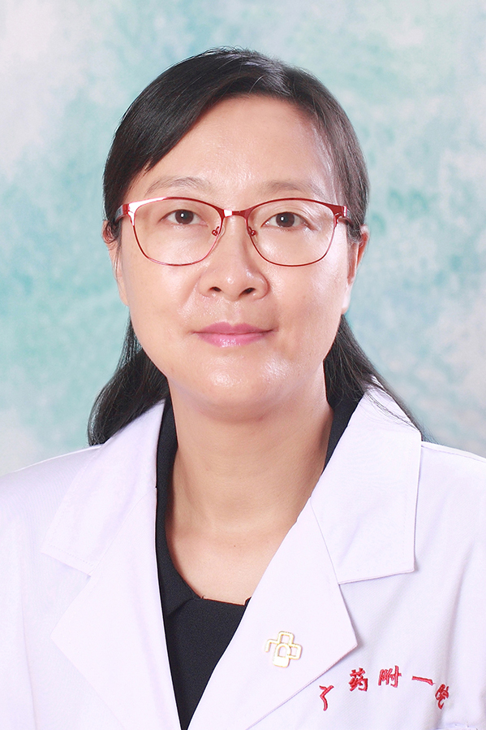

<!-- AUTO-GENERATED-BY: work/generate_obsidian_profiles.py -->

<!-- TEMPLATE: D:\workspace\信息收集整理\医生画像仓库\模板\医生画像模板.md -->

# 章伟明

## 基础信息

| 字段 | 内容 |
|---|---|
| 姓名 | 章伟明 |
| 医院 | 广东药科大学附属第一医院 |
| 科室 | 中医科（共和门诊、农林门诊） |
| 职称/身份 | 教授、主任中医师 |
| 来源链接 | [官网原文](https://www.gy120.net/articleshow.asp?articleid=178) |
| 采集日期 | 2026-08-15 |

## 简介/擅长

中医内科常见病及多发病的中医治疗

## 教育与进修经历

- 个人介绍：1992年毕业于广州中医药大学中医医疗专业，本科学历 2009年6月取得中医临床基础专业硕士学位（在职） 1992.08-1993.07 广州铁路中心医院中医科见习医师 1993.08-2005.05 广州铁路中心医院中医科住院医师 2000.05-2004.12 广州铁路中心医院中医科主治医师 2005.01-2009.01 广东药学院附属第一医院中医科主治医师 2009.02-2014.08 广东药学院附属第一医院中医科副主任中医师 2015.6起至今 广东药学院附属第一医院中医科 主任中医师 主要…

## 科研项目与成果

- 科研与获奖：主持2009年广东省中医药局建设中医药强省立项资助项目《调肝健脾益肾法治疗糖尿病合并抑郁症的临床研究》科研课题（项目编号2009241）

## 论文与学术产出

- 2.《调肝健脾补肾法治疗糖尿病合并抑郁症的临床观察》于2012年11期《新中医》发表；
- 3.《糖尿病合并抑郁症的中医辨证要素及六经辨证研究》于2013年5期《湖南中医药大学学报》发表；
- 4.《糖尿病合并抑郁症的临床研究》于2013年5期《广州中医药大学学报》发表；
- 5.《糖尿病合并抑郁症的六经辨证探讨》2013年16期《中医杂志》发表。

## 可包装亮点

- 个人介绍：1992年毕业于广州中医药大学中医医疗专业，本科学历 2009年6月取得中医临床基础专业硕士学位（在职） 1992.08-1993.07 广州铁路中心医院中医科见习医师 1993.08-2005.05 广州铁路中心医院中医科住院医师 2000.05-2004.12 广州铁路中心医院中医科主治医师 2005.01-2009.01 广东药学院附属第一…
- 2.《调肝健脾补肾法治疗糖尿病合并抑郁症的临床观察》于2012年11期《新中医》发表；
- 3.《糖尿病合并抑郁症的中医辨证要素及六经辨证研究》于2013年5期《湖南中医药大学学报》发表；
- 4.《糖尿病合并抑郁症的临床研究》于2013年5期《广...

## 重点疾病/人群标签

- 慢性病：糖尿病
- 肿瘤：
- 生殖疾病：
- 免疫/风湿：
- 术后恢复/康复：
- 疑难重症：

## 证据摘录

> 只摘录官网公开信息中的短句或关键字段，不复制大段原文。

- 官网身份字段：教授、主任中医师
- 官网简介/擅长：中医内科常见病及多发病的中医治疗
- 官网亮眼经历线索：个人介绍：1992年毕业于广州中医药大学中医医疗专业，本科学历 2009年6月取得中医临床基础专业硕士学位（在职） 1992.08-1993.07 广州铁路中心医院中医科见习医师 1993.08-2005.05 广州铁路中心医院中医科住院医师 2000.05-2004.12 广州铁路中心医院中医科主治医师 2005.01-2009.01 广东药学院附属第一医院中医科主治医师 2009.02-2014.08 广东药学院附属第一医院中医科…
- 来源链接：https://www.gy120.net/articleshow.asp?articleid=178

## BD 画像摘要

章伟明医生可作为慢性病方向的基础画像候选。后续 BD 使用应继续以官网来源和人工复核为准，不添加疗效承诺或无来源包装。

## 合规边界

- 仅使用医院官网、官方公众号、官方小程序等公开渠道。
- 不采集私人电话、私人微信、家庭住址、患者隐私或非公开排班信息。
- 不写“保证治愈”“疗效第一”“包治疑难杂症”等无法由官网证明的表述。
