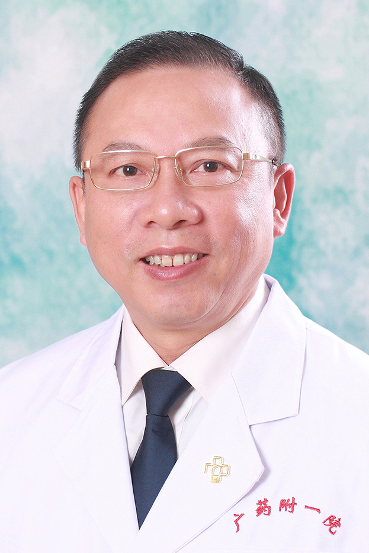

<!-- AUTO-GENERATED-BY: work/generate_obsidian_profiles.py -->

<!-- TEMPLATE: D:\workspace\信息收集整理\医生画像仓库\模板\医生画像模板.md -->

# 章海波

## 基础信息

| 字段 | 内容 |
|---|---|
| 姓名 | 章海波 |
| 医院 | 广东药科大学附属第一医院 |
| 科室 | 心胸外科 |
| 职称/身份 | 教授、主任医师 |
| 来源链接 | [官网原文](https://www.gy120.net/articleshow.asp?articleid=70) |
| 采集日期 | 2026-08-15 |

## 简介/擅长

先心病、风心病、心瓣膜病外科治疗；擅长针对肺癌、食管癌实施术前新辅助化疗、手术治疗、手术后辅助化/放疗的全程综合治疗

## 教育与进修经历

- 个人介绍：1982年大学毕业后留校在湖南医科大学附属第二医院心胸外科任心脏外科医师， 1987年晋升为主治医师，在湖医附二工作10年，在湖医工作期间曾当任小儿先心病组负责医师，参加心脏手术超过1000例，主刀心脏手术超过500例，曾做过“法罗氏四联症根治”“完全性心内膜垫畸形矫治”，“完全性肺静脉异位引流矫治”，“右室双出口矫治”“改良fontan手术”等较复杂的先心病手术。

## 科研项目与成果

- 广东省医疗行业协会胸外科管理分会委员 科研与获奖：主持省科委科技计划项目课题《组蛋白去甲基化酶UTX抑制肺癌的机制研究》。
- 获奖科技成果： 1、体外循环心内直视手术；

## 可包装亮点

- 1992年底调入广东药学院附属第一医院，1993年晋升为副主任医师，1996年任心胸外科主任。
- 社会任职：广东省医学会第七届胸心外科分会委员；
- 广东省医学会第一届心脏外科分会委员；
- 广东省医师协会第一、二届胸外科医师分会委员

## 重点疾病/人群标签

- 慢性病：
- 肿瘤：肿瘤、癌、放疗、化疗、肺癌、术后、复杂
- 生殖疾病：
- 免疫/风湿：
- 术后恢复/康复：肿瘤、癌、放疗、化疗、肺癌、术后、复杂
- 疑难重症：肿瘤、癌、放疗、化疗、肺癌、术后、复杂

## 证据摘录

> 只摘录官网公开信息中的短句或关键字段，不复制大段原文。

- 官网身份字段：教授、主任医师
- 官网简介/擅长：先心病、风心病、心瓣膜病外科治疗；擅长针对肺癌、食管癌实施术前新辅助化疗、手术治疗、手术后辅助化/放疗的全程综合治疗
- 官网亮眼经历线索：1992年底调入广东药学院附属第一医院，1993年晋升为副主任医师，1996年任心胸外科主任。 社会任职：广东省医学会第七届胸心外科分会委员； 广东省医学会第一届心脏外科分会委员； 广东省医师协会第一、二届胸外科医师分会委员
- 来源链接：https://www.gy120.net/articleshow.asp?articleid=70

## BD 画像摘要

章海波医生可作为肿瘤、术后恢复/康复、疑难重症方向的基础画像候选。后续 BD 使用应继续以官网来源和人工复核为准，不添加疗效承诺或无来源包装。

## 合规边界

- 仅使用医院官网、官方公众号、官方小程序等公开渠道。
- 不采集私人电话、私人微信、家庭住址、患者隐私或非公开排班信息。
- 不写“保证治愈”“疗效第一”“包治疑难杂症”等无法由官网证明的表述。
