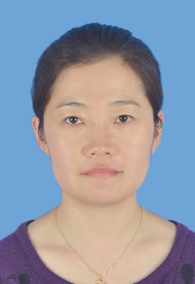

<!-- AUTO-GENERATED-BY: work/generate_obsidian_profiles.py -->

<!-- TEMPLATE: D:\workspace\信息收集整理\医生画像仓库\模板\医生画像模板.md -->

# 罗丽芳

## 基础信息

| 字段 | 内容 |
|---|---|
| 姓名 | 罗丽芳 |
| 医院 | 广东药科大学附属第一医院 |
| 科室 | 皮肤科（共和门诊、健康管理中心） |
| 职称/身份 | 主治医师 |
| 来源链接 | [官网原文](https://www.gy120.net/articleshow.asp?articleid=428) |
| 采集日期 | 2026-08-15 |

## 简介/擅长

毛发疾病、过敏性皮肤病、病毒性皮肤病、真菌性皮肤病、痤疮、梅毒、 尖锐湿疣等疾病的诊治。

## 教育与进修经历

- 个人介绍：2012 年硕士研究生毕业于广州医科大学；

## 科研项目与成果

- 社会任职：广东省医学会皮肤性病学分会毛发学组成员 广东省医学美容学会毛发医学专业委员会委会 广东省医学会变态反应学青年委员会委员 广州市医学会激光医学分会委员 科研与获奖：多次参与省部级课题的申报和研究工作，在医学专业杂志发表研究论 文10 余 篇。

## 论文与学术产出

- 社会任职：广东省医学会皮肤性病学分会毛发学组成员 广东省医学美容学会毛发医学专业委员会委会 广东省医学会变态反应学青年委员会委员 广州市医学会激光医学分会委员 科研与获奖：多次参与省部级课题的申报和研究工作，在医学专业杂志发表研究论 文10 余 篇。

## 可包装亮点

- 社会任职：广东省医学会皮肤性病学分会毛发学组成员 广东省医学美容学会毛发医学专业委员会委会 广东省医学会变态反应学青年委员会委员 广州市医学会激光医学分会委员 科研与获奖：多次参与省部级课题的申报和研究工作，在医学专业杂志发表研究论 文10 余 篇。

## 重点疾病/人群标签

- 慢性病：
- 肿瘤：
- 生殖疾病：
- 免疫/风湿：
- 术后恢复/康复：
- 疑难重症：

## 证据摘录

> 只摘录官网公开信息中的短句或关键字段，不复制大段原文。

- 官网身份字段：主治医师
- 官网简介/擅长：毛发疾病、过敏性皮肤病、病毒性皮肤病、真菌性皮肤病、痤疮、梅毒、 尖锐湿疣等疾病的诊治。
- 官网亮眼经历线索：社会任职：广东省医学会皮肤性病学分会毛发学组成员 广东省医学美容学会毛发医学专业委员会委会 广东省医学会变态反应学青年委员会委员 广州市医学会激光医学分会委员 科研与获奖：多次参与省部级课题的申报和研究工作，在医学专业杂志发表研究论 文10 余 篇。
- 来源链接：https://www.gy120.net/articleshow.asp?articleid=428

## BD 画像摘要

罗丽芳医生可作为广东药科大学附属第一医院皮肤科（共和门诊、健康管理中心）的基础医生资料入库。当前重点方向以总底表标签为准，官网未展示的信息保持空白。

## 合规边界

- 仅使用医院官网、官方公众号、官方小程序等公开渠道。
- 不采集私人电话、私人微信、家庭住址、患者隐私或非公开排班信息。
- 不写“保证治愈”“疗效第一”“包治疑难杂症”等无法由官网证明的表述。
