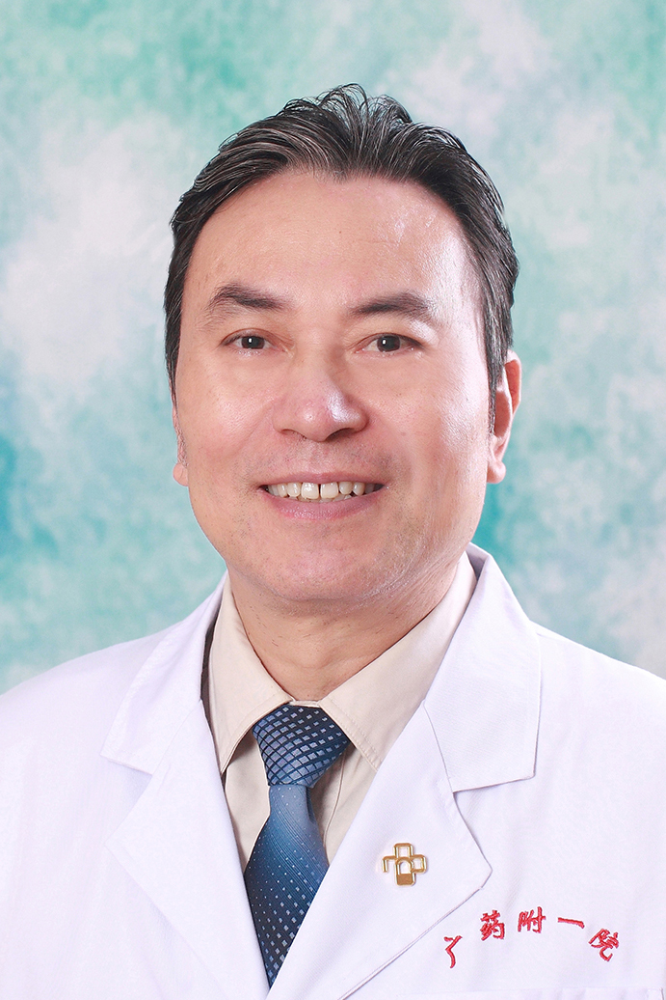

<!-- AUTO-GENERATED-BY: work/generate_obsidian_profiles.py -->

<!-- TEMPLATE: D:\workspace\信息收集整理\医生画像仓库\模板\医生画像模板.md -->

# 罗力

## 基础信息

| 字段 | 内容 |
|---|---|
| 姓名 | 罗力 |
| 医院 | 广东药科大学附属第一医院 |
| 科室 | 泌尿外科（健康管理中心） |
| 职称/身份 | 教授、主任医师、硕士生导师 |
| 来源链接 | [官网原文](https://www.gy120.net/articleshow.asp?articleid=51) |
| 采集日期 | 2026-08-15 |

## 简介/擅长

泌尿系结石、前列腺增生、男性病及遗尿症。

## 教育与进修经历

- 个人介绍：1981年起参加工作，一直从事外科或泌尿外科临床工作 1989年就读泌尿外科硕士研究生 1992年在本院泌尿外科工作至今，曾在北京泌尿外科研究所和广东省医院进修学习。

## 科研项目与成果

- 个人介绍：1981年起参加工作，一直从事外科或泌尿外科临床工作 1989年就读泌尿外科硕士研究生 1992年在本院泌尿外科工作至今，曾在北京泌尿外科研究所和广东省医院进修学习。
- 从医30 余年， 对泌尿外科、男科疾病的诊疗有丰富的临床经验 社会任职：广东省泌尿外科学会 广东省 男科学会委员 广东省泌尿医师协会委员 科研与获奖：对泌尿系结石、前列腺增生、男性病及遗尿症等疾病进行过专项研究，主持过省厅级课题4 项，发表过十余篇专业学术论文

## 论文与学术产出

- 从医30 余年， 对泌尿外科、男科疾病的诊疗有丰富的临床经验 社会任职：广东省泌尿外科学会 广东省 男科学会委员 广东省泌尿医师协会委员 科研与获奖：对泌尿系结石、前列腺增生、男性病及遗尿症等疾病进行过专项研究，主持过省厅级课题4 项，发表过十余篇专业学术论文

## 可包装亮点

- 个人介绍：1981年起参加工作，一直从事外科或泌尿外科临床工作 1989年就读泌尿外科硕士研究生 1992年在本院泌尿外科工作至今，曾在北京泌尿外科研究所和广东省医院进修学习。
- 从医30 余年， 对泌尿外科、男科疾病的诊疗有丰富的临床经验 社会任职：广东省泌尿外科学会 广东省 男科学会委员 广东省泌尿医师协会委员 科研与获奖：对泌尿系结石、前列腺增生、男性病及遗尿症等疾病进行过专项研究，主持过省厅级课题4 项，发表过十余篇专业学术论文

## 重点疾病/人群标签

- 慢性病：
- 肿瘤：
- 生殖疾病：
- 免疫/风湿：
- 术后恢复/康复：
- 疑难重症：

## 证据摘录

> 只摘录官网公开信息中的短句或关键字段，不复制大段原文。

- 官网身份字段：教授、主任医师、硕士生导师
- 官网简介/擅长：泌尿系结石、前列腺增生、男性病及遗尿症。
- 官网亮眼经历线索：个人介绍：1981年起参加工作，一直从事外科或泌尿外科临床工作 1989年就读泌尿外科硕士研究生 1992年在本院泌尿外科工作至今，曾在北京泌尿外科研究所和广东省医院进修学习。 从医30 余年， 对泌尿外科、男科疾病的诊疗有丰富的临床经验 社会任职：广东省泌尿外科学会 广东省 男科学会委员 广东省泌尿医师协会委员 科研与获奖：对泌尿系结石、前列腺增生、男性病及遗尿症等疾病进行过专项研究，主持过省厅级课题4 项，发表过十余篇专业学术论文
- 来源链接：https://www.gy120.net/articleshow.asp?articleid=51

## BD 画像摘要

罗力医生可作为广东药科大学附属第一医院泌尿外科（健康管理中心）的基础医生资料入库。当前重点方向以总底表标签为准，官网未展示的信息保持空白。

## 合规边界

- 仅使用医院官网、官方公众号、官方小程序等公开渠道。
- 不采集私人电话、私人微信、家庭住址、患者隐私或非公开排班信息。
- 不写“保证治愈”“疗效第一”“包治疑难杂症”等无法由官网证明的表述。
