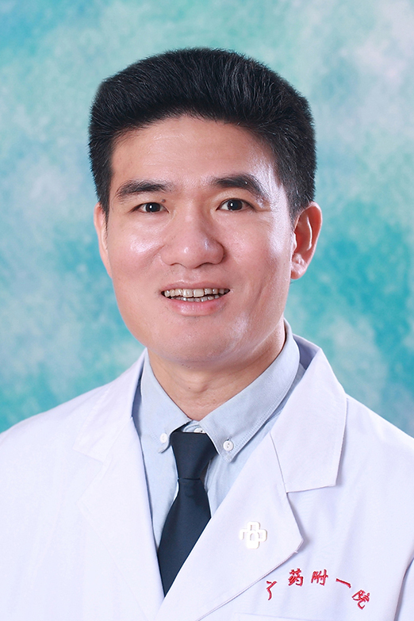

<!-- AUTO-GENERATED-BY: work/generate_obsidian_profiles.py -->

<!-- TEMPLATE: D:\workspace\信息收集整理\医生画像仓库\模板\医生画像模板.md -->

# 罗永平

## 基础信息

| 字段 | 内容 |
|---|---|
| 姓名 | 罗永平 |
| 医院 | 广东药科大学附属第一医院 |
| 科室 | 普外一科（肝胆外科）（健康管理中心） |
| 职称/身份 | 主任医师 |
| 来源链接 | [官网原文](https://www.gy120.net/articleshow.asp?articleid=243) |
| 采集日期 | 2026-08-15 |

## 简介/擅长

各类肝胆外科疾病的诊治、腔镜外科手术及肿瘤消融治疗。主要从事肝胆胰脾、乳腺、甲状腺疾病的诊治，擅长腹腔镜、胆道镜及肿瘤射频消融等微创手术。慢性伤口方面有丰富经验，尤其擅长慢性创面、压疮及糖尿病足等疑难创面的修复。

## 可包装亮点

- 官网目录标注：科室负责人；
- 个人介绍：长期外科工作二十余年 社会任职：广东省医师协会肝胆外科医师工作委员会委员

## 重点疾病/人群标签

- 慢性病：糖尿病、慢性、肿瘤、创面、伤口、疑难
- 肿瘤：糖尿病、慢性、肿瘤、创面、伤口、疑难
- 生殖疾病：
- 免疫/风湿：
- 术后恢复/康复：糖尿病、慢性、肿瘤、创面、伤口、疑难
- 疑难重症：糖尿病、慢性、肿瘤、创面、伤口、疑难

## 证据摘录

> 只摘录官网公开信息中的短句或关键字段，不复制大段原文。

- 官网身份字段：主任医师
- 官网简介/擅长：各类肝胆外科疾病的诊治、腔镜外科手术及肿瘤消融治疗。主要从事肝胆胰脾、乳腺、甲状腺疾病的诊治，擅长腹腔镜、胆道镜及肿瘤射频消融等微创手术。慢性伤口方面有丰富经验，尤其擅长慢性创面、压疮及糖尿病足等疑难创面的修复。
- 官网亮眼经历线索：官网目录标注：科室负责人；个人介绍：长期外科工作二十余年 社会任职：广东省医师协会肝胆外科医师工作委员会委员
- 来源链接：https://www.gy120.net/articleshow.asp?articleid=243

## BD 画像摘要

罗永平医生可作为慢性病、肿瘤、术后恢复/康复、疑难重症方向的基础画像候选。后续 BD 使用应继续以官网来源和人工复核为准，不添加疗效承诺或无来源包装。

## 合规边界

- 仅使用医院官网、官方公众号、官方小程序等公开渠道。
- 不采集私人电话、私人微信、家庭住址、患者隐私或非公开排班信息。
- 不写“保证治愈”“疗效第一”“包治疑难杂症”等无法由官网证明的表述。
