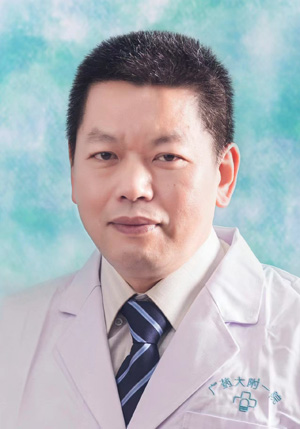

<!-- AUTO-GENERATED-BY: work/generate_obsidian_profiles.py -->

<!-- TEMPLATE: D:\workspace\信息收集整理\医生画像仓库\模板\医生画像模板.md -->

# 肖文豪

## 基础信息

| 字段 | 内容 |
|---|---|
| 姓名 | 肖文豪 |
| 医院 | 广东药科大学附属第一医院 |
| 科室 | 风湿免疫科（健康管理中心） |
| 职称/身份 | 副主任医师 |
| 来源链接 | [官网原文](https://www.gy120.net/articleshow.asp?articleid=257) |
| 采集日期 | 2026-08-15 |

## 简介/擅长

从事风湿免疫科临床工作20余年，擅长诊治类风湿关节炎，系统性红斑狼疮，干燥综合症，脊柱关节病，炎性肌病，痛风性关节炎，血管炎等多种风湿性疾病。

## 教育与进修经历

- 个人介绍：1990年毕业于上海铁道医学院临床医学专业，从事风湿性疾病诊治30余年，在风湿领域有着深厚的学术造诣和丰富的临床经验。

## 可包装亮点

- 官网目录标注：首席专家、科室负责人；
- 擅长类风湿性关节炎、系统性红斑狼疮、强直性脊柱炎等多种风湿免疫疾病的诊治，并担任多项学术职务，通过不断的研究与实践，为风湿免疫病患者提供了专业、精准的医疗服务。

## 重点疾病/人群标签

- 慢性病：
- 肿瘤：
- 生殖疾病：
- 免疫/风湿：风湿、免疫、红斑狼疮、类风湿、强直性脊柱炎
- 术后恢复/康复：
- 疑难重症：

## 证据摘录

> 只摘录官网公开信息中的短句或关键字段，不复制大段原文。

- 官网身份字段：副主任医师
- 官网简介/擅长：从事风湿免疫科临床工作20余年，擅长诊治类风湿关节炎，系统性红斑狼疮，干燥综合症，脊柱关节病，炎性肌病，痛风性关节炎，血管炎等多种风湿性疾病。
- 官网亮眼经历线索：官网目录标注：首席专家、科室负责人；擅长类风湿性关节炎、系统性红斑狼疮、强直性脊柱炎等多种风湿免疫疾病的诊治，并担任多项学术职务，通过不断的研究与实践，为风湿免疫病患者提供了专业、精准的医疗服务。
- 来源链接：https://www.gy120.net/articleshow.asp?articleid=257

## BD 画像摘要

肖文豪医生可作为免疫/风湿/感染方向的基础画像候选。后续 BD 使用应继续以官网来源和人工复核为准，不添加疗效承诺或无来源包装。

## 合规边界

- 仅使用医院官网、官方公众号、官方小程序等公开渠道。
- 不采集私人电话、私人微信、家庭住址、患者隐私或非公开排班信息。
- 不写“保证治愈”“疗效第一”“包治疑难杂症”等无法由官网证明的表述。
