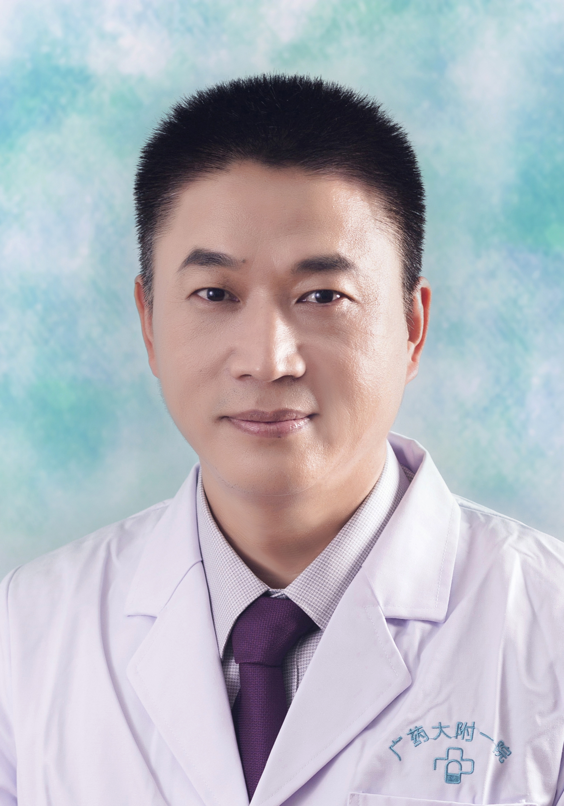

<!-- AUTO-GENERATED-BY: work/generate_obsidian_profiles.py -->

<!-- TEMPLATE: D:\workspace\信息收集整理\医生画像仓库\模板\医生画像模板.md -->

# 肖海平

## 基础信息

| 字段 | 内容 |
|---|---|
| 姓名 | 肖海平 |
| 医院 | 广东药科大学附属第一医院 |
| 科室 | 心胸外科 |
| 职称/身份 | 副主任医师 |
| 来源链接 | [官网原文](https://www.gy120.net/articleshow.asp?articleid=482) |
| 采集日期 | 2026-08-15 |

## 简介/擅长

微创胸外科手术及胸外科常见疾病的诊治，在微创肺癌、食管癌领域拥有独特的单孔技术。纵隔大肿瘤及重症肌无力的治疗，发明了改道引流技术并广泛应用于食管瘘、慢性脓胸、胸壁窦道等胸壁难愈性伤口的治疗。开创了胸腔镜下肋骨肿瘤切除术、微创自体骨胸壁重建术、5毫米单孔手汗症手术、单孔贲门失迟缓手术等。

## 教育与进修经历

- 个人介绍：2008-2021南部战区总医院原广州军区广州总医院 社会任职：国家卫健委基层医疗机构腔镜技术规范化培训项目培训专家 广东省卫生信息协会胸部疾病分会副主任委员 广东医师协会肿瘤外科分会常委 广东省胸部疾病学会创伤专委会常委 广东省医疗健康协会胸外科肺部结节管理分会常委 中国医师协会中西结合分会心胸外科学会常委 中国抗癌协会食管癌专委会青年委员 广东省临床医学会食管外科分会常委 第八届南粤羊城好医生 第六届菁英赛华南省区腔镜肺叶组亚军 科研与获奖：广东省医学科学技术研究基金1项目、SCI论文4篇、实用新型…

## 科研项目与成果

- 个人介绍：2008-2021南部战区总医院原广州军区广州总医院 社会任职：国家卫健委基层医疗机构腔镜技术规范化培训项目培训专家 广东省卫生信息协会胸部疾病分会副主任委员 广东医师协会肿瘤外科分会常委 广东省胸部疾病学会创伤专委会常委 广东省医疗健康协会胸外科肺部结节管理分会常委 中国医师协会中西结合分会心胸外科学会常委 中国抗癌协会食管癌专委会青年委员 广东省临床医学会食管外科分会常委 第八届南粤羊城好医生 第六届菁英赛华南省区腔镜肺叶组亚军 科研与获奖：广东省医学科学技术研究基金1项目、SCI论文4篇、实用新型…

## 论文与学术产出

- 个人介绍：2008-2021南部战区总医院原广州军区广州总医院 社会任职：国家卫健委基层医疗机构腔镜技术规范化培训项目培训专家 广东省卫生信息协会胸部疾病分会副主任委员 广东医师协会肿瘤外科分会常委 广东省胸部疾病学会创伤专委会常委 广东省医疗健康协会胸外科肺部结节管理分会常委 中国医师协会中西结合分会心胸外科学会常委 中国抗癌协会食管癌专委会青年委员 广东省临床医学会食管外科分会常委 第八届南粤羊城好医生 第六届菁英赛华南省区腔镜肺叶组亚军 科研与获奖：广东省医学科学技术研究基金1项目、SCI论文4篇、实用新型…

## 可包装亮点

- 官网目录标注：科室负责人；
- 个人介绍：2008-2021南部战区总医院原广州军区广州总医院 社会任职：国家卫健委基层医疗机构腔镜技术规范化培训项目培训专家 广东省卫生信息协会胸部疾病分会副主任委员 广东医师协会肿瘤外科分会常委 广东省胸部疾病学会创伤专委会常委 广东省医疗健康协会胸外科肺部结节管理分会常委 中国医师协会中西结合分会心胸外科学会常委 中国抗癌协会食管癌专委会青年委员 广…

## 重点疾病/人群标签

- 慢性病：慢性、肿瘤、癌、肺癌、伤口、重症
- 肿瘤：慢性、肿瘤、癌、肺癌、伤口、重症
- 生殖疾病：
- 免疫/风湿：
- 术后恢复/康复：慢性、肿瘤、癌、肺癌、伤口、重症
- 疑难重症：慢性、肿瘤、癌、肺癌、伤口、重症

## 证据摘录

> 只摘录官网公开信息中的短句或关键字段，不复制大段原文。

- 官网身份字段：副主任医师
- 官网简介/擅长：微创胸外科手术及胸外科常见疾病的诊治，在微创肺癌、食管癌领域拥有独特的单孔技术。纵隔大肿瘤及重症肌无力的治疗，发明了改道引流技术并广泛应用于食管瘘、慢性脓胸、胸壁窦道等胸壁难愈性伤口的治疗。开创了胸腔镜下肋骨肿瘤切除术、微创自体骨胸壁重建术、5毫米单孔手汗症手术、单孔贲门失迟缓手术等。
- 官网亮眼经历线索：官网目录标注：科室负责人；个人介绍：2008-2021南部战区总医院原广州军区广州总医院 社会任职：国家卫健委基层医疗机构腔镜技术规范化培训项目培训专家 广东省卫生信息协会胸部疾病分会副主任委员 广东医师协会肿瘤外科分会常委 广东省胸部疾病学会创伤专委会常委 广东省医疗健康协会胸外科肺部结节管理分会常委 中国医师协会中西结合分会心胸外科学会常委 中国抗癌协会食管癌专委会青年委员 广东省临床医学会食管外科分会常委 第八届南粤羊城好医生…
- 来源链接：https://www.gy120.net/articleshow.asp?articleid=482

## BD 画像摘要

肖海平医生可作为慢性病、肿瘤、术后恢复/康复、疑难重症方向的基础画像候选。后续 BD 使用应继续以官网来源和人工复核为准，不添加疗效承诺或无来源包装。

## 合规边界

- 仅使用医院官网、官方公众号、官方小程序等公开渠道。
- 不采集私人电话、私人微信、家庭住址、患者隐私或非公开排班信息。
- 不写“保证治愈”“疗效第一”“包治疑难杂症”等无法由官网证明的表述。
