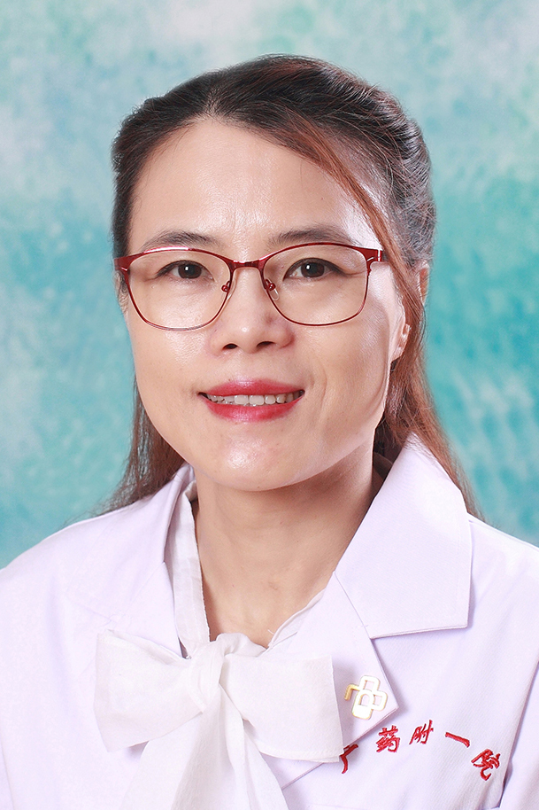

<!-- AUTO-GENERATED-BY: work/generate_obsidian_profiles.py -->

<!-- TEMPLATE: D:\workspace\信息收集整理\医生画像仓库\模板\医生画像模板.md -->

# 舒阳春

## 基础信息

| 字段 | 内容 |
|---|---|
| 姓名 | 舒阳春 |
| 医院 | 广东药科大学附属第一医院 |
| 科室 | 肿瘤二科（农林门诊） |
| 职称/身份 | 副教授、副主任医师 |
| 来源链接 | [官网原文](https://www.gy120.net/articleshow.asp?articleid=252) |
| 采集日期 | 2026-08-15 |

## 简介/擅长

肺癌、乳腺癌、胃肠癌及妇科肿瘤个体化放化疗，免疫生物靶向治疗及晚期患者的姑息治疗

## 科研项目与成果

- 社会任职：广东省医学会肿瘤学会内科组常务委员 科研与获奖：先后参加了科技部十五、"十一五"肺癌公关课题、广东省肠癌课题、教育部肿瘤细胞耐药性的研究，研究成果广泛用于临床实践工作，先后发表学术论文20余篇。

## 论文与学术产出

- 社会任职：广东省医学会肿瘤学会内科组常务委员 科研与获奖：先后参加了科技部十五、"十一五"肺癌公关课题、广东省肠癌课题、教育部肿瘤细胞耐药性的研究，研究成果广泛用于临床实践工作，先后发表学术论文20余篇。

## 可包装亮点

- 社会任职：广东省医学会肿瘤学会内科组常务委员 科研与获奖：先后参加了科技部十五、"十一五"肺癌公关课题、广东省肠癌课题、教育部肿瘤细胞耐药性的研究，研究成果广泛用于临床实践工作，先后发表学术论文20余篇。

## 重点疾病/人群标签

- 慢性病：
- 肿瘤：肿瘤、放疗、化疗、靶向、肺癌、肠癌、乳腺癌、免疫、姑息
- 生殖疾病：
- 免疫/风湿：肿瘤、放疗、化疗、靶向、肺癌、肠癌、乳腺癌、免疫、姑息
- 术后恢复/康复：肿瘤、放疗、化疗、靶向、肺癌、肠癌、乳腺癌、免疫、姑息
- 疑难重症：

## 证据摘录

> 只摘录官网公开信息中的短句或关键字段，不复制大段原文。

- 官网身份字段：副教授、副主任医师
- 官网简介/擅长：肺癌、乳腺癌、胃肠癌及妇科肿瘤个体化放化疗，免疫生物靶向治疗及晚期患者的姑息治疗
- 官网亮眼经历线索：社会任职：广东省医学会肿瘤学会内科组常务委员 科研与获奖：先后参加了科技部十五、"十一五"肺癌公关课题、广东省肠癌课题、教育部肿瘤细胞耐药性的研究，研究成果广泛用于临床实践工作，先后发表学术论文20余篇。
- 来源链接：https://www.gy120.net/articleshow.asp?articleid=252

## BD 画像摘要

舒阳春医生可作为肿瘤、免疫/风湿/感染、术后恢复/康复方向的基础画像候选。后续 BD 使用应继续以官网来源和人工复核为准，不添加疗效承诺或无来源包装。

## 合规边界

- 仅使用医院官网、官方公众号、官方小程序等公开渠道。
- 不采集私人电话、私人微信、家庭住址、患者隐私或非公开排班信息。
- 不写“保证治愈”“疗效第一”“包治疑难杂症”等无法由官网证明的表述。
