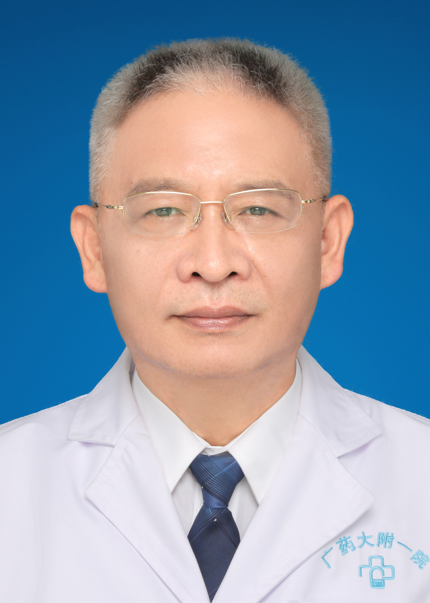

<!-- AUTO-GENERATED-BY: work/generate_obsidian_profiles.py -->

<!-- TEMPLATE: D:\workspace\信息收集整理\医生画像仓库\模板\医生画像模板.md -->

# 蔡杰衡

## 基础信息

| 字段 | 内容 |
|---|---|
| 姓名 | 蔡杰衡 |
| 医院 | 广东药科大学附属第一医院 |
| 科室 | 麻醉科 |
| 职称/身份 | 教授、主任医师 |
| 来源链接 | [官网原文](https://www.gy120.net/articleshow.asp?articleid=48) |
| 采集日期 | 2026-08-15 |

## 简介/擅长

从事临床麻醉工作30余年，具有丰富的临床经验，擅长体外循环技术、心脏及大血管手术患者的围手术期管理工作。

## 教育与进修经历

- 个人介绍：1982年广州医学院医疗系毕业 1982年在广州铁路中心医院（现广东药学院附一院）麻醉科工作至今 1989年主治医师，1994年副主任医师，2001年主任医师，2004年聘为广东药学院教授 1997年任科主任至今 社会任职：广东省麻醉学会委员 主要论著：1．异氟醚对维库溴铵肌松效应的影响《中国煤炭工业医学杂志》2006年第九卷第四期 2．氯普鲁卡因与利多卡因硬膜外阻滞用于剖宫产术的麻醉观察《实用临床医学》2006年第七卷第五期 3．国产盐酸氯普鲁卡因在持续硬膜外麻醉的临床效应《广东药学院学报》2006年…

## 可包装亮点

- 个人介绍：1982年广州医学院医疗系毕业 1982年在广州铁路中心医院（现广东药学院附一院）麻醉科工作至今 1989年主治医师，1994年副主任医师，2001年主任医师，2004年聘为广东药学院教授 1997年任科主任至今 社会任职：广东省麻醉学会委员 主要论著：1．异氟醚对维库溴铵肌松效应的影响《中国煤炭工业医学杂志》2006年第九卷第四期 2．氯普鲁卡…

## 重点疾病/人群标签

- 慢性病：
- 肿瘤：
- 生殖疾病：
- 免疫/风湿：
- 术后恢复/康复：
- 疑难重症：

## 证据摘录

> 只摘录官网公开信息中的短句或关键字段，不复制大段原文。

- 官网身份字段：教授、主任医师
- 官网简介/擅长：从事临床麻醉工作30余年，具有丰富的临床经验，擅长体外循环技术、心脏及大血管手术患者的围手术期管理工作。
- 官网亮眼经历线索：个人介绍：1982年广州医学院医疗系毕业 1982年在广州铁路中心医院（现广东药学院附一院）麻醉科工作至今 1989年主治医师，1994年副主任医师，2001年主任医师，2004年聘为广东药学院教授 1997年任科主任至今 社会任职：广东省麻醉学会委员 主要论著：1．异氟醚对维库溴铵肌松效应的影响《中国煤炭工业医学杂志》2006年第九卷第四期 2．氯普鲁卡因与利多卡因硬膜外阻滞用于剖宫产术的麻醉观察《实用临床医学》2006年第七卷第五…
- 来源链接：https://www.gy120.net/articleshow.asp?articleid=48

## BD 画像摘要

蔡杰衡医生可作为广东药科大学附属第一医院麻醉科的基础医生资料入库。当前重点方向以总底表标签为准，官网未展示的信息保持空白。

## 合规边界

- 仅使用医院官网、官方公众号、官方小程序等公开渠道。
- 不采集私人电话、私人微信、家庭住址、患者隐私或非公开排班信息。
- 不写“保证治愈”“疗效第一”“包治疑难杂症”等无法由官网证明的表述。
