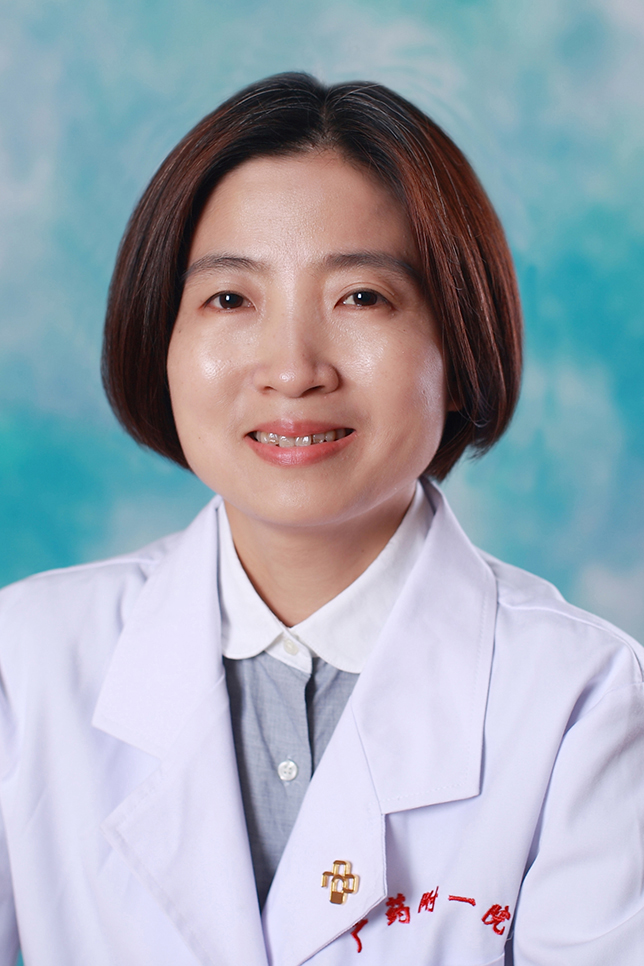

<!-- AUTO-GENERATED-BY: work/generate_obsidian_profiles.py -->

<!-- TEMPLATE: D:\workspace\信息收集整理\医生画像仓库\模板\医生画像模板.md -->

# 蔡洁毅

## 基础信息

| 字段 | 内容 |
|---|---|
| 姓名 | 蔡洁毅 |
| 医院 | 广东药科大学附属第一医院 |
| 科室 | 消化内科（健康管理中心） |
| 职称/身份 | 副主任医师 |
| 来源链接 | [官网原文](https://www.gy120.net/articleshow.asp?articleid=210) |
| 采集日期 | 2026-08-15 |

## 简介/擅长

擅长诊治腹胀、便秘、吞咽困难、胃食管反流病等功能性胃肠病及胃肠动力疾病。擅长消化科常见疾病及上消化道出血、急性胰腺炎重症的处理。 掌握胃肠镜、胶囊内镜检查及内镜下治疗。

## 教育与进修经历

- 个人介绍：1996 年毕业于广州医学院临床医学系，从事消化科工作二十余年，曾在武汉协和医院进修学习胃肠动力学。

## 可包装亮点

- 个人介绍：1996 年毕业于广州医学院临床医学系，从事消化科工作二十余年，曾在武汉协和医院进修学习胃肠动力学。
- 社会任职：广东省肝脏病学会脂肪肝专业委员会委员

## 重点疾病/人群标签

- 慢性病：
- 肿瘤：
- 生殖疾病：
- 免疫/风湿：
- 术后恢复/康复：
- 疑难重症：重症

## 证据摘录

> 只摘录官网公开信息中的短句或关键字段，不复制大段原文。

- 官网身份字段：副主任医师
- 官网简介/擅长：擅长诊治腹胀、便秘、吞咽困难、胃食管反流病等功能性胃肠病及胃肠动力疾病。擅长消化科常见疾病及上消化道出血、急性胰腺炎重症的处理。 掌握胃肠镜、胶囊内镜检查及内镜下治疗。
- 官网亮眼经历线索：个人介绍：1996 年毕业于广州医学院临床医学系，从事消化科工作二十余年，曾在武汉协和医院进修学习胃肠动力学。 社会任职：广东省肝脏病学会脂肪肝专业委员会委员
- 来源链接：https://www.gy120.net/articleshow.asp?articleid=210

## BD 画像摘要

蔡洁毅医生可作为疑难重症方向的基础画像候选。后续 BD 使用应继续以官网来源和人工复核为准，不添加疗效承诺或无来源包装。

## 合规边界

- 仅使用医院官网、官方公众号、官方小程序等公开渠道。
- 不采集私人电话、私人微信、家庭住址、患者隐私或非公开排班信息。
- 不写“保证治愈”“疗效第一”“包治疑难杂症”等无法由官网证明的表述。
