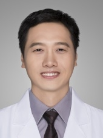

<!-- AUTO-GENERATED-BY: work/generate_obsidian_profiles.py -->

<!-- TEMPLATE: D:\workspace\信息收集整理\医生画像仓库\模板\医生画像模板.md -->

# 袁伟锋

## 基础信息

| 字段 | 内容 |
|---|---|
| 姓名 | 袁伟锋 |
| 医院 | 广东药科大学附属第一医院 |
| 科室 | 呼吸与危重症医学科（健康管理中心） |
| 职称/身份 | 主任医师、医学博士 |
| 来源链接 | [官网原文](https://www.gy120.net/articleshow.asp?articleid=40) |
| 采集日期 | 2026-08-15 |

## 简介/擅长

呼吸系统感染性疾病，气道慢性炎症

## 教育与进修经历

- 个人介绍：2000年09月-2005年07月，天津医科大学临床医学专业就读，获得学士学位。
- 2005年09月-2008年06月，南方医科大学内科学（呼吸病学）专业就读，获得硕士学位。
- 2008年09月-2011年06月，南方医科大学内科学（呼吸病学）专业就读，获得博士学位。

## 科研项目与成果

- 社会任职：广州市医学会呼吸病学分会委员 广东省病理生理学会呼吸专业委员会委员 广东省医师协会呼吸分会结核防治组成员 广东省康复医学会呼吸康复分会理事 广东省预防医学会呼吸病预防与控制专业委员会青年委员 科研与获奖：自工作以来以第一作者或通讯作者发表论著 10篇，主持市厅级科研项目3项，参与国家级及省部级项目10项，获 医疗成果奖二等奖 一项。

## 论文与学术产出

- 社会任职：广州市医学会呼吸病学分会委员 广东省病理生理学会呼吸专业委员会委员 广东省医师协会呼吸分会结核防治组成员 广东省康复医学会呼吸康复分会理事 广东省预防医学会呼吸病预防与控制专业委员会青年委员 科研与获奖：自工作以来以第一作者或通讯作者发表论著 10篇，主持市厅级科研项目3项，参与国家级及省部级项目10项，获 医疗成果奖二等奖 一项。

## 可包装亮点

- 官网目录标注：科室负责人；
- 社会任职：广州市医学会呼吸病学分会委员 广东省病理生理学会呼吸专业委员会委员 广东省医师协会呼吸分会结核防治组成员 广东省康复医学会呼吸康复分会理事 广东省预防医学会呼吸病预防与控制专业委员会青年委员 科研与获奖：自工作以来以第一作者或通讯作者发表论著 10篇，主持市厅级科研项目3项，参与国家级及省部级项目10项，获 医疗成果奖二等奖 一项。

## 重点疾病/人群标签

- 慢性病：慢性、感染、康复、危重
- 肿瘤：
- 生殖疾病：
- 免疫/风湿：慢性、感染、康复、危重
- 术后恢复/康复：慢性、感染、康复、危重
- 疑难重症：慢性、感染、康复、危重

## 证据摘录

> 只摘录官网公开信息中的短句或关键字段，不复制大段原文。

- 官网身份字段：主任医师、医学博士
- 官网简介/擅长：呼吸系统感染性疾病，气道慢性炎症
- 官网亮眼经历线索：官网目录标注：科室负责人；社会任职：广州市医学会呼吸病学分会委员 广东省病理生理学会呼吸专业委员会委员 广东省医师协会呼吸分会结核防治组成员 广东省康复医学会呼吸康复分会理事 广东省预防医学会呼吸病预防与控制专业委员会青年委员 科研与获奖：自工作以来以第一作者或通讯作者发表论著 10篇，主持市厅级科研项目3项，参与国家级及省部级项目10项，获 医疗成果奖二等奖 一项。
- 来源链接：https://www.gy120.net/articleshow.asp?articleid=40

## BD 画像摘要

袁伟锋医生可作为慢性病、免疫/风湿/感染、术后恢复/康复、疑难重症方向的基础画像候选。后续 BD 使用应继续以官网来源和人工复核为准，不添加疗效承诺或无来源包装。

## 合规边界

- 仅使用医院官网、官方公众号、官方小程序等公开渠道。
- 不采集私人电话、私人微信、家庭住址、患者隐私或非公开排班信息。
- 不写“保证治愈”“疗效第一”“包治疑难杂症”等无法由官网证明的表述。
