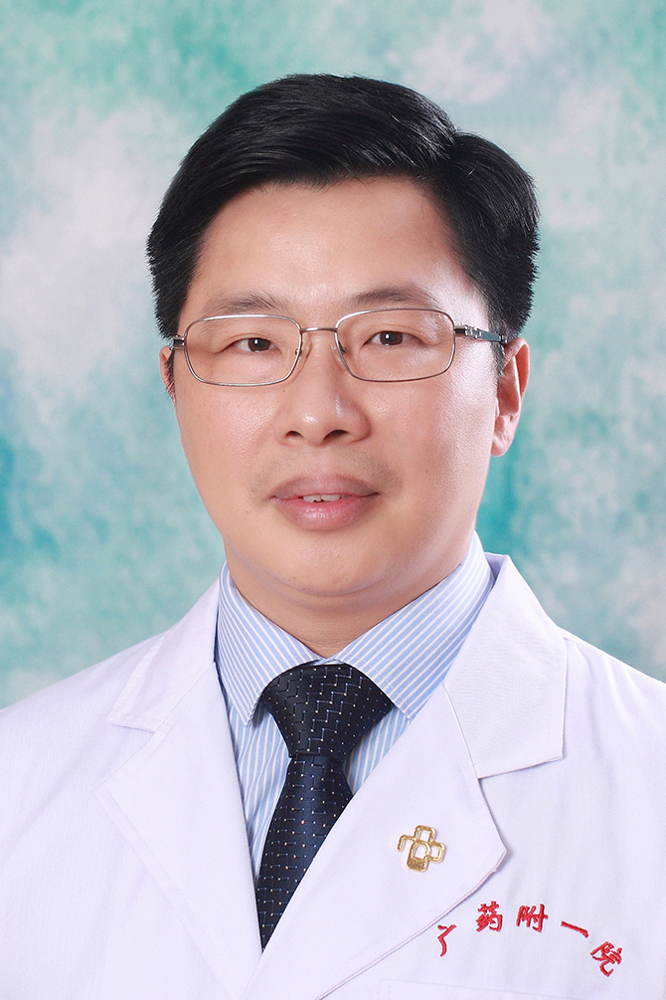

<!-- AUTO-GENERATED-BY: work/generate_obsidian_profiles.py -->

<!-- TEMPLATE: D:\workspace\信息收集整理\医生画像仓库\模板\医生画像模板.md -->

# 袁建伟

## 基础信息

| 字段 | 内容 |
|---|---|
| 姓名 | 袁建伟 |
| 医院 | 广东药科大学附属第一医院 |
| 科室 | 核医学科（农林门诊） |
| 职称/身份 | 教授、主任医师、硕士生导师 |
| 来源链接 | [官网原文](https://www.gy120.net/articleshow.asp?articleid=345) |
| 采集日期 | 2026-08-15 |

## 简介/擅长

“羊城好医生”、“岭南名医”，具有丰富的PET/CT、SPECT/CT核医学影像诊断和核素治疗经验，擅长格雷夫斯甲亢和分化型甲状腺癌的碘-131治疗、放射性核素治疗骨转移、皮肤疤痕和血管瘤的敷贴治疗等。

## 教育与进修经历

- 个人介绍：2002年6月本科毕业于苏州大学放射医学（核医学）专业；

## 科研项目与成果

- 2006年广东省医学科学研究基金；
- 项目编号：A2006657；
- 项目负责人。

## 可包装亮点

- 官网目录标注：科室负责人；
- 2015年7月 人才引进至广东药科大学附属第一医院担任核医学科科主任至今。
- 社会任职：中国医师协会核医学医师分会第三届青年委员；
- 中国医师协会整合医学医师分会整合影像学专业委员会第一届委员；
- 广东省核学会第七届理事会理事

## 重点疾病/人群标签

- 慢性病：冠心病、肿瘤、癌、瘤、放疗、鼻咽癌、乳腺癌
- 肿瘤：冠心病、肿瘤、癌、瘤、放疗、鼻咽癌、乳腺癌
- 生殖疾病：
- 免疫/风湿：
- 术后恢复/康复：
- 疑难重症：

## 证据摘录

> 只摘录官网公开信息中的短句或关键字段，不复制大段原文。

- 官网身份字段：教授、主任医师、硕士生导师
- 官网简介/擅长：“羊城好医生”、“岭南名医”，具有丰富的PET/CT、SPECT/CT核医学影像诊断和核素治疗经验，擅长格雷夫斯甲亢和分化型甲状腺癌的碘-131治疗、放射性核素治疗骨转移、皮肤疤痕和血管瘤的敷贴治疗等。
- 官网亮眼经历线索：官网目录标注：科室负责人；2015年7月 人才引进至广东药科大学附属第一医院担任核医学科科主任至今。 社会任职：中国医师协会核医学医师分会第三届青年委员； 中国医师协会整合医学医师分会整合影像学专业委员会第一届委员； 广东省核学会第七届理事会理事
- 来源链接：https://www.gy120.net/articleshow.asp?articleid=345

## BD 画像摘要

袁建伟医生可作为慢性病、肿瘤方向的基础画像候选。后续 BD 使用应继续以官网来源和人工复核为准，不添加疗效承诺或无来源包装。

## 合规边界

- 仅使用医院官网、官方公众号、官方小程序等公开渠道。
- 不采集私人电话、私人微信、家庭住址、患者隐私或非公开排班信息。
- 不写“保证治愈”“疗效第一”“包治疑难杂症”等无法由官网证明的表述。
