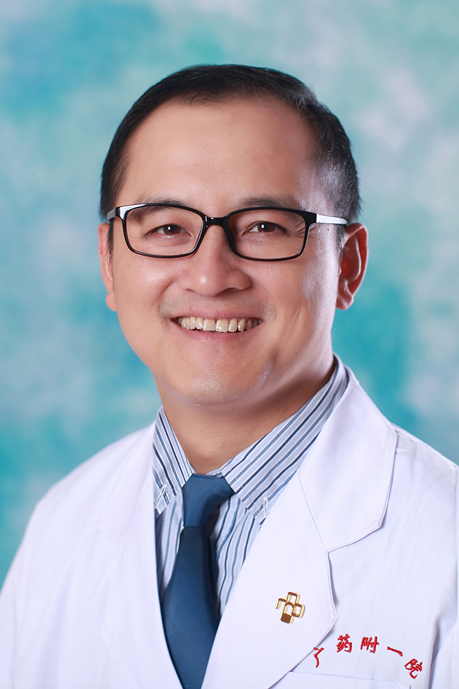

<!-- AUTO-GENERATED-BY: work/generate_obsidian_profiles.py -->

<!-- TEMPLATE: D:\workspace\信息收集整理\医生画像仓库\模板\医生画像模板.md -->

# 袁瑜

## 基础信息

| 字段 | 内容 |
|---|---|
| 姓名 | 袁瑜 |
| 医院 | 广东药科大学附属第一医院 |
| 科室 | 消化内科（健康管理中心） |
| 职称/身份 | 副教授、副主任医师 |
| 来源链接 | [官网原文](https://www.gy120.net/articleshow.asp?articleid=211) |
| 采集日期 | 2026-08-15 |

## 简介/擅长

急慢性肝病、胰腺疾病、胃肠道疾病的诊治，消化内镜常规检查及镜下治疗

## 教育与进修经历

- 个人介绍：1995年毕业于湖南医科大学临床医疗专业，长期在三甲医院一线临床工作 2000年开始从事消化内科专科临床诊治及消化内镜操作工作，多次在南方医科大学附属南方医院、上海东方肝胆医院、中山医科大学附属第三医院进修学习 并于2010年在粤北地区南雄市人民医院挂职副院长工作1年 社会任职：广东省肝脏病学会第三届脂肪肝专业委员会常务委员 广东省医师协会消化内镜学医师工作委员会常务委员 主要论著：1、DukeA、B期大肠癌术后总生存率及无瘤生存率分析.中华全科医学，2011，9（01）： 2、CA-199在肝囊肿患者…

## 可包装亮点

- 个人介绍：1995年毕业于湖南医科大学临床医疗专业，长期在三甲医院一线临床工作 2000年开始从事消化内科专科临床诊治及消化内镜操作工作，多次在南方医科大学附属南方医院、上海东方肝胆医院、中山医科大学附属第三医院进修学习 并于2010年在粤北地区南雄市人民医院挂职副院长工作1年 社会任职：广东省肝脏病学会第三届脂肪肝专业委员会常务委员 广东省医师协会消化内…

## 重点疾病/人群标签

- 慢性病：慢性、肿瘤、瘤、肠癌、术后
- 肿瘤：慢性、肿瘤、瘤、肠癌、术后
- 生殖疾病：
- 免疫/风湿：
- 术后恢复/康复：慢性、肿瘤、瘤、肠癌、术后
- 疑难重症：

## 证据摘录

> 只摘录官网公开信息中的短句或关键字段，不复制大段原文。

- 官网身份字段：副教授、副主任医师
- 官网简介/擅长：急慢性肝病、胰腺疾病、胃肠道疾病的诊治，消化内镜常规检查及镜下治疗
- 官网亮眼经历线索：个人介绍：1995年毕业于湖南医科大学临床医疗专业，长期在三甲医院一线临床工作 2000年开始从事消化内科专科临床诊治及消化内镜操作工作，多次在南方医科大学附属南方医院、上海东方肝胆医院、中山医科大学附属第三医院进修学习 并于2010年在粤北地区南雄市人民医院挂职副院长工作1年 社会任职：广东省肝脏病学会第三届脂肪肝专业委员会常务委员 广东省医师协会消化内镜学医师工作委员会常务委员 主要论著：1、DukeA、B期大肠癌术后总生存率及无…
- 来源链接：https://www.gy120.net/articleshow.asp?articleid=211

## BD 画像摘要

袁瑜医生可作为慢性病、肿瘤、术后恢复/康复方向的基础画像候选。后续 BD 使用应继续以官网来源和人工复核为准，不添加疗效承诺或无来源包装。

## 合规边界

- 仅使用医院官网、官方公众号、官方小程序等公开渠道。
- 不采集私人电话、私人微信、家庭住址、患者隐私或非公开排班信息。
- 不写“保证治愈”“疗效第一”“包治疑难杂症”等无法由官网证明的表述。
