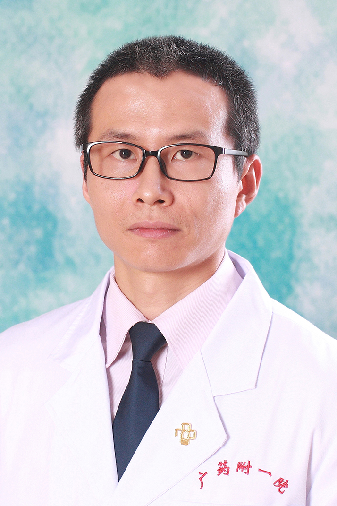

<!-- AUTO-GENERATED-BY: work/generate_obsidian_profiles.py -->

<!-- TEMPLATE: D:\workspace\信息收集整理\医生画像仓库\模板\医生画像模板.md -->

# 赵晓

## 基础信息

| 字段 | 内容 |
|---|---|
| 姓名 | 赵晓 |
| 医院 | 广东药科大学附属第一医院 |
| 科室 | 正骨科（健康管理中心、共和门诊） |
| 职称/身份 | 副主任医师 |
| 来源链接 | [官网原文](https://www.gy120.net/articleshow.asp?articleid=249) |
| 采集日期 | 2026-08-15 |

## 简介/擅长

正骨整脊手法、针灸、小针刀等

## 教育与进修经历

- 个人介绍：2007年7月广州中医药大学中医骨伤科硕士研究生毕业，后一直在医院正骨科工作至今，积累了较丰富的临床经验 社会任职：广东省中西医结合学会骨伤科专业委员会委员 科研与获奖：广东省中医药局课题《基于动态MRI对不同角度牵引下伴根性症状的轻度脊髓压迫者颈椎形态学安全性研究及疗效观察》第二作者

## 科研项目与成果

- 个人介绍：2007年7月广州中医药大学中医骨伤科硕士研究生毕业，后一直在医院正骨科工作至今，积累了较丰富的临床经验 社会任职：广东省中西医结合学会骨伤科专业委员会委员 科研与获奖：广东省中医药局课题《基于动态MRI对不同角度牵引下伴根性症状的轻度脊髓压迫者颈椎形态学安全性研究及疗效观察》第二作者

## 可包装亮点

- 个人介绍：2007年7月广州中医药大学中医骨伤科硕士研究生毕业，后一直在医院正骨科工作至今，积累了较丰富的临床经验 社会任职：广东省中西医结合学会骨伤科专业委员会委员 科研与获奖：广东省中医药局课题《基于动态MRI对不同角度牵引下伴根性症状的轻度脊髓压迫者颈椎形态学安全性研究及疗效观察》第二作者

## 重点疾病/人群标签

- 慢性病：
- 肿瘤：
- 生殖疾病：
- 免疫/风湿：
- 术后恢复/康复：
- 疑难重症：

## 证据摘录

> 只摘录官网公开信息中的短句或关键字段，不复制大段原文。

- 官网身份字段：副主任医师
- 官网简介/擅长：正骨整脊手法、针灸、小针刀等
- 官网亮眼经历线索：个人介绍：2007年7月广州中医药大学中医骨伤科硕士研究生毕业，后一直在医院正骨科工作至今，积累了较丰富的临床经验 社会任职：广东省中西医结合学会骨伤科专业委员会委员 科研与获奖：广东省中医药局课题《基于动态MRI对不同角度牵引下伴根性症状的轻度脊髓压迫者颈椎形态学安全性研究及疗效观察》第二作者
- 来源链接：https://www.gy120.net/articleshow.asp?articleid=249

## BD 画像摘要

赵晓医生可作为广东药科大学附属第一医院正骨科（健康管理中心、共和门诊）的基础医生资料入库。当前重点方向以总底表标签为准，官网未展示的信息保持空白。

## 合规边界

- 仅使用医院官网、官方公众号、官方小程序等公开渠道。
- 不采集私人电话、私人微信、家庭住址、患者隐私或非公开排班信息。
- 不写“保证治愈”“疗效第一”“包治疑难杂症”等无法由官网证明的表述。
