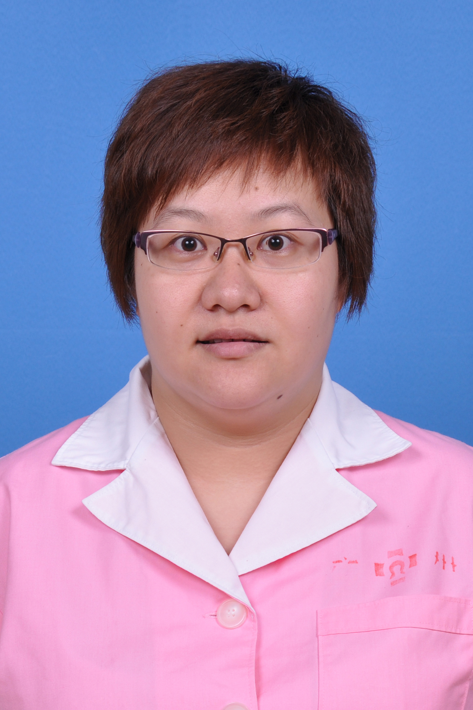

<!-- AUTO-GENERATED-BY: work/generate_obsidian_profiles.py -->

<!-- TEMPLATE: D:\workspace\信息收集整理\医生画像仓库\模板\医生画像模板.md -->

# 赵曼丹

## 基础信息

| 字段 | 内容 |
|---|---|
| 姓名 | 赵曼丹 |
| 医院 | 广东药科大学附属第一医院 |
| 科室 | 妇产科（农林门诊） |
| 职称/身份 | 主治医师 |
| 来源链接 | [官网原文](https://www.gy120.net/articleshow.asp?articleid=432) |
| 采集日期 | 2026-08-15 |

## 简介/擅长

现从事妇产科临床工作10多年，对妇产科常见病、多发病及妇产科急症的诊断和治疗有较丰富的临床经验。擅长围产期保健，优生优育指导，高危妊娠的筛查及诊治，产科合并症及并发症的防治，母乳喂养咨询。

## 教育与进修经历

- 个人介绍：2006 年毕业于湖北郧阳医学院临床医学系，毕业后一直从事妇产科临床一线工作，具有丰富的妇产科临床经验。

## 可包装亮点

- 社会任职：广东省基层医药学会围产医学分会委员

## 重点疾病/人群标签

- 慢性病：
- 肿瘤：
- 生殖疾病：
- 免疫/风湿：
- 术后恢复/康复：
- 疑难重症：高危

## 证据摘录

> 只摘录官网公开信息中的短句或关键字段，不复制大段原文。

- 官网身份字段：主治医师
- 官网简介/擅长：现从事妇产科临床工作10多年，对妇产科常见病、多发病及妇产科急症的诊断和治疗有较丰富的临床经验。擅长围产期保健，优生优育指导，高危妊娠的筛查及诊治，产科合并症及并发症的防治，母乳喂养咨询。
- 官网亮眼经历线索：社会任职：广东省基层医药学会围产医学分会委员
- 来源链接：https://www.gy120.net/articleshow.asp?articleid=432

## BD 画像摘要

赵曼丹医生可作为疑难重症方向的基础画像候选。后续 BD 使用应继续以官网来源和人工复核为准，不添加疗效承诺或无来源包装。

## 合规边界

- 仅使用医院官网、官方公众号、官方小程序等公开渠道。
- 不采集私人电话、私人微信、家庭住址、患者隐私或非公开排班信息。
- 不写“保证治愈”“疗效第一”“包治疑难杂症”等无法由官网证明的表述。
