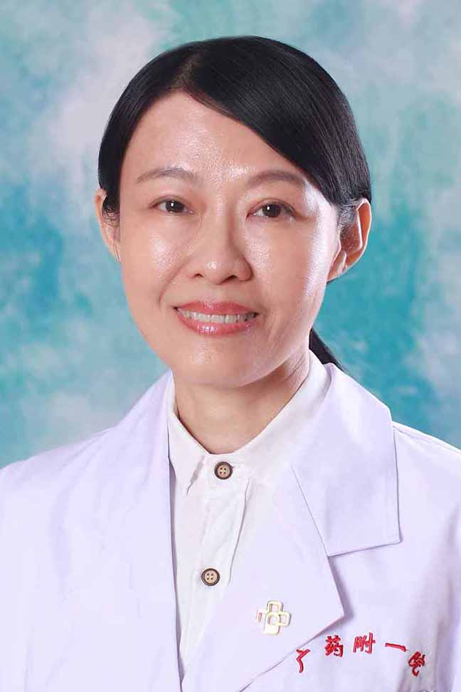

<!-- AUTO-GENERATED-BY: work/generate_obsidian_profiles.py -->

<!-- TEMPLATE: D:\workspace\信息收集整理\医生画像仓库\模板\医生画像模板.md -->

# 赵欣欣

## 基础信息

| 字段 | 内容 |
|---|---|
| 姓名 | 赵欣欣 |
| 医院 | 广东药科大学附属第一医院 |
| 科室 | 普外三科（整形美容科）（健康管理中心） |
| 职称/身份 | 副主任医师 |
| 来源链接 | [官网原文](https://www.gy120.net/articleshow.asp?articleid=238) |
| 采集日期 | 2026-08-15 |

## 简介/擅长

激光治疗各类皮肤色素病变及文刺、强脉冲光机治疗痤疮、痤疮印、毛细血管扩张、色斑及光老化皮肤、疤痕磨削术治疗各类疤痕、冰点激光脱毛仪治疗身体各部位的毛发过多

## 教育与进修经历

- 个人介绍：1991年毕业于中山大学（中山医科大学）临床医学系， 2007年获中山大学整形外科学硕士 曾在上海第九人民医院、北京空军总院研修 从事激光整形美容外科工作二十年，临床经验丰富，善于与患者沟通，了解患者的需求。

## 可包装亮点

- 个人介绍：1991年毕业于中山大学（中山医科大学）临床医学系， 2007年获中山大学整形外科学硕士 曾在上海第九人民医院、北京空军总院研修 从事激光整形美容外科工作二十年，临床经验丰富，善于与患者沟通，了解患者的需求。
- 赵医生在广州市最早引进意大利微晶祛疤设备，率先开展微晶磨疤技术，十余年来在这方面积累了大量的临床经验，治愈了数千例疤痕患者。
- 在祛除文身、多毛症、皮肤色素性疾病的治疗等方面达到国内先进水平 社会任职：广州市医学会医学美学与美容学分会委员 主要论著：1）赵欣欣，罗锦辉，耳部瘢痕疙瘩的临床分析，[J]中国美容整形外科杂志2008,19（1）：12-14 2）赵欣欣，黎志明，瘢痕疙瘩切除加浅表放疗的临床分析，[J]中国美容整形外科杂志 2009,20（5）：298-301 3）赵欣欣…

## 重点疾病/人群标签

- 慢性病：
- 肿瘤：肿瘤、放疗
- 生殖疾病：
- 免疫/风湿：
- 术后恢复/康复：
- 疑难重症：

## 证据摘录

> 只摘录官网公开信息中的短句或关键字段，不复制大段原文。

- 官网身份字段：副主任医师
- 官网简介/擅长：激光治疗各类皮肤色素病变及文刺、强脉冲光机治疗痤疮、痤疮印、毛细血管扩张、色斑及光老化皮肤、疤痕磨削术治疗各类疤痕、冰点激光脱毛仪治疗身体各部位的毛发过多
- 官网亮眼经历线索：个人介绍：1991年毕业于中山大学（中山医科大学）临床医学系， 2007年获中山大学整形外科学硕士 曾在上海第九人民医院、北京空军总院研修 从事激光整形美容外科工作二十年，临床经验丰富，善于与患者沟通，了解患者的需求。 赵医生在广州市最早引进意大利微晶祛疤设备，率先开展微晶磨疤技术，十余年来在这方面积累了大量的临床经验，治愈了数千例疤痕患者。 在祛除文身、多毛症、皮肤色素性疾病的治疗等方面达到国内先进水平 社会任职：广州市医学会医学美…
- 来源链接：https://www.gy120.net/articleshow.asp?articleid=238

## BD 画像摘要

赵欣欣医生可作为肿瘤方向的基础画像候选。后续 BD 使用应继续以官网来源和人工复核为准，不添加疗效承诺或无来源包装。

## 合规边界

- 仅使用医院官网、官方公众号、官方小程序等公开渠道。
- 不采集私人电话、私人微信、家庭住址、患者隐私或非公开排班信息。
- 不写“保证治愈”“疗效第一”“包治疑难杂症”等无法由官网证明的表述。
