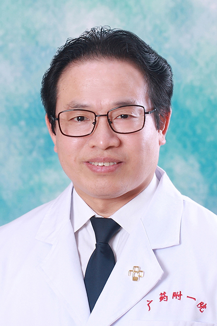

<!-- AUTO-GENERATED-BY: work/generate_obsidian_profiles.py -->

<!-- TEMPLATE: D:\workspace\信息收集整理\医生画像仓库\模板\医生画像模板.md -->

# 连福珍

## 基础信息

| 字段 | 内容 |
|---|---|
| 姓名 | 连福珍 |
| 医院 | 广东药科大学附属第一医院 |
| 科室 | 普外一科（肝胆外科）（健康管理中心） |
| 职称/身份 | 副主任医师 |
| 来源链接 | [官网原文](https://www.gy120.net/articleshow.asp?articleid=8) |
| 采集日期 | 2026-08-15 |

## 简介/擅长

擅长肝胆胰脾、甲状腺、乳腺和周围血管疾病诊断和治疗；擅长微创（腹腔镜、胆道镜）手术和血管外科介入诊疗

## 教育与进修经历

- 个人介绍：1989年毕业于南京铁道医学院临床医疗系本科 长期从事普外科临床诊疗工作 社会任职：广东省医学会血管外科分会委员 主要论著：1 腹部术后并发ARDS诊断与治疗 （现代医学 1996） 2 经皮浅静脉连续环形缝扎术治疗下肢静脉曲张 （广东医学 2002 ） 3 腹主动脉瘤10例诊治体会 （广东医学 2003 ） 4 腹主动脉瘤临床治疗分析 （实用医学杂志 2005） 科研与获奖：《液电碎石治疗肝内胆管难治性结石的安全性及临床应用研究》获得广州铁路集团科学技术进步二等奖 参与《肝内胆管难取性结石临床研究》…

## 科研项目与成果

- 个人介绍：1989年毕业于南京铁道医学院临床医疗系本科 长期从事普外科临床诊疗工作 社会任职：广东省医学会血管外科分会委员 主要论著：1 腹部术后并发ARDS诊断与治疗 （现代医学 1996） 2 经皮浅静脉连续环形缝扎术治疗下肢静脉曲张 （广东医学 2002 ） 3 腹主动脉瘤10例诊治体会 （广东医学 2003 ） 4 腹主动脉瘤临床治疗分析 （实用医学杂志 2005） 科研与获奖：《液电碎石治疗肝内胆管难治性结石的安全性及临床应用研究》获得广州铁路集团科学技术进步二等奖 参与《肝内胆管难取性结石临床研究》…

## 可包装亮点

- 个人介绍：1989年毕业于南京铁道医学院临床医疗系本科 长期从事普外科临床诊疗工作 社会任职：广东省医学会血管外科分会委员 主要论著：1 腹部术后并发ARDS诊断与治疗 （现代医学 1996） 2 经皮浅静脉连续环形缝扎术治疗下肢静脉曲张 （广东医学 2002 ） 3 腹主动脉瘤10例诊治体会 （广东医学 2003 ） 4 腹主动脉瘤临床治疗分析 （实用医…

## 重点疾病/人群标签

- 慢性病：
- 肿瘤：瘤、术后、难治
- 生殖疾病：
- 免疫/风湿：
- 术后恢复/康复：瘤、术后、难治
- 疑难重症：瘤、术后、难治

## 证据摘录

> 只摘录官网公开信息中的短句或关键字段，不复制大段原文。

- 官网身份字段：副主任医师
- 官网简介/擅长：擅长肝胆胰脾、甲状腺、乳腺和周围血管疾病诊断和治疗；擅长微创（腹腔镜、胆道镜）手术和血管外科介入诊疗
- 官网亮眼经历线索：个人介绍：1989年毕业于南京铁道医学院临床医疗系本科 长期从事普外科临床诊疗工作 社会任职：广东省医学会血管外科分会委员 主要论著：1 腹部术后并发ARDS诊断与治疗 （现代医学 1996） 2 经皮浅静脉连续环形缝扎术治疗下肢静脉曲张 （广东医学 2002 ） 3 腹主动脉瘤10例诊治体会 （广东医学 2003 ） 4 腹主动脉瘤临床治疗分析 （实用医学杂志 2005） 科研与获奖：《液电碎石治疗肝内胆管难治性结石的安全性及临床应…
- 来源链接：https://www.gy120.net/articleshow.asp?articleid=8

## BD 画像摘要

连福珍医生可作为肿瘤、术后恢复/康复、疑难重症方向的基础画像候选。后续 BD 使用应继续以官网来源和人工复核为准，不添加疗效承诺或无来源包装。

## 合规边界

- 仅使用医院官网、官方公众号、官方小程序等公开渠道。
- 不采集私人电话、私人微信、家庭住址、患者隐私或非公开排班信息。
- 不写“保证治愈”“疗效第一”“包治疑难杂症”等无法由官网证明的表述。
