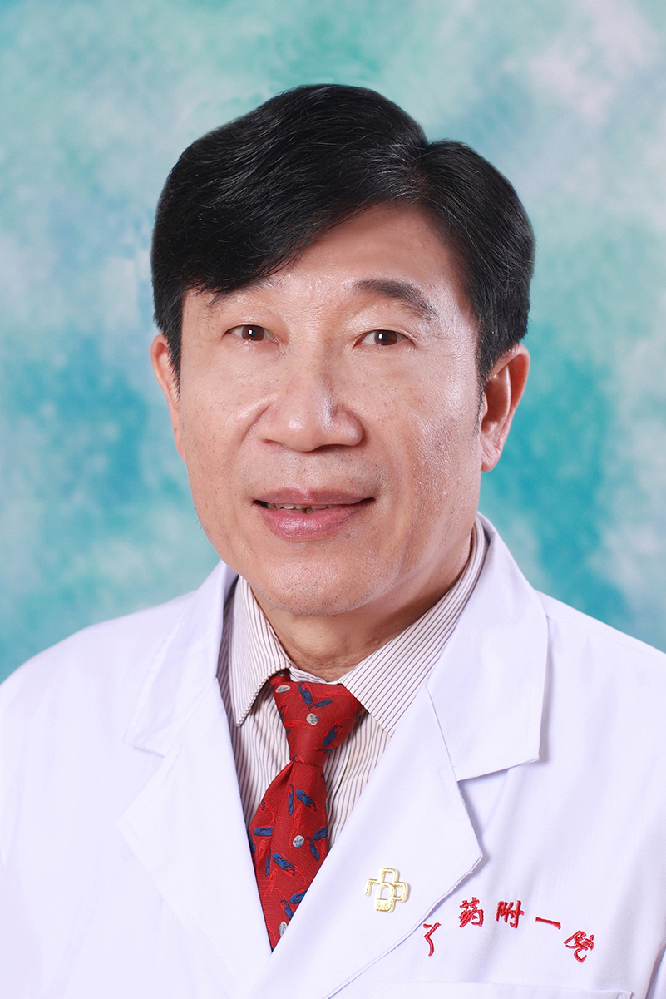

<!-- AUTO-GENERATED-BY: work/generate_obsidian_profiles.py -->

<!-- TEMPLATE: D:\workspace\信息收集整理\医生画像仓库\模板\医生画像模板.md -->

# 郑祥光

## 基础信息

| 字段 | 内容 |
|---|---|
| 姓名 | 郑祥光 |
| 医院 | 广东药科大学附属第一医院 |
| 科室 | 泌尿外科（农林门诊） |
| 职称/身份 | 教授，主任医师 |
| 来源链接 | [官网原文](https://www.gy120.net/articleshow.asp?articleid=377) |
| 采集日期 | 2026-08-15 |

## 简介/擅长

精通肾移植；肾、膀胱、前列腺肿瘤及其他泌尿生殖系统疾病的诊治

## 教育与进修经历

- 个人介绍：77级中山大学医学院毕业，后留校于中山大学附属第一医院任泌尿外科医师 1989年由卫生部公派于 美国密执安大学、费城宾州大学任研究员， 1996年美国医师考核通过获取美国医师资格证书 1998年回国受聘广东省人民医院， 曾任大外科副主任兼手术室主任，后于 2008 年起任泌尿外科主任，大外科主任等职 2015年12月起担任广东药学院附属第一医院泌尿外科主任 社会任职：广东医师协会泌尿外科分会副主任委员 广东省抗癌协会泌尿外科副主任委员 广东省手术室质量控制中心专家组组长

## 可包装亮点

- 个人介绍：77级中山大学医学院毕业，后留校于中山大学附属第一医院任泌尿外科医师 1989年由卫生部公派于 美国密执安大学、费城宾州大学任研究员， 1996年美国医师考核通过获取美国医师资格证书 1998年回国受聘广东省人民医院， 曾任大外科副主任兼手术室主任，后于 2008 年起任泌尿外科主任，大外科主任等职 2015年12月起担任广东药学院附属第一医院泌…

## 重点疾病/人群标签

- 慢性病：
- 肿瘤：肿瘤、癌、生殖
- 生殖疾病：肿瘤、癌、生殖
- 免疫/风湿：
- 术后恢复/康复：
- 疑难重症：

## 证据摘录

> 只摘录官网公开信息中的短句或关键字段，不复制大段原文。

- 官网身份字段：教授，主任医师
- 官网简介/擅长：精通肾移植；肾、膀胱、前列腺肿瘤及其他泌尿生殖系统疾病的诊治
- 官网亮眼经历线索：个人介绍：77级中山大学医学院毕业，后留校于中山大学附属第一医院任泌尿外科医师 1989年由卫生部公派于 美国密执安大学、费城宾州大学任研究员， 1996年美国医师考核通过获取美国医师资格证书 1998年回国受聘广东省人民医院， 曾任大外科副主任兼手术室主任，后于 2008 年起任泌尿外科主任，大外科主任等职 2015年12月起担任广东药学院附属第一医院泌尿外科主任 社会任职：广东医师协会泌尿外科分会副主任委员 广东省抗癌协会泌尿外科…
- 来源链接：https://www.gy120.net/articleshow.asp?articleid=377

## BD 画像摘要

郑祥光医生可作为肿瘤、生殖疾病方向的基础画像候选。后续 BD 使用应继续以官网来源和人工复核为准，不添加疗效承诺或无来源包装。

## 合规边界

- 仅使用医院官网、官方公众号、官方小程序等公开渠道。
- 不采集私人电话、私人微信、家庭住址、患者隐私或非公开排班信息。
- 不写“保证治愈”“疗效第一”“包治疑难杂症”等无法由官网证明的表述。
