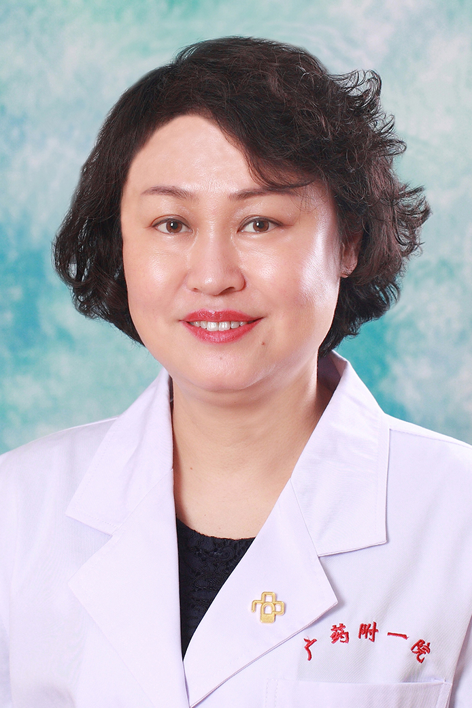

<!-- AUTO-GENERATED-BY: work/generate_obsidian_profiles.py -->

<!-- TEMPLATE: D:\workspace\信息收集整理\医生画像仓库\模板\医生画像模板.md -->

# 钱蔚珍

## 基础信息

| 字段 | 内容 |
|---|---|
| 姓名 | 钱蔚珍 |
| 医院 | 广东药科大学附属第一医院 |
| 科室 | 儿科（健康管理中心） |
| 职称/身份 | 副教授、副主任医师 |
| 来源链接 | [官网原文](https://www.gy120.net/articleshow.asp?articleid=167) |
| 采集日期 | 2026-08-15 |

## 简介/擅长

擅长于新生儿黄疸、早产儿、足月小样儿、母亲妊娠期糖尿病、甲状腺功能异常的孩子的学习困难、注意力缺陷多动症、抽动症、心理问题的干预及治疗

## 教育与进修经历

- 个人介绍：986 年 毕业于广州医学院 , 从事儿科 临床工作 2 9余年，现任广东药学院儿科副教授，广东药学院附属第一医院儿科副主任医师， 1993 年开始从事小儿神经专业，历经多种重大疾病的抢救及疑难疾病的诊治，参与了广东省儿童睡眠问题的调查与研究，常年轮转于儿科门急诊 、病房的工作 社会任职：广东省医师学会委员 广东省脑瘫协会委员 广东省中华儿科学会广东分会神经学组委员

## 可包装亮点

- 个人介绍：986 年 毕业于广州医学院 , 从事儿科 临床工作 2 9余年，现任广东药学院儿科副教授，广东药学院附属第一医院儿科副主任医师， 1993 年开始从事小儿神经专业，历经多种重大疾病的抢救及疑难疾病的诊治，参与了广东省儿童睡眠问题的调查与研究，常年轮转于儿科门急诊 、病房的工作 社会任职：广东省医师学会委员 广东省脑瘫协会委员 广东省中华儿科学会…

## 重点疾病/人群标签

- 慢性病：糖尿病、疑难
- 肿瘤：
- 生殖疾病：
- 免疫/风湿：
- 术后恢复/康复：
- 疑难重症：糖尿病、疑难

## 证据摘录

> 只摘录官网公开信息中的短句或关键字段，不复制大段原文。

- 官网身份字段：副教授、副主任医师
- 官网简介/擅长：擅长于新生儿黄疸、早产儿、足月小样儿、母亲妊娠期糖尿病、甲状腺功能异常的孩子的学习困难、注意力缺陷多动症、抽动症、心理问题的干预及治疗
- 官网亮眼经历线索：个人介绍：986 年 毕业于广州医学院 , 从事儿科 临床工作 2 9余年，现任广东药学院儿科副教授，广东药学院附属第一医院儿科副主任医师， 1993 年开始从事小儿神经专业，历经多种重大疾病的抢救及疑难疾病的诊治，参与了广东省儿童睡眠问题的调查与研究，常年轮转于儿科门急诊 、病房的工作 社会任职：广东省医师学会委员 广东省脑瘫协会委员 广东省中华儿科学会广东分会神经学组委员
- 来源链接：https://www.gy120.net/articleshow.asp?articleid=167

## BD 画像摘要

钱蔚珍医生可作为慢性病、疑难重症方向的基础画像候选。后续 BD 使用应继续以官网来源和人工复核为准，不添加疗效承诺或无来源包装。

## 合规边界

- 仅使用医院官网、官方公众号、官方小程序等公开渠道。
- 不采集私人电话、私人微信、家庭住址、患者隐私或非公开排班信息。
- 不写“保证治愈”“疗效第一”“包治疑难杂症”等无法由官网证明的表述。
