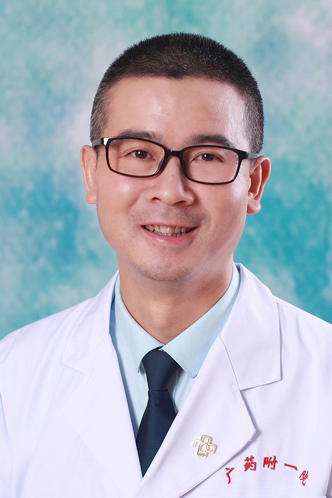

<!-- AUTO-GENERATED-BY: work/generate_obsidian_profiles.py -->

<!-- TEMPLATE: D:\workspace\信息收集整理\医生画像仓库\模板\医生画像模板.md -->

# 陈元良

## 基础信息

| 字段 | 内容 |
|---|---|
| 姓名 | 陈元良 |
| 医院 | 广东药科大学附属第一医院 |
| 科室 | 普外三科（整形美容科）（健康管理中心） |
| 职称/身份 | 副主任医师，副教授 |
| 来源链接 | [官网原文](https://www.gy120.net/articleshow.asp?articleid=237) |
| 采集日期 | 2026-08-15 |

## 简介/擅长

（一）脂肪整形 （二）乳房塑形。 （三）面部整形

## 教育与进修经历

- 个人介绍：1996年本科毕业于东南大学医学院，整形外科学硕士毕业于南方医科大学（原第一军医大学）研究生学院 毕业至今在广东药学院附属第一医院，历任整形外科住院医师，住院总医师，主治医师，副主任医师，并任广东药学院临床医学院副教授 从事整形美容外科十余年，临床经验丰富，富现代审美观，强调顾客的个性化需求，设计精巧，技术精湛，并一切以诚信和责任心作为前提 社会任职：广州市医学会整形外科分会常委 中国修复重建外科学会美容外科分会委员 科研与获奖：(1)广东省2012年医学科研基金立项课题《可降解聚酰胺微型骨内固定板钉系…

## 科研项目与成果

- 个人介绍：1996年本科毕业于东南大学医学院，整形外科学硕士毕业于南方医科大学（原第一军医大学）研究生学院 毕业至今在广东药学院附属第一医院，历任整形外科住院医师，住院总医师，主治医师，副主任医师，并任广东药学院临床医学院副教授 从事整形美容外科十余年，临床经验丰富，富现代审美观，强调顾客的个性化需求，设计精巧，技术精湛，并一切以诚信和责任心作为前提 社会任职：广州市医学会整形外科分会常委 中国修复重建外科学会美容外科分会委员 科研与获奖：(1)广东省2012年医学科研基金立项课题《可降解聚酰胺微型骨内固定板钉系…

## 可包装亮点

- 个人介绍：1996年本科毕业于东南大学医学院，整形外科学硕士毕业于南方医科大学（原第一军医大学）研究生学院 毕业至今在广东药学院附属第一医院，历任整形外科住院医师，住院总医师，主治医师，副主任医师，并任广东药学院临床医学院副教授 从事整形美容外科十余年，临床经验丰富，富现代审美观，强调顾客的个性化需求，设计精巧，技术精湛，并一切以诚信和责任心作为前提 社会…

## 重点疾病/人群标签

- 慢性病：
- 肿瘤：
- 生殖疾病：
- 免疫/风湿：
- 术后恢复/康复：
- 疑难重症：

## 证据摘录

> 只摘录官网公开信息中的短句或关键字段，不复制大段原文。

- 官网身份字段：副主任医师，副教授
- 官网简介/擅长：（一）脂肪整形 （二）乳房塑形。 （三）面部整形
- 官网亮眼经历线索：个人介绍：1996年本科毕业于东南大学医学院，整形外科学硕士毕业于南方医科大学（原第一军医大学）研究生学院 毕业至今在广东药学院附属第一医院，历任整形外科住院医师，住院总医师，主治医师，副主任医师，并任广东药学院临床医学院副教授 从事整形美容外科十余年，临床经验丰富，富现代审美观，强调顾客的个性化需求，设计精巧，技术精湛，并一切以诚信和责任心作为前提 社会任职：广州市医学会整形外科分会常委 中国修复重建外科学会美容外科分会委员 科研与…
- 来源链接：https://www.gy120.net/articleshow.asp?articleid=237

## BD 画像摘要

陈元良医生可作为广东药科大学附属第一医院普外三科（整形美容科）（健康管理中心）的基础医生资料入库。当前重点方向以总底表标签为准，官网未展示的信息保持空白。

## 合规边界

- 仅使用医院官网、官方公众号、官方小程序等公开渠道。
- 不采集私人电话、私人微信、家庭住址、患者隐私或非公开排班信息。
- 不写“保证治愈”“疗效第一”“包治疑难杂症”等无法由官网证明的表述。
