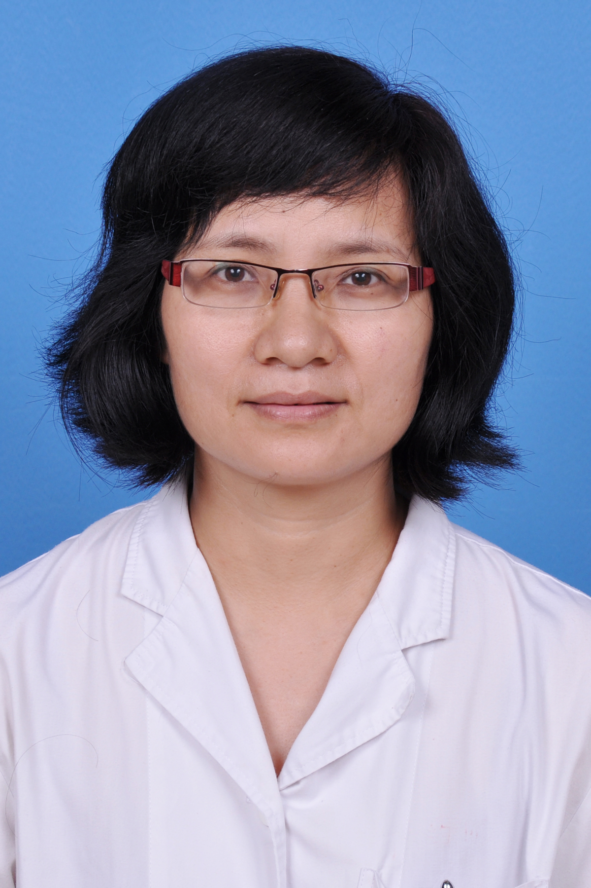

<!-- AUTO-GENERATED-BY: work/generate_obsidian_profiles.py -->

<!-- TEMPLATE: D:\workspace\信息收集整理\医生画像仓库\模板\医生画像模板.md -->

# 陈少莲

## 基础信息

| 字段 | 内容 |
|---|---|
| 姓名 | 陈少莲 |
| 医院 | 广东药科大学附属第一医院 |
| 科室 | 检验科 |
| 职称/身份 | 副主任技师 |
| 来源链接 | [官网原文](https://www.gy120.net/articleshow.asp?articleid=349) |
| 采集日期 | 2026-08-15 |

## 简介/擅长

研究方向：生化检验技术方向 临床生化检验以及检验报告解读

## 教育与进修经历

- 个人介绍：1983年毕业于南京铁道医学院（现东南大学），从医20多年，有丰富的临床检验经验，在临床生化检验专业方向有较深的造诣。

## 科研项目与成果

- 社会任职：在多个学会任委员或常委 科研与获奖：主持或参与了多个科研课题。

## 可包装亮点

- 社会任职：在多个学会任委员或常委 科研与获奖：主持或参与了多个科研课题。

## 重点疾病/人群标签

- 慢性病：
- 肿瘤：
- 生殖疾病：
- 免疫/风湿：
- 术后恢复/康复：
- 疑难重症：

## 证据摘录

> 只摘录官网公开信息中的短句或关键字段，不复制大段原文。

- 官网身份字段：副主任技师
- 官网简介/擅长：研究方向：生化检验技术方向 临床生化检验以及检验报告解读
- 官网亮眼经历线索：社会任职：在多个学会任委员或常委 科研与获奖：主持或参与了多个科研课题。
- 来源链接：https://www.gy120.net/articleshow.asp?articleid=349

## BD 画像摘要

陈少莲医生可作为广东药科大学附属第一医院检验科的基础医生资料入库。当前重点方向以总底表标签为准，官网未展示的信息保持空白。

## 合规边界

- 仅使用医院官网、官方公众号、官方小程序等公开渠道。
- 不采集私人电话、私人微信、家庭住址、患者隐私或非公开排班信息。
- 不写“保证治愈”“疗效第一”“包治疑难杂症”等无法由官网证明的表述。
