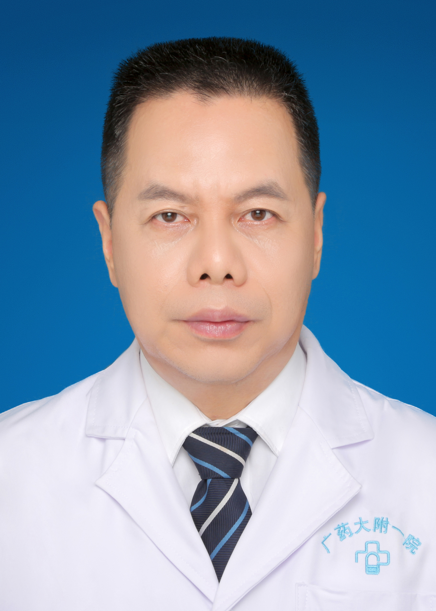

<!-- AUTO-GENERATED-BY: work/generate_obsidian_profiles.py -->

<!-- TEMPLATE: D:\workspace\信息收集整理\医生画像仓库\模板\医生画像模板.md -->

# 陈建颜

## 基础信息

| 字段 | 内容 |
|---|---|
| 姓名 | 陈建颜 |
| 医院 | 广东药科大学附属第一医院 |
| 科室 | 麻醉科 |
| 职称/身份 | 主任医师、教授 、博士 |
| 来源链接 | [官网原文](https://www.gy120.net/articleshow.asp?articleid=475) |
| 采集日期 | 2026-08-15 |

## 简介/擅长

主要从事临床麻醉和疼痛诊疗中有关危重疑难病人的麻醉实施和急性疼痛诊治工作，具有丰富的临床经验，擅长心血管疾病病人、器官移植病人的围术期麻醉管理。科研及教学经验丰富，主要研究方向为肿瘤麻醉与肿瘤免疫，在国内外发表文章三十余篇，单篇SCI影响因子最高达5.008，拥有2项国家级实用新型专利。

## 可包装亮点

- 官网目录标注：科室负责人；
- 社会任职：广东省医学会麻醉学分会委员 广东省药学会麻醉专家委员会委员 广东省妇幼保健协会麻醉与镇痛专业委员会委员

## 重点疾病/人群标签

- 慢性病：
- 肿瘤：肿瘤、免疫、疼痛、疑难、危重
- 生殖疾病：
- 免疫/风湿：肿瘤、免疫、疼痛、疑难、危重
- 术后恢复/康复：肿瘤、免疫、疼痛、疑难、危重
- 疑难重症：肿瘤、免疫、疼痛、疑难、危重

## 证据摘录

> 只摘录官网公开信息中的短句或关键字段，不复制大段原文。

- 官网身份字段：主任医师、教授 、博士
- 官网简介/擅长：主要从事临床麻醉和疼痛诊疗中有关危重疑难病人的麻醉实施和急性疼痛诊治工作，具有丰富的临床经验，擅长心血管疾病病人、器官移植病人的围术期麻醉管理。科研及教学经验丰富，主要研究方向为肿瘤麻醉与肿瘤免疫，在国内外发表文章三十余篇，单篇SCI影响因子最高达5.008，拥有2项国家级实用新型专利。
- 官网亮眼经历线索：官网目录标注：科室负责人；社会任职：广东省医学会麻醉学分会委员 广东省药学会麻醉专家委员会委员 广东省妇幼保健协会麻醉与镇痛专业委员会委员
- 来源链接：https://www.gy120.net/articleshow.asp?articleid=475

## BD 画像摘要

陈建颜医生可作为肿瘤、免疫/风湿/感染、术后恢复/康复、疑难重症方向的基础画像候选。后续 BD 使用应继续以官网来源和人工复核为准，不添加疗效承诺或无来源包装。

## 合规边界

- 仅使用医院官网、官方公众号、官方小程序等公开渠道。
- 不采集私人电话、私人微信、家庭住址、患者隐私或非公开排班信息。
- 不写“保证治愈”“疗效第一”“包治疑难杂症”等无法由官网证明的表述。
