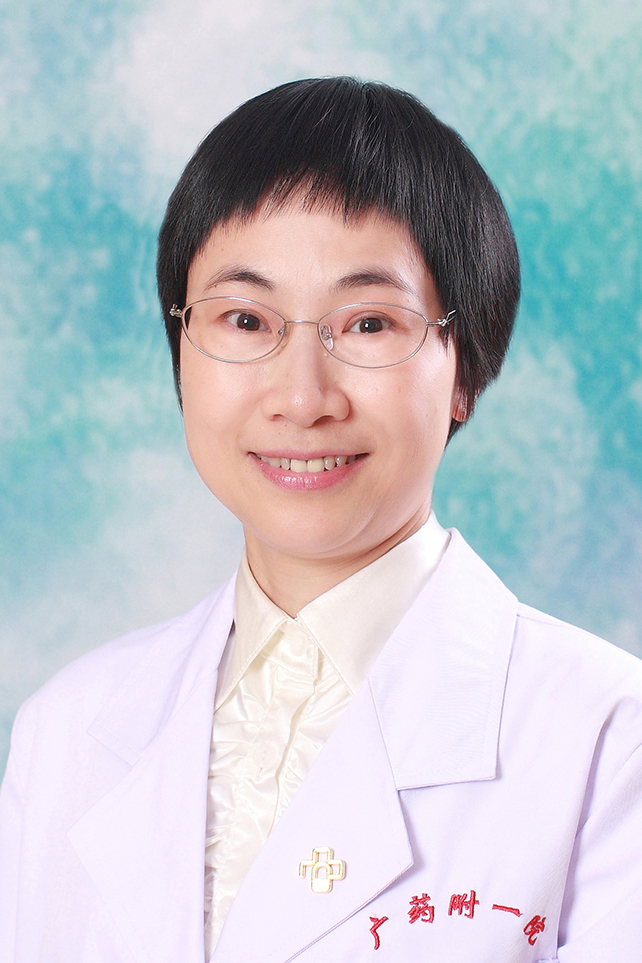

<!-- AUTO-GENERATED-BY: work/generate_obsidian_profiles.py -->

<!-- TEMPLATE: D:\workspace\信息收集整理\医生画像仓库\模板\医生画像模板.md -->

# 陈慧芝

## 基础信息

| 字段 | 内容 |
|---|---|
| 姓名 | 陈慧芝 |
| 医院 | 广东药科大学附属第一医院 |
| 科室 | 口腔科（农林门诊） |
| 职称/身份 | 副教授 、副主任医师 |
| 来源链接 | [官网原文](https://www.gy120.net/articleshow.asp?articleid=288) |
| 采集日期 | 2026-08-15 |

## 简介/擅长

活动及固定义齿修复、牙体牙髓病、老年口腔疾病、儿童牙病等。

## 教育与进修经历

- 个人介绍：1994年毕业于中山医科大学口腔医学专业本科，毕业后一直从事口腔科专业临床、科研和教学工作，临床工作经验丰富，尤其擅长活动及固定义齿修复、牙体牙髓病、老年口腔疾病、儿童牙病等专科。

## 科研项目与成果

- 个人介绍：1994年毕业于中山医科大学口腔医学专业本科，毕业后一直从事口腔科专业临床、科研和教学工作，临床工作经验丰富，尤其擅长活动及固定义齿修复、牙体牙髓病、老年口腔疾病、儿童牙病等专科。
- 2、 承担（或参与）省厅级科研课题三项；
- 参与的项目曾获得省级科技进步二等奖。

## 论文与学术产出

- 社会任职：广东省口腔医学会老年口腔医学专业委员会委员 广东省妇幼保健协会儿童口腔专业委员会委员 主要论著：1、陈慧芝等（第三作者）Hero镍钛机动根管锉在下颌磨牙C形根管预备中的应用，中山大学学报，2004，25（7）：135-136（国家级核心期刊） 2、陈慧芝等（第一作者） 携带1L-B等位基因2牙周炎患者基础治疗后牙周可疑致病菌的变化，中山大学学报，2007，28（2）：175-179（国家级核心期刊） 3、陈慧芝等（第一作者） 原发性干燥综合症23例临床分析，热带医学，2008,1，8（1）：54-55（…

## 可包装亮点

- 社会任职：广东省口腔医学会老年口腔医学专业委员会委员 广东省妇幼保健协会儿童口腔专业委员会委员 主要论著：1、陈慧芝等（第三作者）Hero镍钛机动根管锉在下颌磨牙C形根管预备中的应用，中山大学学报，2004，25（7）：135-136（国家级核心期刊） 2、陈慧芝等（第一作者） 携带1L-B等位基因2牙周炎患者基础治疗后牙周可疑致病菌的变化，中山大学学报…

## 重点疾病/人群标签

- 慢性病：
- 肿瘤：
- 生殖疾病：
- 免疫/风湿：
- 术后恢复/康复：
- 疑难重症：

## 证据摘录

> 只摘录官网公开信息中的短句或关键字段，不复制大段原文。

- 官网身份字段：副教授 、副主任医师
- 官网简介/擅长：活动及固定义齿修复、牙体牙髓病、老年口腔疾病、儿童牙病等。
- 官网亮眼经历线索：社会任职：广东省口腔医学会老年口腔医学专业委员会委员 广东省妇幼保健协会儿童口腔专业委员会委员 主要论著：1、陈慧芝等（第三作者）Hero镍钛机动根管锉在下颌磨牙C形根管预备中的应用，中山大学学报，2004，25（7）：135-136（国家级核心期刊） 2、陈慧芝等（第一作者） 携带1L-B等位基因2牙周炎患者基础治疗后牙周可疑致病菌的变化，中山大学学报，2007，28（2）：175-179（国家级核心期刊） 3、陈慧芝等（第一作者）…
- 来源链接：https://www.gy120.net/articleshow.asp?articleid=288

## BD 画像摘要

陈慧芝医生可作为广东药科大学附属第一医院口腔科（农林门诊）的基础医生资料入库。当前重点方向以总底表标签为准，官网未展示的信息保持空白。

## 合规边界

- 仅使用医院官网、官方公众号、官方小程序等公开渠道。
- 不采集私人电话、私人微信、家庭住址、患者隐私或非公开排班信息。
- 不写“保证治愈”“疗效第一”“包治疑难杂症”等无法由官网证明的表述。
