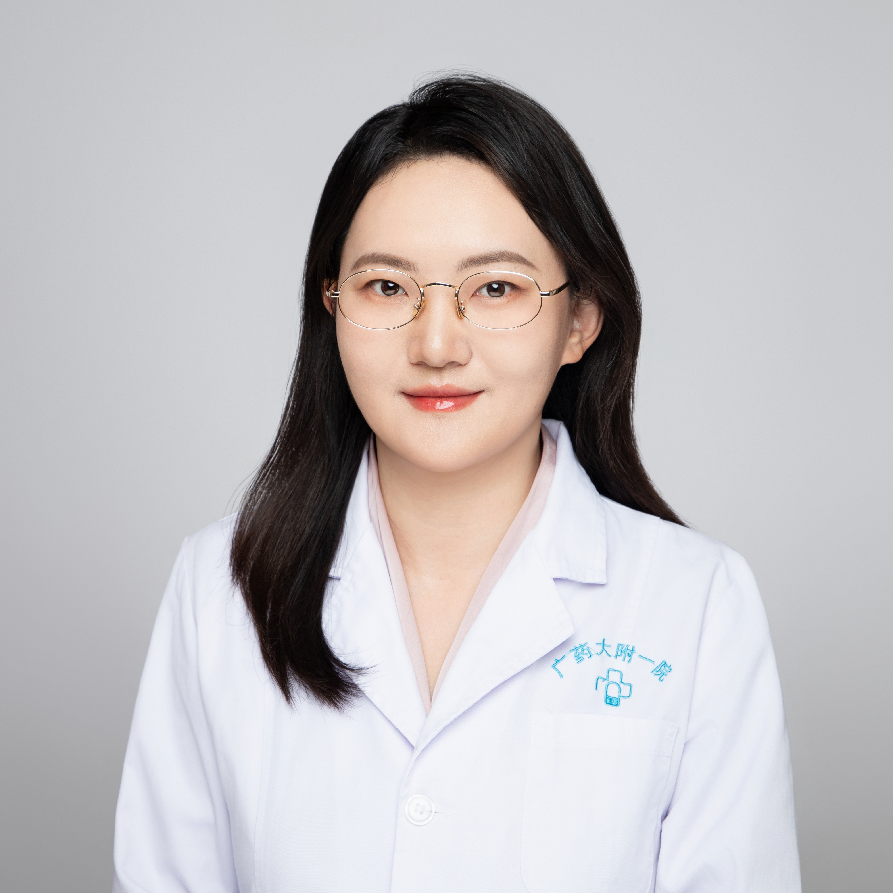

<!-- AUTO-GENERATED-BY: work/generate_obsidian_profiles.py -->

<!-- TEMPLATE: D:\workspace\信息收集整理\医生画像仓库\模板\医生画像模板.md -->

# 陈滢宇

## 基础信息

| 字段 | 内容 |
|---|---|
| 姓名 | 陈滢宇 |
| 医院 | 广东药科大学附属第一医院 |
| 科室 | 中西医结合代谢病科（健康管理中心） |
| 职称/身份 | 医学博士，主治医师 |
| 来源链接 | [官网原文](https://www.gy120.net/articleshow.asp?articleid=317) |
| 采集日期 | 2026-08-15 |

## 简介/擅长

倡导“中医治未病”，擅长中西医结合防治肥胖、糖尿病、高脂血症、脂肪肝、高血压、心脑血管等糖脂代谢病，中医药联合针灸治疗失眠、胃肠炎、小儿脾虚咳喘、月经不调、慢性疼痛等。

## 科研项目与成果

- 曾参与国家"十一五"科技重大专项、国家自然科学基金项目及中法国际合作项目， 长期从事中医药防治糖脂代谢病临床和临床基础研究，发表研究论文10余篇，其中SCI三篇，主持广东省中医药管理局项目一项，参与国家、省部级课题5项 。

## 论文与学术产出

- 曾参与国家"十一五"科技重大专项、国家自然科学基金项目及中法国际合作项目， 长期从事中医药防治糖脂代谢病临床和临床基础研究，发表研究论文10余篇，其中SCI三篇，主持广东省中医药管理局项目一项，参与国家、省部级课题5项 。
- 曾荣获“2013年全国中医药博士论坛——中医学理论的传承与创新征文”一等奖，“2014年第五届全国中医药博士生优秀论文评选”三等奖。

## 可包装亮点

- 个人介绍：2004.9- 2009.6 广州中医药大学 针灸推拿学专业 本科 2009.9 - 2014.6 广州中医药大学 中医临床基础专业 博士（硕博连读） 2014.7 - 至今 广东药学院附属第一医院 中医科 主治医师 社会任职：世界中医药联合会代谢病专业委员会委员 广东省中西医结合学会代谢病专业委员会成员 广东代谢病中西医结合研究中心临床部秘书…

## 重点疾病/人群标签

- 慢性病：高血压、糖尿病、高脂血症、慢性、代谢、月经、感染、免疫功能、疼痛、多学科
- 肿瘤：
- 生殖疾病：高血压、糖尿病、高脂血症、慢性、代谢、月经、感染、免疫功能、疼痛、多学科
- 免疫/风湿：高血压、糖尿病、高脂血症、慢性、代谢、月经、感染、免疫功能、疼痛、多学科
- 术后恢复/康复：高血压、糖尿病、高脂血症、慢性、代谢、月经、感染、免疫功能、疼痛、多学科
- 疑难重症：高血压、糖尿病、高脂血症、慢性、代谢、月经、感染、免疫功能、疼痛、多学科

## 证据摘录

> 只摘录官网公开信息中的短句或关键字段，不复制大段原文。

- 官网身份字段：医学博士，主治医师
- 官网简介/擅长：倡导“中医治未病”，擅长中西医结合防治肥胖、糖尿病、高脂血症、脂肪肝、高血压、心脑血管等糖脂代谢病，中医药联合针灸治疗失眠、胃肠炎、小儿脾虚咳喘、月经不调、慢性疼痛等。
- 官网亮眼经历线索：个人介绍：2004.9- 2009.6 广州中医药大学 针灸推拿学专业 本科 2009.9 - 2014.6 广州中医药大学 中医临床基础专业 博士（硕博连读） 2014.7 - 至今 广东药学院附属第一医院 中医科 主治医师 社会任职：世界中医药联合会代谢病专业委员会委员 广东省中西医结合学会代谢病专业委员会成员 广东代谢病中西医结合研究中心临床部秘书 广东药科大学附属第一医院中医老年病专业GCP秘书 广东省中西医结合学会代谢病专业…
- 来源链接：https://www.gy120.net/articleshow.asp?articleid=317

## BD 画像摘要

陈滢宇医生可作为慢性病、生殖疾病、免疫/风湿/感染、术后恢复/康复、疑难重症方向的基础画像候选。后续 BD 使用应继续以官网来源和人工复核为准，不添加疗效承诺或无来源包装。

## 合规边界

- 仅使用医院官网、官方公众号、官方小程序等公开渠道。
- 不采集私人电话、私人微信、家庭住址、患者隐私或非公开排班信息。
- 不写“保证治愈”“疗效第一”“包治疑难杂症”等无法由官网证明的表述。
