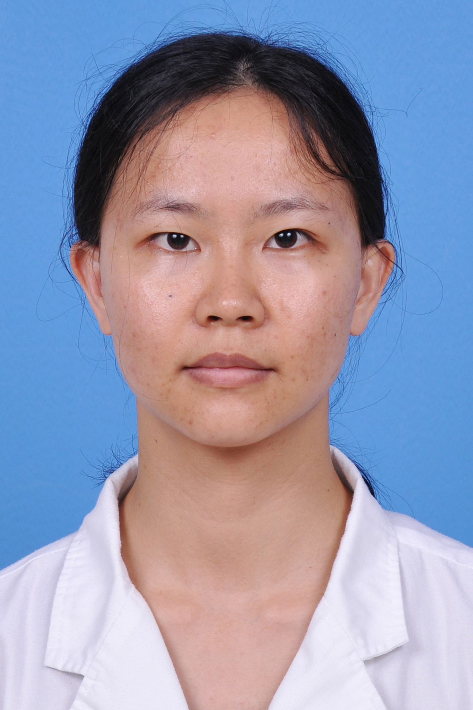

<!-- AUTO-GENERATED-BY: work/generate_obsidian_profiles.py -->

<!-- TEMPLATE: D:\workspace\信息收集整理\医生画像仓库\模板\医生画像模板.md -->

# 陈碧珊

## 基础信息

| 字段 | 内容 |
|---|---|
| 姓名 | 陈碧珊 |
| 医院 | 广东药科大学附属第一医院 |
| 科室 | 药学部（农林门诊） |
| 职称/身份 | 副主任药师 |
| 来源链接 | [官网原文](https://www.gy120.net/articleshow.asp?articleid=299) |
| 采集日期 | 2026-08-15 |

## 简介/擅长

从事医院药学工作十年，有一定的医院药事管理经验，熟悉心血管系统疾病的药物应用。

## 教育与进修经历

- 个人介绍：本人毕业就职后，一直从事药学相关工作，轮转过住院药房、门急诊药房、制剂室、西药库、药品采购等岗位，熟练掌握药品信息和相关法律法规。

## 论文与学术产出

- 作为编委参编专著1部，以第一作者发表论文3篇。

## 可包装亮点

- 作为编委参编专著1部，以第一作者发表论文3篇。

## 重点疾病/人群标签

- 慢性病：高血压、冠心病、心力衰竭、高脂血症、感染、康复
- 肿瘤：
- 生殖疾病：
- 免疫/风湿：高血压、冠心病、心力衰竭、高脂血症、感染、康复
- 术后恢复/康复：高血压、冠心病、心力衰竭、高脂血症、感染、康复
- 疑难重症：

## 证据摘录

> 只摘录官网公开信息中的短句或关键字段，不复制大段原文。

- 官网身份字段：副主任药师
- 官网简介/擅长：从事医院药学工作十年，有一定的医院药事管理经验，熟悉心血管系统疾病的药物应用。
- 官网亮眼经历线索：作为编委参编专著1部，以第一作者发表论文3篇。
- 来源链接：https://www.gy120.net/articleshow.asp?articleid=299

## BD 画像摘要

陈碧珊医生可作为慢性病、免疫/风湿/感染、术后恢复/康复方向的基础画像候选。后续 BD 使用应继续以官网来源和人工复核为准，不添加疗效承诺或无来源包装。

## 合规边界

- 仅使用医院官网、官方公众号、官方小程序等公开渠道。
- 不采集私人电话、私人微信、家庭住址、患者隐私或非公开排班信息。
- 不写“保证治愈”“疗效第一”“包治疑难杂症”等无法由官网证明的表述。
