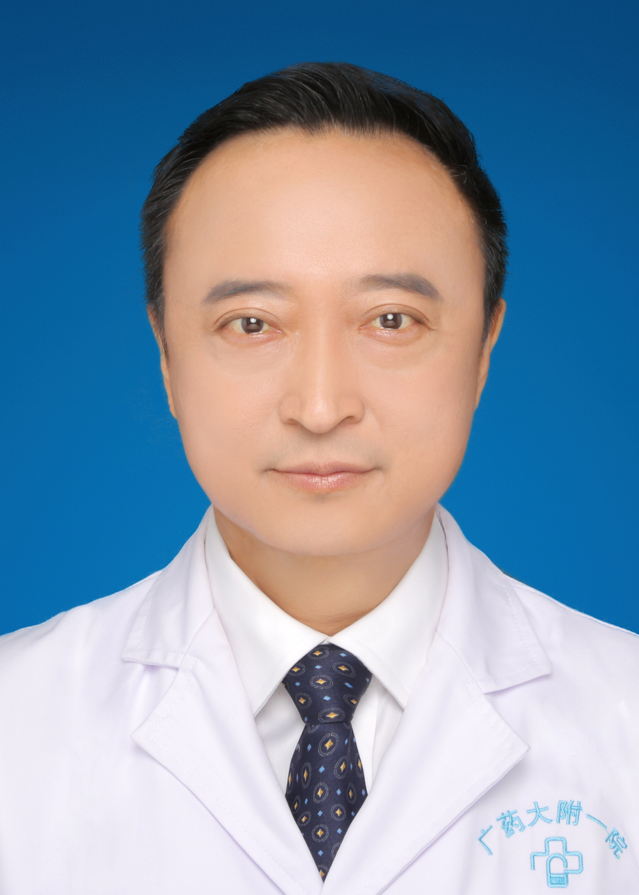

<!-- AUTO-GENERATED-BY: work/generate_obsidian_profiles.py -->

<!-- TEMPLATE: D:\workspace\信息收集整理\医生画像仓库\模板\医生画像模板.md -->

# 马翔

## 基础信息

| 字段 | 内容 |
|---|---|
| 姓名 | 马翔 |
| 医院 | 广东药科大学附属第一医院 |
| 科室 | 麻醉科 |
| 职称/身份 | 副主任医师 、副教授 、麻醉学硕士 |
| 来源链接 | [官网原文](https://www.gy120.net/articleshow.asp?articleid=185) |
| 采集日期 | 2026-08-15 |

## 简介/擅长

从事临床麻醉工作及临床医学教育20余年，对急危重患者的麻醉管理工作有着丰富的经验，擅长神经外科手术、心胸外科手术及婴幼儿的围手术期管理。

## 教育与进修经历

- 个人介绍：从事本专业近 20 年， 2009 年取得中山大学硕士学位。

## 科研项目与成果

- 社会任职：广东省医师协会麻醉分会委员 广东省医学教育协会麻醉学分会委员 广东省抗癌协会肿瘤麻醉与镇痛治疗专业委会委员 科研与获奖：参与多项科研课题，发表学术论文 7 篇

## 论文与学术产出

- 社会任职：广东省医师协会麻醉分会委员 广东省医学教育协会麻醉学分会委员 广东省抗癌协会肿瘤麻醉与镇痛治疗专业委会委员 科研与获奖：参与多项科研课题，发表学术论文 7 篇

## 可包装亮点

- 社会任职：广东省医师协会麻醉分会委员 广东省医学教育协会麻醉学分会委员 广东省抗癌协会肿瘤麻醉与镇痛治疗专业委会委员 科研与获奖：参与多项科研课题，发表学术论文 7 篇

## 重点疾病/人群标签

- 慢性病：
- 肿瘤：肿瘤、癌、急危重
- 生殖疾病：
- 免疫/风湿：
- 术后恢复/康复：
- 疑难重症：肿瘤、癌、急危重

## 证据摘录

> 只摘录官网公开信息中的短句或关键字段，不复制大段原文。

- 官网身份字段：副主任医师 、副教授 、麻醉学硕士
- 官网简介/擅长：从事临床麻醉工作及临床医学教育20余年，对急危重患者的麻醉管理工作有着丰富的经验，擅长神经外科手术、心胸外科手术及婴幼儿的围手术期管理。
- 官网亮眼经历线索：社会任职：广东省医师协会麻醉分会委员 广东省医学教育协会麻醉学分会委员 广东省抗癌协会肿瘤麻醉与镇痛治疗专业委会委员 科研与获奖：参与多项科研课题，发表学术论文 7 篇
- 来源链接：https://www.gy120.net/articleshow.asp?articleid=185

## BD 画像摘要

马翔医生可作为肿瘤、疑难重症方向的基础画像候选。后续 BD 使用应继续以官网来源和人工复核为准，不添加疗效承诺或无来源包装。

## 合规边界

- 仅使用医院官网、官方公众号、官方小程序等公开渠道。
- 不采集私人电话、私人微信、家庭住址、患者隐私或非公开排班信息。
- 不写“保证治愈”“疗效第一”“包治疑难杂症”等无法由官网证明的表述。
