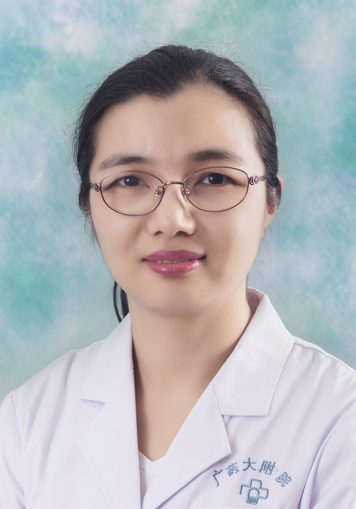

<!-- AUTO-GENERATED-BY: work/generate_obsidian_profiles.py -->

<!-- TEMPLATE: D:\workspace\信息收集整理\医生画像仓库\模板\医生画像模板.md -->

# 骆婕

## 基础信息

| 字段 | 内容 |
|---|---|
| 姓名 | 骆婕 |
| 医院 | 广东药科大学附属第一医院 |
| 科室 | 妇产科（农林门诊） |
| 职称/身份 | 主任医师、硕士研究生导师 |
| 来源链接 | [官网原文](https://www.gy120.net/articleshow.asp?articleid=387) |
| 采集日期 | 2026-08-15 |

## 简介/擅长

擅长妇科腹腔镜、单孔腹腔镜、宫腔镜等微创技术，在腹腔镜下治疗各类卵巢囊肿、子宫内膜异位症、子宫腺肌病、子宫肌瘤、妇科恶性肿瘤、盆底功能障碍性疾病，压力性尿失禁；在宫腔镜下诊治各类宫内疾病以及开腹、阴式手术均有丰富的经验。尤其擅长妇科子宫肌瘤、子宫颈癌、卵巢癌、子宫内膜癌等良恶性肿瘤的复杂疑难手术

## 科研项目与成果

- 科研与获奖：参加省厅及课题 3 项，主持院内课题 1 项。

## 论文与学术产出

- 尤其擅长妇科子宫肌瘤、子宫颈癌、卵巢癌、子宫内膜癌等良恶性肿瘤的复杂疑难手术，在国内外学术期刊发表论文20余篇，主要研究方向为子宫内膜异位症的发病机理及卵巢癌的新诊治方法探索。

## 可包装亮点

- 官网目录标注：科室负责人；
- 尤其擅长妇科子宫肌瘤、子宫颈癌、卵巢癌、子宫内膜癌等良恶性肿瘤的复杂疑难手术，在国内外学术期刊发表论文20余篇，主要研究方向为子宫内膜异位症的发病机理及卵巢癌的新诊治方法探索。
- 2025年获得羊城晚报“妙手仁心美医生”奖。
- 社会任职：中国优生优育协会妇幼健康技术专委会常务委员；
- 广州市女医师协会第六届理事会副秘书长

## 重点疾病/人群标签

- 慢性病：
- 肿瘤：肿瘤、癌、瘤、生殖、卵巢、功能障碍、疑难、复杂
- 生殖疾病：肿瘤、癌、瘤、生殖、卵巢、功能障碍、疑难、复杂
- 免疫/风湿：
- 术后恢复/康复：肿瘤、癌、瘤、生殖、卵巢、功能障碍、疑难、复杂
- 疑难重症：肿瘤、癌、瘤、生殖、卵巢、功能障碍、疑难、复杂

## 证据摘录

> 只摘录官网公开信息中的短句或关键字段，不复制大段原文。

- 官网身份字段：主任医师、硕士研究生导师
- 官网简介/擅长：擅长妇科腹腔镜、单孔腹腔镜、宫腔镜等微创技术，在腹腔镜下治疗各类卵巢囊肿、子宫内膜异位症、子宫腺肌病、子宫肌瘤、妇科恶性肿瘤、盆底功能障碍性疾病，压力性尿失禁；在宫腔镜下诊治各类宫内疾病以及开腹、阴式手术均有丰富的经验。尤其擅长妇科子宫肌瘤、子宫颈癌、卵巢癌、子宫内膜癌等良恶性肿瘤的复杂疑难手术
- 官网亮眼经历线索：官网目录标注：科室负责人；尤其擅长妇科子宫肌瘤、子宫颈癌、卵巢癌、子宫内膜癌等良恶性肿瘤的复杂疑难手术，在国内外学术期刊发表论文20余篇，主要研究方向为子宫内膜异位症的发病机理及卵巢癌的新诊治方法探索。 2025年获得羊城晚报“妙手仁心美医生”奖。 社会任职：中国优生优育协会妇幼健康技术专委会常务委员； 广州市女医师协会第六届理事会副秘书长
- 来源链接：https://www.gy120.net/articleshow.asp?articleid=387

## BD 画像摘要

骆婕医生可作为肿瘤、生殖疾病、术后恢复/康复、疑难重症方向的基础画像候选。后续 BD 使用应继续以官网来源和人工复核为准，不添加疗效承诺或无来源包装。

## 合规边界

- 仅使用医院官网、官方公众号、官方小程序等公开渠道。
- 不采集私人电话、私人微信、家庭住址、患者隐私或非公开排班信息。
- 不写“保证治愈”“疗效第一”“包治疑难杂症”等无法由官网证明的表述。
