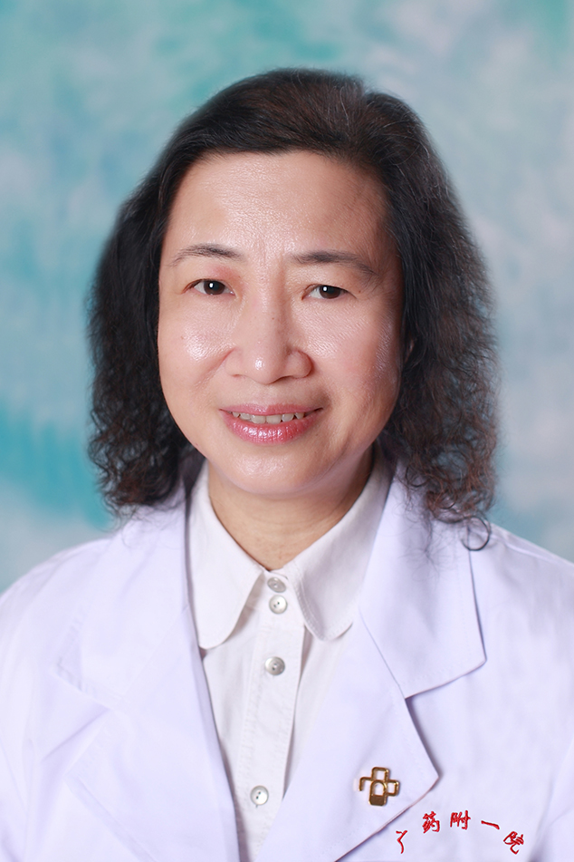

<!-- AUTO-GENERATED-BY: work/generate_obsidian_profiles.py -->

<!-- TEMPLATE: D:\workspace\信息收集整理\医生画像仓库\模板\医生画像模板.md -->

# 黄华

## 基础信息

| 字段 | 内容 |
|---|---|
| 姓名 | 黄华 |
| 医院 | 广东药科大学附属第一医院 |
| 科室 | 肾内科（健康管理中心） |
| 职称/身份 | 副教授、副主任医师 |
| 来源链接 | [官网原文](https://www.gy120.net/articleshow.asp?articleid=62) |
| 采集日期 | 2026-08-15 |

## 简介/擅长

擅长各种肾脏病的诊治。如肾病综合症、肾性高血压、泌尿系感染、急慢性肾功能衰竭的非透析疗法和血液净化疗法。掌握各种肾科专业操作。如肾活检术、深静脉置管术、腹膜透析置管术、血液透析等。

## 教育与进修经历

- 个人介绍：1986年毕业于中山大学，一直在临床一线工作 1993年起从事肾内科工作，1999年聘为副主任医师 曾在中山大学附属医院肾内科专科进修班学习 社会任职：广东省医学会肾脏病分会委员 广东省医师协会肾脏内科医师分会委员 主要论著：曾发表多篇学术论文。

## 科研项目与成果

- 科研与获奖：“甘露醇腹透液临床应用”获省科技进步三等奖

## 论文与学术产出

- 个人介绍：1986年毕业于中山大学，一直在临床一线工作 1993年起从事肾内科工作，1999年聘为副主任医师 曾在中山大学附属医院肾内科专科进修班学习 社会任职：广东省医学会肾脏病分会委员 广东省医师协会肾脏内科医师分会委员 主要论著：曾发表多篇学术论文。

## 可包装亮点

- 个人介绍：1986年毕业于中山大学，一直在临床一线工作 1993年起从事肾内科工作，1999年聘为副主任医师 曾在中山大学附属医院肾内科专科进修班学习 社会任职：广东省医学会肾脏病分会委员 广东省医师协会肾脏内科医师分会委员 主要论著：曾发表多篇学术论文。
- 科研与获奖：“甘露醇腹透液临床应用”获省科技进步三等奖

## 重点疾病/人群标签

- 慢性病：高血压、慢性、化疗、感染
- 肿瘤：高血压、慢性、化疗、感染
- 生殖疾病：
- 免疫/风湿：高血压、慢性、化疗、感染
- 术后恢复/康复：
- 疑难重症：

## 证据摘录

> 只摘录官网公开信息中的短句或关键字段，不复制大段原文。

- 官网身份字段：副教授、副主任医师
- 官网简介/擅长：擅长各种肾脏病的诊治。如肾病综合症、肾性高血压、泌尿系感染、急慢性肾功能衰竭的非透析疗法和血液净化疗法。掌握各种肾科专业操作。如肾活检术、深静脉置管术、腹膜透析置管术、血液透析等。
- 官网亮眼经历线索：个人介绍：1986年毕业于中山大学，一直在临床一线工作 1993年起从事肾内科工作，1999年聘为副主任医师 曾在中山大学附属医院肾内科专科进修班学习 社会任职：广东省医学会肾脏病分会委员 广东省医师协会肾脏内科医师分会委员 主要论著：曾发表多篇学术论文。 科研与获奖：“甘露醇腹透液临床应用”获省科技进步三等奖
- 来源链接：https://www.gy120.net/articleshow.asp?articleid=62

## BD 画像摘要

黄华医生可作为慢性病、肿瘤、免疫/风湿/感染方向的基础画像候选。后续 BD 使用应继续以官网来源和人工复核为准，不添加疗效承诺或无来源包装。

## 合规边界

- 仅使用医院官网、官方公众号、官方小程序等公开渠道。
- 不采集私人电话、私人微信、家庭住址、患者隐私或非公开排班信息。
- 不写“保证治愈”“疗效第一”“包治疑难杂症”等无法由官网证明的表述。
