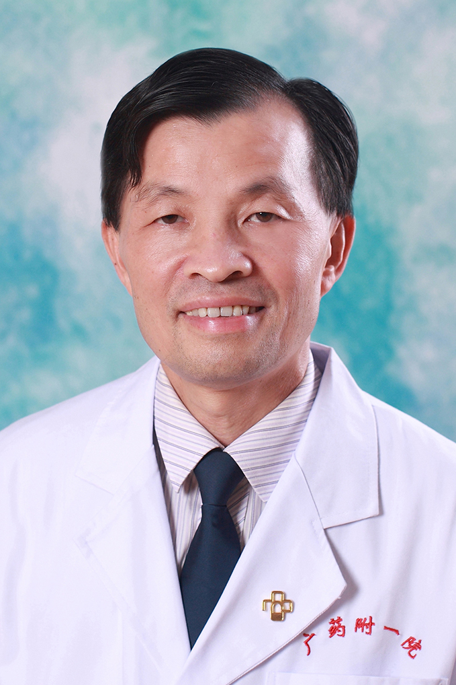

<!-- AUTO-GENERATED-BY: work/generate_obsidian_profiles.py -->

<!-- TEMPLATE: D:\workspace\信息收集整理\医生画像仓库\模板\医生画像模板.md -->

# 黄壮荣

## 基础信息

| 字段 | 内容 |
|---|---|
| 姓名 | 黄壮荣 |
| 医院 | 广东药科大学附属第一医院 |
| 科室 | 心胸外科（农林门诊） |
| 职称/身份 | 教授、主任医师 |
| 来源链接 | [官网原文](https://www.gy120.net/articleshow.asp?articleid=105) |
| 采集日期 | 2026-08-15 |

## 简介/擅长

纵膈肿瘤、肺癌、食管癌的外科诊断和治疗，特别是微创胸腔镜治疗、先天性心脏病、风湿性心脏病的外科手术治疗、胸心外科各种疾病的围术期处理，重型胸部外伤及复合伤的抢救治疗。

## 教育与进修经历

- 个人介绍：1.1987.7-1988.8 广州铁路中心医院见习医师（内、外科各半年） 2.1989.5-1989.11 中山大学附属第一医院胸心外科ICU进修 3.1992.1-1993.1 中山大学附属第一医院胸心外科进修 4.1988.8-1994.3 广州铁路中心医院胸心外科住院医师 5.1994．4-2005.6 广州铁路中心医院胸心外科主治医师 6.2005.7-2014.12 广东药学院附属第一医院胸心外科副主任医师 7.2015.1-2015.3 中山大学附属肿瘤医院胸外科学习胸腔镜外科 8.201…

## 可包装亮点

- 个人介绍：1.1987.7-1988.8 广州铁路中心医院见习医师（内、外科各半年） 2.1989.5-1989.11 中山大学附属第一医院胸心外科ICU进修 3.1992.1-1993.1 中山大学附属第一医院胸心外科进修 4.1988.8-1994.3 广州铁路中心医院胸心外科住院医师 5.1994．4-2005.6 广州铁路中心医院胸心外科主治医师…

## 重点疾病/人群标签

- 慢性病：
- 肿瘤：肿瘤、癌、肺癌、风湿
- 生殖疾病：
- 免疫/风湿：肿瘤、癌、肺癌、风湿
- 术后恢复/康复：
- 疑难重症：

## 证据摘录

> 只摘录官网公开信息中的短句或关键字段，不复制大段原文。

- 官网身份字段：教授、主任医师
- 官网简介/擅长：纵膈肿瘤、肺癌、食管癌的外科诊断和治疗，特别是微创胸腔镜治疗、先天性心脏病、风湿性心脏病的外科手术治疗、胸心外科各种疾病的围术期处理，重型胸部外伤及复合伤的抢救治疗。
- 官网亮眼经历线索：个人介绍：1.1987.7-1988.8 广州铁路中心医院见习医师（内、外科各半年） 2.1989.5-1989.11 中山大学附属第一医院胸心外科ICU进修 3.1992.1-1993.1 中山大学附属第一医院胸心外科进修 4.1988.8-1994.3 广州铁路中心医院胸心外科住院医师 5.1994．4-2005.6 广州铁路中心医院胸心外科主治医师 6.2005.7-2014.12 广东药学院附属第一医院胸心外科副主任医师 7.…
- 来源链接：https://www.gy120.net/articleshow.asp?articleid=105

## BD 画像摘要

黄壮荣医生可作为肿瘤、免疫/风湿/感染方向的基础画像候选。后续 BD 使用应继续以官网来源和人工复核为准，不添加疗效承诺或无来源包装。

## 合规边界

- 仅使用医院官网、官方公众号、官方小程序等公开渠道。
- 不采集私人电话、私人微信、家庭住址、患者隐私或非公开排班信息。
- 不写“保证治愈”“疗效第一”“包治疑难杂症”等无法由官网证明的表述。
