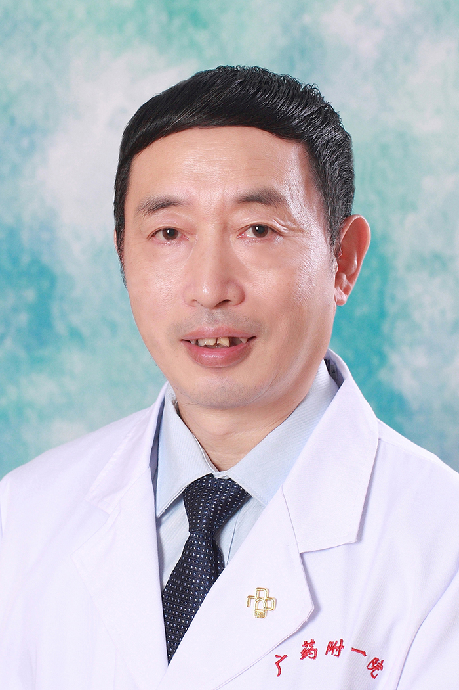

<!-- AUTO-GENERATED-BY: work/generate_obsidian_profiles.py -->

<!-- TEMPLATE: D:\workspace\信息收集整理\医生画像仓库\模板\医生画像模板.md -->

# 黄旭明

## 基础信息

| 字段 | 内容 |
|---|---|
| 姓名 | 黄旭明 |
| 医院 | 广东药科大学附属第一医院 |
| 科室 | 康复医学科（共和门诊、农林门诊） |
| 职称/身份 | 教授、主任医师 |
| 来源链接 | [官网原文](https://www.gy120.net/articleshow.asp?articleid=173) |
| 采集日期 | 2026-08-15 |

## 简介/擅长

神经系统康复，包括脑卒中、脑外伤、脊髓损伤、帕金森、痴呆等神经系统疾病相关功能障碍的治疗与康复。

## 教育与进修经历

- 个人介绍：1986 年毕业于广州医学院后一直在本院内科临床 1991 年开始从事神经内科专业 2009 年起到今开始转入康复医学科，主要从事神经系统的康复。

## 科研项目与成果

- 社会任职：广东省医学会物理医学与康复分会常委 广东省康复医学会卒中防治与康复分会常务理事 广东省康复医学发展研究会常务理事 广东省医院协会康复医学管理专委会常委 广东省医师协会神经修复专业医师分会常委 广东省康复质控中心专家组成员 广州市医学会物理医学与康复分会副主委 广东老年保健协会老年康复分会副主委 科研与获奖：近年来曾主持或参与省部、院级等课题 6 项， SCI 文章 4 篇

## 论文与学术产出

- 社会任职：广东省医学会物理医学与康复分会常委 广东省康复医学会卒中防治与康复分会常务理事 广东省康复医学发展研究会常务理事 广东省医院协会康复医学管理专委会常委 广东省医师协会神经修复专业医师分会常委 广东省康复质控中心专家组成员 广州市医学会物理医学与康复分会副主委 广东老年保健协会老年康复分会副主委 科研与获奖：近年来曾主持或参与省部、院级等课题 6 项， SCI 文章 4 篇

## 可包装亮点

- 社会任职：广东省医学会物理医学与康复分会常委 广东省康复医学会卒中防治与康复分会常务理事 广东省康复医学发展研究会常务理事 广东省医院协会康复医学管理专委会常委 广东省医师协会神经修复专业医师分会常委 广东省康复质控中心专家组成员 广州市医学会物理医学与康复分会副主委 广东老年保健协会老年康复分会副主委 科研与获奖：近年来曾主持或参与省部、院级等课题 6…

## 重点疾病/人群标签

- 慢性病：
- 肿瘤：
- 生殖疾病：
- 免疫/风湿：
- 术后恢复/康复：康复、功能障碍
- 疑难重症：

## 证据摘录

> 只摘录官网公开信息中的短句或关键字段，不复制大段原文。

- 官网身份字段：教授、主任医师
- 官网简介/擅长：神经系统康复，包括脑卒中、脑外伤、脊髓损伤、帕金森、痴呆等神经系统疾病相关功能障碍的治疗与康复。
- 官网亮眼经历线索：社会任职：广东省医学会物理医学与康复分会常委 广东省康复医学会卒中防治与康复分会常务理事 广东省康复医学发展研究会常务理事 广东省医院协会康复医学管理专委会常委 广东省医师协会神经修复专业医师分会常委 广东省康复质控中心专家组成员 广州市医学会物理医学与康复分会副主委 广东老年保健协会老年康复分会副主委 科研与获奖：近年来曾主持或参与省部、院级等课题 6 项， SCI 文章 4 篇
- 来源链接：https://www.gy120.net/articleshow.asp?articleid=173

## BD 画像摘要

黄旭明医生可作为术后恢复/康复方向的基础画像候选。后续 BD 使用应继续以官网来源和人工复核为准，不添加疗效承诺或无来源包装。

## 合规边界

- 仅使用医院官网、官方公众号、官方小程序等公开渠道。
- 不采集私人电话、私人微信、家庭住址、患者隐私或非公开排班信息。
- 不写“保证治愈”“疗效第一”“包治疑难杂症”等无法由官网证明的表述。
