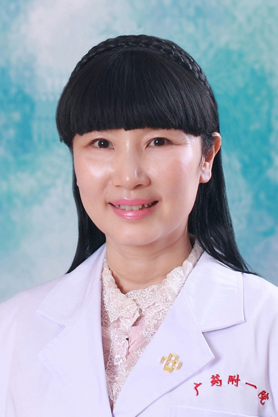

<!-- AUTO-GENERATED-BY: work/generate_obsidian_profiles.py -->

<!-- TEMPLATE: D:\workspace\信息收集整理\医生画像仓库\模板\医生画像模板.md -->

# 黄雪薇

## 基础信息

| 字段 | 内容 |
|---|---|
| 姓名 | 黄雪薇 |
| 医院 | 广东药科大学附属第一医院 |
| 科室 | 心理科（农林门诊） |
| 职称/身份 | 教授、主任医师 |
| 来源链接 | [官网原文](https://www.gy120.net/articleshow.asp?articleid=104) |
| 采集日期 | 2026-08-15 |

## 简介/擅长

对失眠、焦虑症、强迫症等神经症、抑郁症、躁狂症、精神分裂症、应激相关障碍等心理障碍的治疗、恋爱与婚姻等咨询等有丰富的临床经验，擅长药物治疗结合心理治疗的整合治疗。

## 教育与进修经历

- 个人介绍：1986年临床医学专业本科学士毕业后一直从事精神科临床和心理咨询、心理治疗工作，曾在广州市精神病院（惠爱医院）、中山三院、澳大利亚皇家北海岸医院工作和进修，积累了丰富的临床经验，对常见病、疑难病例均有独特的解决方法。

## 科研项目与成果

- 社会任职：中国医学心理学教育分会理事 国家及省自然科学基金同行评审专家 教育部科技奖励和科技成果鉴定专家 广东省教育厅与卫生厅高级专业技术资格评审专家 广东省行为与心身医学、精神科学会委员 广东省红十字会心理救援队专家 中华行为医学与脑科学杂志等多家专业期刊编委、审稿专家 科研与获奖：创立了“豁达心理治疗” 主持国家自然科学基金等国家级、省部级各级科研课题共16项，主编、参编专著、教材八部，在国内外权威期刊发表学术论文三十多篇 曾获南粤优秀教师、千百十培养人才、中青年骨干教师、教学成果奖、优秀科技工作者等奖项

## 论文与学术产出

- 社会任职：中国医学心理学教育分会理事 国家及省自然科学基金同行评审专家 教育部科技奖励和科技成果鉴定专家 广东省教育厅与卫生厅高级专业技术资格评审专家 广东省行为与心身医学、精神科学会委员 广东省红十字会心理救援队专家 中华行为医学与脑科学杂志等多家专业期刊编委、审稿专家 科研与获奖：创立了“豁达心理治疗” 主持国家自然科学基金等国家级、省部级各级科研课题共16项，主编、参编专著、教材八部，在国内外权威期刊发表学术论文三十多篇 曾获南粤优秀教师、千百十培养人才、中青年骨干教师、教学成果奖、优秀科技工作者等奖项

## 可包装亮点

- 个人介绍：1986年临床医学专业本科学士毕业后一直从事精神科临床和心理咨询、心理治疗工作，曾在广州市精神病院（惠爱医院）、中山三院、澳大利亚皇家北海岸医院工作和进修，积累了丰富的临床经验，对常见病、疑难病例均有独特的解决方法。
- 社会任职：中国医学心理学教育分会理事 国家及省自然科学基金同行评审专家 教育部科技奖励和科技成果鉴定专家 广东省教育厅与卫生厅高级专业技术资格评审专家 广东省行为与心身医学、精神科学会委员 广东省红十字会心理救援队专家 中华行为医学与脑科学杂志等多家专业期刊编委、审稿专家 科研与获奖：创立了“豁达心理治疗” 主持国家自然科学基金等国家级、省部级各级科研课题…

## 重点疾病/人群标签

- 慢性病：
- 肿瘤：
- 生殖疾病：
- 免疫/风湿：
- 术后恢复/康复：
- 疑难重症：疑难

## 证据摘录

> 只摘录官网公开信息中的短句或关键字段，不复制大段原文。

- 官网身份字段：教授、主任医师
- 官网简介/擅长：对失眠、焦虑症、强迫症等神经症、抑郁症、躁狂症、精神分裂症、应激相关障碍等心理障碍的治疗、恋爱与婚姻等咨询等有丰富的临床经验，擅长药物治疗结合心理治疗的整合治疗。
- 官网亮眼经历线索：个人介绍：1986年临床医学专业本科学士毕业后一直从事精神科临床和心理咨询、心理治疗工作，曾在广州市精神病院（惠爱医院）、中山三院、澳大利亚皇家北海岸医院工作和进修，积累了丰富的临床经验，对常见病、疑难病例均有独特的解决方法。 社会任职：中国医学心理学教育分会理事 国家及省自然科学基金同行评审专家 教育部科技奖励和科技成果鉴定专家 广东省教育厅与卫生厅高级专业技术资格评审专家 广东省行为与心身医学、精神科学会委员 广东省红十字会心理救…
- 来源链接：https://www.gy120.net/articleshow.asp?articleid=104

## BD 画像摘要

黄雪薇医生可作为疑难重症方向的基础画像候选。后续 BD 使用应继续以官网来源和人工复核为准，不添加疗效承诺或无来源包装。

## 合规边界

- 仅使用医院官网、官方公众号、官方小程序等公开渠道。
- 不采集私人电话、私人微信、家庭住址、患者隐私或非公开排班信息。
- 不写“保证治愈”“疗效第一”“包治疑难杂症”等无法由官网证明的表述。
