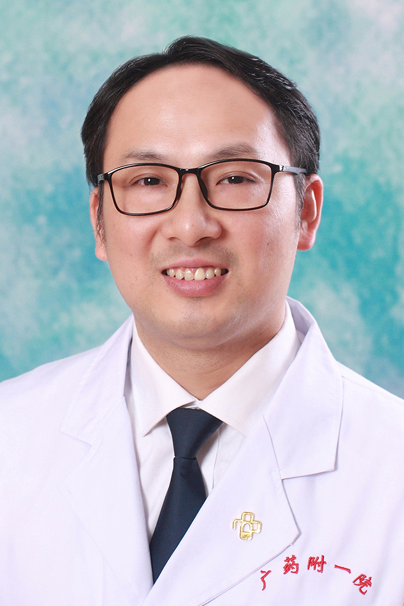

<!-- AUTO-GENERATED-BY: work/generate_obsidian_profiles.py -->

<!-- TEMPLATE: D:\workspace\信息收集整理\医生画像仓库\模板\医生画像模板.md -->

# 黄飞麒

## 基础信息

| 字段 | 内容 |
|---|---|
| 姓名 | 黄飞麒 |
| 医院 | 广东药科大学附属第一医院 |
| 科室 | 正骨科（共和门诊、健康管理中心） |
| 职称/身份 | 主任医师 |
| 来源链接 | [官网原文](https://www.gy120.net/articleshow.asp?articleid=248) |
| 采集日期 | 2026-08-15 |

## 简介/擅长

擅长运用针灸、整脊疗法、正骨等中医特色治疗方法治疗颈椎病、关节炎、腰椎间盘突出症等骨伤科疾病。

## 教育与进修经历

- 个人介绍：2006年7月广州中医药大学中医骨伤科硕士研究生毕业，后一直在医院正骨科工作至今，积累了较丰富的临床经验。

## 科研项目与成果

- 社会任职：中国医药学会整脊分会委员 科研与获奖：广东省中医药局课题《赤芍总苷对自发性高血压大鼠血小板CD4OL的干预研究》第三作者

## 可包装亮点

- 官网目录标注：科室负责人；
- 社会任职：中国医药学会整脊分会委员 科研与获奖：广东省中医药局课题《赤芍总苷对自发性高血压大鼠血小板CD4OL的干预研究》第三作者

## 重点疾病/人群标签

- 慢性病：高血压
- 肿瘤：
- 生殖疾病：
- 免疫/风湿：
- 术后恢复/康复：
- 疑难重症：

## 证据摘录

> 只摘录官网公开信息中的短句或关键字段，不复制大段原文。

- 官网身份字段：主任医师
- 官网简介/擅长：擅长运用针灸、整脊疗法、正骨等中医特色治疗方法治疗颈椎病、关节炎、腰椎间盘突出症等骨伤科疾病。
- 官网亮眼经历线索：官网目录标注：科室负责人；社会任职：中国医药学会整脊分会委员 科研与获奖：广东省中医药局课题《赤芍总苷对自发性高血压大鼠血小板CD4OL的干预研究》第三作者
- 来源链接：https://www.gy120.net/articleshow.asp?articleid=248

## BD 画像摘要

黄飞麒医生可作为慢性病方向的基础画像候选。后续 BD 使用应继续以官网来源和人工复核为准，不添加疗效承诺或无来源包装。

## 合规边界

- 仅使用医院官网、官方公众号、官方小程序等公开渠道。
- 不采集私人电话、私人微信、家庭住址、患者隐私或非公开排班信息。
- 不写“保证治愈”“疗效第一”“包治疑难杂症”等无法由官网证明的表述。
