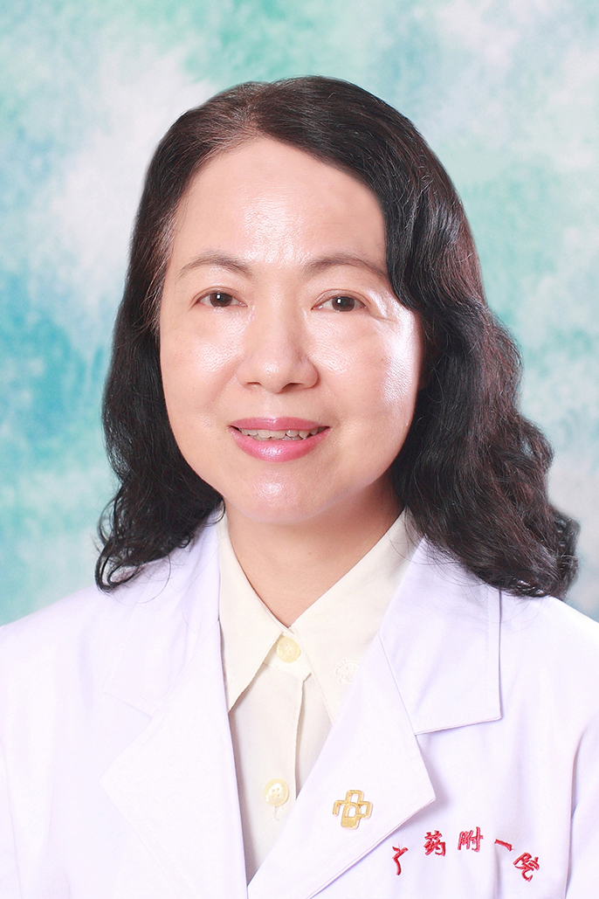

<!-- AUTO-GENERATED-BY: work/generate_obsidian_profiles.py -->

<!-- TEMPLATE: D:\workspace\信息收集整理\医生画像仓库\模板\医生画像模板.md -->

# 黎慧瑜

## 基础信息

| 字段 | 内容 |
|---|---|
| 姓名 | 黎慧瑜 |
| 医院 | 广东药科大学附属第一医院 |
| 科室 | 口腔科（共和门诊、农林门诊） |
| 职称/身份 | 副主任医师 |
| 来源链接 | [官网原文](https://www.gy120.net/articleshow.asp?articleid=44) |
| 采集日期 | 2026-08-15 |

## 简介/擅长

擅长牙体牙髓病、根尖周病，牙周病的诊断和治疗，擅长牙列缺损和缺失的修复，如：种植牙、烤瓷牙、活动牙、精密附着体等

## 教育与进修经历

- 个人介绍：1986年毕业于中山医科大学口腔系，一直在广州铁路中心医院（现广东药学院附属第一医院）从事口腔临床工作， 曾到华西口腔医院，北大口腔医院，中大口腔医院进修学习牙体牙髓病，牙周病，口腔粘膜病和种植牙。

## 科研项目与成果

- 社会任职：广东省口腔医学会口腔预防医学专业委员会常委 广东省口腔医学会口腔粘膜病专业委员会委员 科研与获奖：曾获院内科技成果三等奖，四等奖各一项，在《牙体牙髓牙周病》和《广东牙病防治》等发表论文近十篇

## 论文与学术产出

- 社会任职：广东省口腔医学会口腔预防医学专业委员会常委 广东省口腔医学会口腔粘膜病专业委员会委员 科研与获奖：曾获院内科技成果三等奖，四等奖各一项，在《牙体牙髓牙周病》和《广东牙病防治》等发表论文近十篇

## 可包装亮点

- 个人介绍：1986年毕业于中山医科大学口腔系，一直在广州铁路中心医院（现广东药学院附属第一医院）从事口腔临床工作， 曾到华西口腔医院，北大口腔医院，中大口腔医院进修学习牙体牙髓病，牙周病，口腔粘膜病和种植牙。
- 社会任职：广东省口腔医学会口腔预防医学专业委员会常委 广东省口腔医学会口腔粘膜病专业委员会委员 科研与获奖：曾获院内科技成果三等奖，四等奖各一项，在《牙体牙髓牙周病》和《广东牙病防治》等发表论文近十篇

## 重点疾病/人群标签

- 慢性病：
- 肿瘤：
- 生殖疾病：
- 免疫/风湿：
- 术后恢复/康复：
- 疑难重症：

## 证据摘录

> 只摘录官网公开信息中的短句或关键字段，不复制大段原文。

- 官网身份字段：副主任医师
- 官网简介/擅长：擅长牙体牙髓病、根尖周病，牙周病的诊断和治疗，擅长牙列缺损和缺失的修复，如：种植牙、烤瓷牙、活动牙、精密附着体等
- 官网亮眼经历线索：个人介绍：1986年毕业于中山医科大学口腔系，一直在广州铁路中心医院（现广东药学院附属第一医院）从事口腔临床工作， 曾到华西口腔医院，北大口腔医院，中大口腔医院进修学习牙体牙髓病，牙周病，口腔粘膜病和种植牙。 社会任职：广东省口腔医学会口腔预防医学专业委员会常委 广东省口腔医学会口腔粘膜病专业委员会委员 科研与获奖：曾获院内科技成果三等奖，四等奖各一项，在《牙体牙髓牙周病》和《广东牙病防治》等发表论文近十篇
- 来源链接：https://www.gy120.net/articleshow.asp?articleid=44

## BD 画像摘要

黎慧瑜医生可作为广东药科大学附属第一医院口腔科（共和门诊、农林门诊）的基础医生资料入库。当前重点方向以总底表标签为准，官网未展示的信息保持空白。

## 合规边界

- 仅使用医院官网、官方公众号、官方小程序等公开渠道。
- 不采集私人电话、私人微信、家庭住址、患者隐私或非公开排班信息。
- 不写“保证治愈”“疗效第一”“包治疑难杂症”等无法由官网证明的表述。
