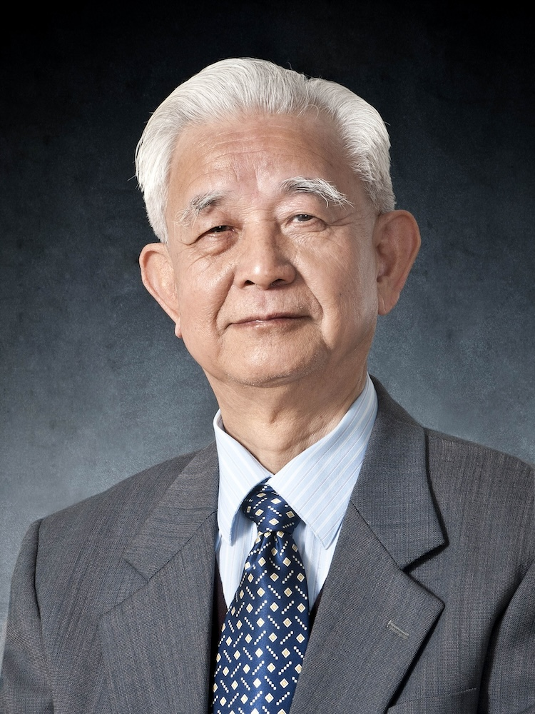

<!-- AUTO-GENERATED-BY: work/generate_obsidian_profiles.py -->

<!-- TEMPLATE: D:\workspace\信息收集整理\医生画像仓库\模板\医生画像模板.md -->

# 丘和明

## 基础信息

| 字段 | 内容 |
|---|---|
| 姓名 | 丘和明 |
| 医院 | 广州中医药大学第一附属医院 |
| 科室 |  |
| 职称/身份 | 男，1936年4月生，广东梅县人；广东省名中医，广州中医药大学首席教授，博士生导师，全国老中医药专家学术经验继承工作指导老师，享受国务院政府特殊津贴。 第八届全国政协委员，原任广州中医学院第一附属医院院长、广州中医药大学副校长。 |
| 来源链接 | [官网原文](https://www.gztcm.com.cn/myzl/myhc/1hbabtagqoij.shtml) |
| 采集日期 | 2026-08-15 |

## 简介/擅长

中医血证（血液病）、脾胃病及其他内科疑难杂病临床诊治，血证系列研究获国家突出贡献奖，研制成药“紫地宁血散”，被批准为国家新药

## 科研项目与成果

- 从事中医内科医疗、教学、科研工作近六十载，擅长中医血证（血液病）、脾胃病及其他内科疑难杂病临床诊治，血证系列研究获国家突出贡献奖，研制成药“紫地宁血散”，被批准为国家新药。

## 论文与学术产出

- 主编《血证要览》《中西医结合血液病治疗学》，主编《中医内科学》获“国家中医药管理局优秀教材二等奖”。

## 可包装亮点

- 官网名医荟萃收录；
- 广东省名中医，广州中医药大学首席教授，博士生导师，全国老中医药专家学术经验继承工作指导老师，享受国务院政府特殊津贴。
- 从事中医内科医疗、教学、科研工作近六十载，擅长中医血证（血液病）、脾胃病及其他内科疑难杂病临床诊治，血证系列研究获国家突出贡献奖，研制成药“紫地宁血散”，被批准为国家新药。
- 主编《血证要览》《中西医结合血液病治疗学》，主编《中医内科学》获“国家中医药管理局优秀教材二等奖”。
- 先后培养了博士、硕士、优秀中医临床人才40余名，其学术影响深远。

## 重点疾病/人群标签

- 慢性病：
- 肿瘤：
- 生殖疾病：
- 免疫/风湿：
- 术后恢复/康复：
- 疑难重症：

## 证据摘录

> 只摘录官网公开信息中的短句或关键字段，不复制大段原文。

- 官网身份字段：男，1936年4月生，广东梅县人；广东省名中医，广州中医药大学首席教授，博士生导师，全国老中医药专家学术经验继承工作指导老师，享受国务院政府特殊津贴。 第八届全国政协委员，原任广州中医学院第一附属医院院长、广州中医药大学副校长。
- 官网简介/擅长：中医血证（血液病）、脾胃病及其他内科疑难杂病临床诊治，血证系列研究获国家突出贡献奖，研制成药“紫地宁血散”，被批准为国家新药
- 官网亮眼经历线索：官网名医荟萃收录；广东省名中医，广州中医药大学首席教授，博士生导师，全国老中医药专家学术经验继承工作指导老师，享受国务院政府特殊津贴。 从事中医内科医疗、教学、科研工作近六十载，擅长中医血证（血液病）、脾胃病及其他内科疑难杂病临床诊治，血证系列研究获国家突出贡献奖，研制成药“紫地宁血散”，被批准为国家新药。 主编《血证要览》《中西医结合血液病治疗学》，主编《中医内科学》获“国家中医药管理局优秀教材二等奖”。 先后培养了博士、硕士、优秀…
- 异常提示：名医荟萃详情未标当前科室
- 来源链接：https://www.gztcm.com.cn/myzl/myhc/1hbabtagqoij.shtml

## BD 画像摘要

当前画像仅作基础资料归档，后续使用需先完成人工复核。

## 合规边界

- 仅使用医院官网、官方公众号、官方小程序等公开渠道。
- 不采集私人电话、私人微信、家庭住址、患者隐私或非公开排班信息。
- 不写“保证治愈”“疗效第一”“包治疑难杂症”等无法由官网证明的表述。
