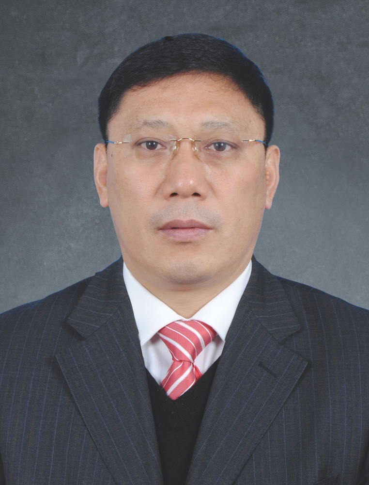

<!-- AUTO-GENERATED-BY: work/generate_obsidian_profiles.py -->

<!-- TEMPLATE: D:\workspace\信息收集整理\医生画像仓库\模板\医生画像模板.md -->

# 刘凤斌

## 基础信息

| 字段 | 内容 |
|---|---|
| 姓名 | 刘凤斌 |
| 医院 | 广州中医药大学第一附属医院 |
| 科室 |  |
| 职称/身份 | 男，1963年10月生，河南内黄人，中共党员；广东省名中医，广东省干部保健专家，主任中医师，教授，博士生导师，博士后合作导师，国家百千万人才培养对象，享受国务院政府特殊津贴专家，广东省千百十人才工程国家级人才。 现任广州中医药大学第一附属医院白云医院党总支书记、国家区域中医脾胃病诊疗中心主任，国家临床重点专科、国家局重点学科和专科带头人，曾任脾胃病科主任。 |
| 来源链接 | [官网原文](https://www.gztcm.com.cn/myzl/myhc/1hbaab10jcd87.shtml) |
| 采集日期 | 2026-08-15 |

## 简介/擅长

中医综合疗法诊治慢性萎缩性胃炎、炎症性肠病、慢性肝病、重症肌无力等

## 教育与进修经历

- 广东省名中医，广东省干部保健专家，主任中医师，教授，博士生导师，博士后合作导师，国家百千万人才培养对象，享受国务院政府特殊津贴专家，广东省千百十人才工程国家级人才。

## 科研项目与成果

- 主持国家级、省部级课题20余项，主持获省部级科技奖励6项。

## 可包装亮点

- 官网名医荟萃收录；
- 广东省名中医，广东省干部保健专家，主任中医师，教授，博士生导师，博士后合作导师，国家百千万人才培养对象，享受国务院政府特殊津贴专家，广东省千百十人才工程国家级人才。
- 现任广州中医药大学第一附属医院白云医院党总支书记、国家区域中医脾胃病诊疗中心主任，国家临床重点专科、国家局重点学科和专科带头人，曾任脾胃病科主任。
- 兼任中国研究型医院学会中西医整合脾胃消化病专委会主委，中华中医药学会脾胃病分会副主委等。
- 获广东省五一劳动奖章，丁颖科技奖。

## 重点疾病/人群标签

- 慢性病：
- 肿瘤：
- 生殖疾病：
- 免疫/风湿：
- 术后恢复/康复：
- 疑难重症：

## 证据摘录

> 只摘录官网公开信息中的短句或关键字段，不复制大段原文。

- 官网身份字段：男，1963年10月生，河南内黄人，中共党员；广东省名中医，广东省干部保健专家，主任中医师，教授，博士生导师，博士后合作导师，国家百千万人才培养对象，享受国务院政府特殊津贴专家，广东省千百十人才工程国家级人才。 现任广州中医药大学第一附属…
- 官网简介/擅长：中医综合疗法诊治慢性萎缩性胃炎、炎症性肠病、慢性肝病、重症肌无力等
- 官网亮眼经历线索：官网名医荟萃收录；广东省名中医，广东省干部保健专家，主任中医师，教授，博士生导师，博士后合作导师，国家百千万人才培养对象，享受国务院政府特殊津贴专家，广东省千百十人才工程国家级人才。 现任广州中医药大学第一附属医院白云医院党总支书记、国家区域中医脾胃病诊疗中心主任，国家临床重点专科、国家局重点学科和专科带头人，曾任脾胃病科主任。 兼任中国研究型医院学会中西医整合脾胃消化病专委会主委，中华中医药学会脾胃病分会副主委等。 获广东省五一劳动…
- 异常提示：名医荟萃详情未标当前科室
- 来源链接：https://www.gztcm.com.cn/myzl/myhc/1hbaab10jcd87.shtml

## BD 画像摘要

当前画像仅作基础资料归档，后续使用需先完成人工复核。

## 合规边界

- 仅使用医院官网、官方公众号、官方小程序等公开渠道。
- 不采集私人电话、私人微信、家庭住址、患者隐私或非公开排班信息。
- 不写“保证治愈”“疗效第一”“包治疑难杂症”等无法由官网证明的表述。
