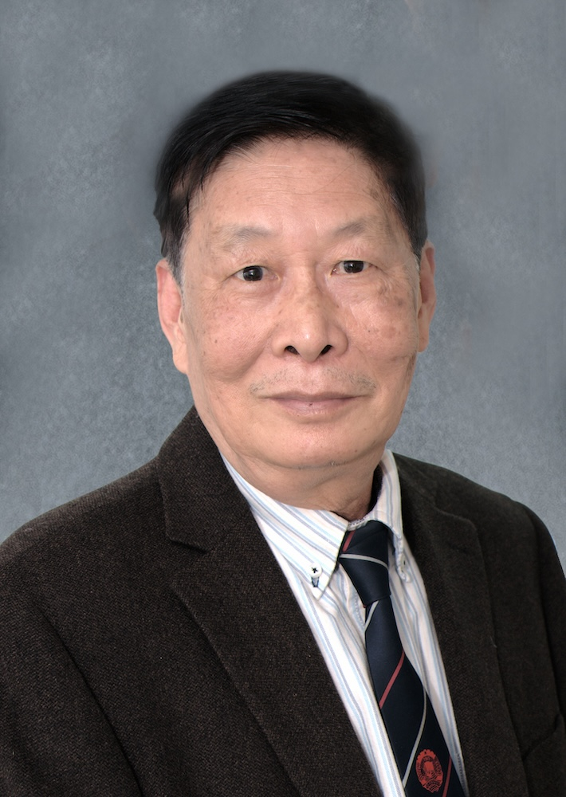

<!-- AUTO-GENERATED-BY: work/generate_obsidian_profiles.py -->

<!-- TEMPLATE: D:\workspace\信息收集整理\医生画像仓库\模板\医生画像模板.md -->

# 区永欣

## 基础信息

| 字段 | 内容 |
|---|---|
| 姓名 | 区永欣 |
| 医院 | 广州中医药大学第一附属医院 |
| 科室 |  |
| 职称/身份 | 男，1939年7月生，广东番禺人；广东省名中医，广州中医药大学首席教授，博士生导师，广东省政协第五至第八届委员，享受国务院政府特殊津贴。 主编《中医大辞典》系列工具书，主持卫气生理病理研究等课题，培养硕士生12名、博士生21名，先后获省部级科研成果奖4项、国家科技进步三等奖1项、国家教学成果二等奖1项。 |
| 来源链接 | [官网原文](https://www.gztcm.com.cn/myzl/myhc/1hbabhi33e2la.shtml) |
| 采集日期 | 2026-08-15 |

## 简介/擅长

呼吸、消化和免疫失调疾病

## 科研项目与成果

- 主编《中医大辞典》系列工具书，主持卫气生理病理研究等课题，培养硕士生12名、博士生21名，先后获省部级科研成果奖4项、国家科技进步三等奖1项、国家教学成果二等奖1项。

## 论文与学术产出

- 主编《中医大辞典》系列工具书，主持卫气生理病理研究等课题，培养硕士生12名、博士生21名，先后获省部级科研成果奖4项、国家科技进步三等奖1项、国家教学成果二等奖1项。
- 近十年发表论文、论著40篇、主编教材3门，并受聘美•中国医学研究会，台、港中医学会学术顾问等职。

## 可包装亮点

- 官网名医荟萃收录；
- 广东省名中医，广州中医药大学首席教授，博士生导师，广东省政协第五至第八届委员，享受国务院政府特殊津贴。
- 主编《中医大辞典》系列工具书，主持卫气生理病理研究等课题，培养硕士生12名、博士生21名，先后获省部级科研成果奖4项、国家科技进步三等奖1项、国家教学成果二等奖1项。
- 近十年发表论文、论著40篇、主编教材3门，并受聘美•中国医学研究会，台、港中医学会学术顾问等职。

## 重点疾病/人群标签

- 慢性病：
- 肿瘤：
- 生殖疾病：
- 免疫/风湿：
- 术后恢复/康复：
- 疑难重症：

## 证据摘录

> 只摘录官网公开信息中的短句或关键字段，不复制大段原文。

- 官网身份字段：男，1939年7月生，广东番禺人；广东省名中医，广州中医药大学首席教授，博士生导师，广东省政协第五至第八届委员，享受国务院政府特殊津贴。 主编《中医大辞典》系列工具书，主持卫气生理病理研究等课题，培养硕士生12名、博士生21名，先后获省部…
- 官网简介/擅长：呼吸、消化和免疫失调疾病
- 官网亮眼经历线索：官网名医荟萃收录；广东省名中医，广州中医药大学首席教授，博士生导师，广东省政协第五至第八届委员，享受国务院政府特殊津贴。 主编《中医大辞典》系列工具书，主持卫气生理病理研究等课题，培养硕士生12名、博士生21名，先后获省部级科研成果奖4项、国家科技进步三等奖1项、国家教学成果二等奖1项。 近十年发表论文、论著40篇、主编教材3门，并受聘美•中国医学研究会，台、港中医学会学术顾问等职。
- 异常提示：名医荟萃详情未标当前科室
- 来源链接：https://www.gztcm.com.cn/myzl/myhc/1hbabhi33e2la.shtml

## BD 画像摘要

当前画像仅作基础资料归档，后续使用需先完成人工复核。

## 合规边界

- 仅使用医院官网、官方公众号、官方小程序等公开渠道。
- 不采集私人电话、私人微信、家庭住址、患者隐私或非公开排班信息。
- 不写“保证治愈”“疗效第一”“包治疑难杂症”等无法由官网证明的表述。
