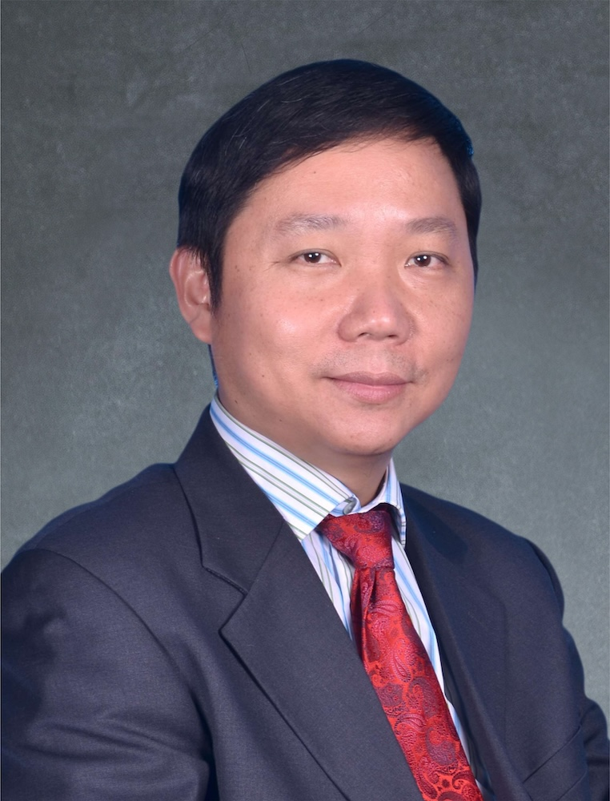

<!-- AUTO-GENERATED-BY: work/generate_obsidian_profiles.py -->

<!-- TEMPLATE: D:\workspace\信息收集整理\医生画像仓库\模板\医生画像模板.md -->

# 吴伟

## 基础信息

| 字段 | 内容 |
|---|---|
| 姓名 | 吴伟 |
| 医院 | 广州中医药大学第一附属医院 |
| 科室 |  |
| 职称/身份 | 男，1964年7月生，广西北海合浦县人，中共党员；广东省名中医，教授，博士生导师，广东省名中医师承项目指导老师，广东省高等学校教学名师，“广东特支计划”教学名师，国医大师邓铁涛教授学术继承人之一。 现任大内科主任，内科学教研室主任，内科第一党支部书记。 |
| 来源链接 | [官网原文](https://www.gztcm.com.cn/myzl/myhc/1hbaaevmqcsd9.shtml) |
| 采集日期 | 2026-08-15 |

## 简介/擅长

## 科研项目与成果

- 广东省名中医，教授，博士生导师，广东省名中医师承项目指导老师，广东省高等学校教学名师，“广东特支计划”教学名师，国医大师邓铁涛教授学术继承人之一。
- 主持和参与国家自然科学基金课题6项，主持省部级课题4项，主编或参编著作15部，发表核心期刊学术论文200余篇，其中SCI 14篇。

## 论文与学术产出

- 国家“十二五”、“十三五”规划教材《中医内科学》本科生、规培医师、研究生3部教材主编。
- 主持和参与国家自然科学基金课题6项，主持省部级课题4项，主编或参编著作15部，发表核心期刊学术论文200余篇，其中SCI 14篇。

## 可包装亮点

- 官网名医荟萃收录；
- 广东省名中医，教授，博士生导师，广东省名中医师承项目指导老师，广东省高等学校教学名师，“广东特支计划”教学名师，国医大师邓铁涛教授学术继承人之一。
- 现任大内科主任，内科学教研室主任，内科第一党支部书记。
- 兼任中华中医药学会介入心脏病学分会副主任委员，中华中医药学会心病专业委员会常委兼副秘书长，中国医师协会中西医结合介入专业委员会副主任委员，广东省中医药学会心血管病专业委员会主任委员。
- 主持和参与国家自然科学基金课题6项，主持省部级课题4项，主编或参编著作15部，发表核心期刊学术论文200余篇，其中SCI 14篇。

## 重点疾病/人群标签

- 慢性病：
- 肿瘤：
- 生殖疾病：
- 免疫/风湿：
- 术后恢复/康复：
- 疑难重症：

## 证据摘录

> 只摘录官网公开信息中的短句或关键字段，不复制大段原文。

- 官网身份字段：男，1964年7月生，广西北海合浦县人，中共党员；广东省名中医，教授，博士生导师，广东省名中医师承项目指导老师，广东省高等学校教学名师，“广东特支计划”教学名师，国医大师邓铁涛教授学术继承人之一。 现任大内科主任，内科学教研室主任，内科第…
- 官网亮眼经历线索：官网名医荟萃收录；广东省名中医，教授，博士生导师，广东省名中医师承项目指导老师，广东省高等学校教学名师，“广东特支计划”教学名师，国医大师邓铁涛教授学术继承人之一。 现任大内科主任，内科学教研室主任，内科第一党支部书记。 兼任中华中医药学会介入心脏病学分会副主任委员，中华中医药学会心病专业委员会常委兼副秘书长，中国医师协会中西医结合介入专业委员会副主任委员，广东省中医药学会心血管病专业委员会主任委员。 主持和参与国家自然科学基金课题6…
- 异常提示：名医荟萃详情未标当前科室
- 来源链接：https://www.gztcm.com.cn/myzl/myhc/1hbaaevmqcsd9.shtml

## BD 画像摘要

当前画像仅作基础资料归档，后续使用需先完成人工复核。

## 合规边界

- 仅使用医院官网、官方公众号、官方小程序等公开渠道。
- 不采集私人电话、私人微信、家庭住址、患者隐私或非公开排班信息。
- 不写“保证治愈”“疗效第一”“包治疑难杂症”等无法由官网证明的表述。
