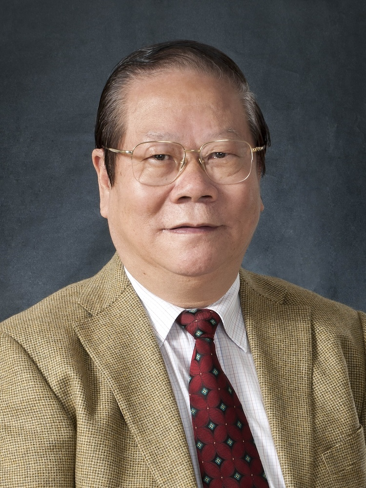

<!-- AUTO-GENERATED-BY: work/generate_obsidian_profiles.py -->

<!-- TEMPLATE: D:\workspace\信息收集整理\医生画像仓库\模板\医生画像模板.md -->

# 周岱翰

## 基础信息

| 字段 | 内容 |
|---|---|
| 姓名 | 周岱翰 |
| 医院 | 广州中医药大学第一附属医院 |
| 科室 |  |
| 职称/身份 | 男，1941年5月生，广东汕头人，中国农工党党员；著名中医肿瘤学家，第三届国医大师，中国中医科学院学部委员，广东省名中医，广东省医学领军人才，广州中医药大学首席教授，主任医师，博士生导师，全国老中医药专家学术经验继承工作指导老师。 曾创建并担任该院首任肿瘤科主任，1982年在大学开设中医肿瘤学课堂授课，曾兼任中华中医药学会肿瘤分会创会会长及第二届会长。 |
| 来源链接 | [官网原文](https://www.gztcm.com.cn/myzl/myhc/1hbac0vetmul9.shtml) |
| 采集日期 | 2026-08-15 |

## 简介/擅长

晚期、难治癌症等疑难重疾，提出“带瘤生存”，更新治癌理念，奠定岭南中医肿瘤学术流派理论体系

## 科研项目与成果

- 创制“鹤蟾片”(获“1986年卫生部中医药重大科技成果乙等奖”)、“清金得生片”等制剂，代表性著作有《肿瘤治验集要》《中医肿瘤食疗学》《临床中医肿瘤学》等10部，主编《中医肿瘤学》并纳入全国高等中医院校专业课程，2010年获“教育部科学技术成果一等奖”、“广东省科学技术奖励二等奖”，2017获评“南粤楷模”称号，2019年获“全国中医药杰出贡献奖”。

## 论文与学术产出

- 现为广州中医药大学肿瘤研究所所长，深圳市中医肿瘤医学中心主任，广东中医药研究促进会会长，《中医肿瘤学杂志》主编。
- 创制“鹤蟾片”(获“1986年卫生部中医药重大科技成果乙等奖”)、“清金得生片”等制剂，代表性著作有《肿瘤治验集要》《中医肿瘤食疗学》《临床中医肿瘤学》等10部，主编《中医肿瘤学》并纳入全国高等中医院校专业课程，2010年获“教育部科学技术成果一等奖”、“广东省科学技术奖励二等奖”，2017获评“南粤楷模”称号，2019年获“全国中医药杰出贡献奖”。

## 可包装亮点

- 官网名医荟萃收录；
- 著名中医肿瘤学家，第三届国医大师，中国中医科学院学部委员，广东省名中医，广东省医学领军人才，广州中医药大学首席教授，主任医师，博士生导师，全国老中医药专家学术经验继承工作指导老师。
- 曾创建并担任该院首任肿瘤科主任，1982年在大学开设中医肿瘤学课堂授课，曾兼任中华中医药学会肿瘤分会创会会长及第二届会长。
- 擅长治疗晚期、难治癌症等疑难重疾，提出“带瘤生存”，更新治癌理念，奠定岭南中医肿瘤学术流派理论体系。
- 创制“鹤蟾片”(获“1986年卫生部中医药重大科技成果乙等奖”)、“清金得生片”等制剂，代表性著作有《肿瘤治验集要》《中医肿瘤食疗学》《临床中医肿瘤学》等10部，主编《中医肿瘤学》并纳入全国高等中医院校专业课程，2010年获“教育部科学技术成果一等奖”、“广东省科学技术奖励二等奖”，2017获评“南粤楷模”称号，2019年获“全国中医药杰出贡献奖”。

## 重点疾病/人群标签

- 慢性病：
- 肿瘤：
- 生殖疾病：
- 免疫/风湿：
- 术后恢复/康复：
- 疑难重症：

## 证据摘录

> 只摘录官网公开信息中的短句或关键字段，不复制大段原文。

- 官网身份字段：男，1941年5月生，广东汕头人，中国农工党党员；著名中医肿瘤学家，第三届国医大师，中国中医科学院学部委员，广东省名中医，广东省医学领军人才，广州中医药大学首席教授，主任医师，博士生导师，全国老中医药专家学术经验继承工作指导老师。 曾创建…
- 官网简介/擅长：晚期、难治癌症等疑难重疾，提出“带瘤生存”，更新治癌理念，奠定岭南中医肿瘤学术流派理论体系
- 官网亮眼经历线索：官网名医荟萃收录；著名中医肿瘤学家，第三届国医大师，中国中医科学院学部委员，广东省名中医，广东省医学领军人才，广州中医药大学首席教授，主任医师，博士生导师，全国老中医药专家学术经验继承工作指导老师。 曾创建并担任该院首任肿瘤科主任，1982年在大学开设中医肿瘤学课堂授课，曾兼任中华中医药学会肿瘤分会创会会长及第二届会长。 擅长治疗晚期、难治癌症等疑难重疾，提出“带瘤生存”，更新治癌理念，奠定岭南中医肿瘤学术流派理论体系。 创制“鹤蟾片…
- 异常提示：名医荟萃详情未标当前科室
- 来源链接：https://www.gztcm.com.cn/myzl/myhc/1hbac0vetmul9.shtml

## BD 画像摘要

当前画像仅作基础资料归档，后续使用需先完成人工复核。

## 合规边界

- 仅使用医院官网、官方公众号、官方小程序等公开渠道。
- 不采集私人电话、私人微信、家庭住址、患者隐私或非公开排班信息。
- 不写“保证治愈”“疗效第一”“包治疑难杂症”等无法由官网证明的表述。
