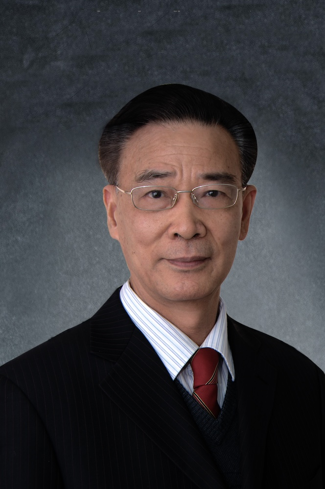

<!-- AUTO-GENERATED-BY: work/generate_obsidian_profiles.py -->

<!-- TEMPLATE: D:\workspace\信息收集整理\医生画像仓库\模板\医生画像模板.md -->

# 周福生

## 基础信息

| 字段 | 内容 |
|---|---|
| 姓名 | 周福生 |
| 医院 | 广州中医药大学第一附属医院 |
| 科室 |  |
| 职称/身份 | 男，1950年7月生，广东惠来人；广东省名中医，主任中医师、教授、博士生导师、博士后合作教授，全国老中医药专家学术经验继承工作指导老师，广东省名中医师承项目指导老师。 兼任广东省肝脏病学会中医药学专业委员会主任委员，广东省中医药学会消化专业委员会副主任委员。 |
| 来源链接 | [官网原文](https://www.gztcm.com.cn/myzl/myhc/1hbaame2otgil.shtml) |
| 采集日期 | 2026-08-15 |

## 简介/擅长

诊治脾胃、肝胆内科，消化道肿瘤和老年性疾病，倡“心胃相关”及“辨证、辨病、辨体质”三位一体辨治模式，研发胃肠宁、胃炎消、顺激合剂等院内制剂，以及和胃片、胃热清胶囊、胃痞消颗粒、六味顺激胶囊等中药新药

## 教育与进修经历

- 广东省名中医，主任中医师、教授、博士生导师、博士后合作教授，全国老中医药专家学术经验继承工作指导老师，广东省名中医师承项目指导老师。
- 发表学术论文180余篇，培养研究生50余名、博士后6名、师承弟子13名。

## 科研项目与成果

- 广东省名中医，主任中医师、教授、博士生导师、博士后合作教授，全国老中医药专家学术经验继承工作指导老师，广东省名中医师承项目指导老师。

## 论文与学术产出

- 发表学术论文180余篇，培养研究生50余名、博士后6名、师承弟子13名。

## 可包装亮点

- 官网名医荟萃收录；
- 广东省名中医，主任中医师、教授、博士生导师、博士后合作教授，全国老中医药专家学术经验继承工作指导老师，广东省名中医师承项目指导老师。
- 兼任广东省肝脏病学会中医药学专业委员会主任委员，广东省中医药学会消化专业委员会副主任委员。
- 发表学术论文180余篇，培养研究生50余名、博士后6名、师承弟子13名。
- 曾获中华中医药学会李时珍医药创新奖、广东省科学技术进步三等奖、首届邓铁涛中医医学奖。

## 重点疾病/人群标签

- 慢性病：
- 肿瘤：
- 生殖疾病：
- 免疫/风湿：
- 术后恢复/康复：
- 疑难重症：

## 证据摘录

> 只摘录官网公开信息中的短句或关键字段，不复制大段原文。

- 官网身份字段：男，1950年7月生，广东惠来人；广东省名中医，主任中医师、教授、博士生导师、博士后合作教授，全国老中医药专家学术经验继承工作指导老师，广东省名中医师承项目指导老师。 兼任广东省肝脏病学会中医药学专业委员会主任委员，广东省中医药学会消化专…
- 官网简介/擅长：诊治脾胃、肝胆内科，消化道肿瘤和老年性疾病，倡“心胃相关”及“辨证、辨病、辨体质”三位一体辨治模式，研发胃肠宁、胃炎消、顺激合剂等院内制剂，以及和胃片、胃热清胶囊、胃痞消颗粒、六味顺激胶囊等中药新药
- 官网亮眼经历线索：官网名医荟萃收录；广东省名中医，主任中医师、教授、博士生导师、博士后合作教授，全国老中医药专家学术经验继承工作指导老师，广东省名中医师承项目指导老师。 兼任广东省肝脏病学会中医药学专业委员会主任委员，广东省中医药学会消化专业委员会副主任委员。 发表学术论文180余篇，培养研究生50余名、博士后6名、师承弟子13名。 曾获中华中医药学会李时珍医药创新奖、广东省科学技术进步三等奖、首届邓铁涛中医医学奖。
- 异常提示：名医荟萃详情未标当前科室
- 来源链接：https://www.gztcm.com.cn/myzl/myhc/1hbaame2otgil.shtml

## BD 画像摘要

当前画像仅作基础资料归档，后续使用需先完成人工复核。

## 合规边界

- 仅使用医院官网、官方公众号、官方小程序等公开渠道。
- 不采集私人电话、私人微信、家庭住址、患者隐私或非公开排班信息。
- 不写“保证治愈”“疗效第一”“包治疑难杂症”等无法由官网证明的表述。
