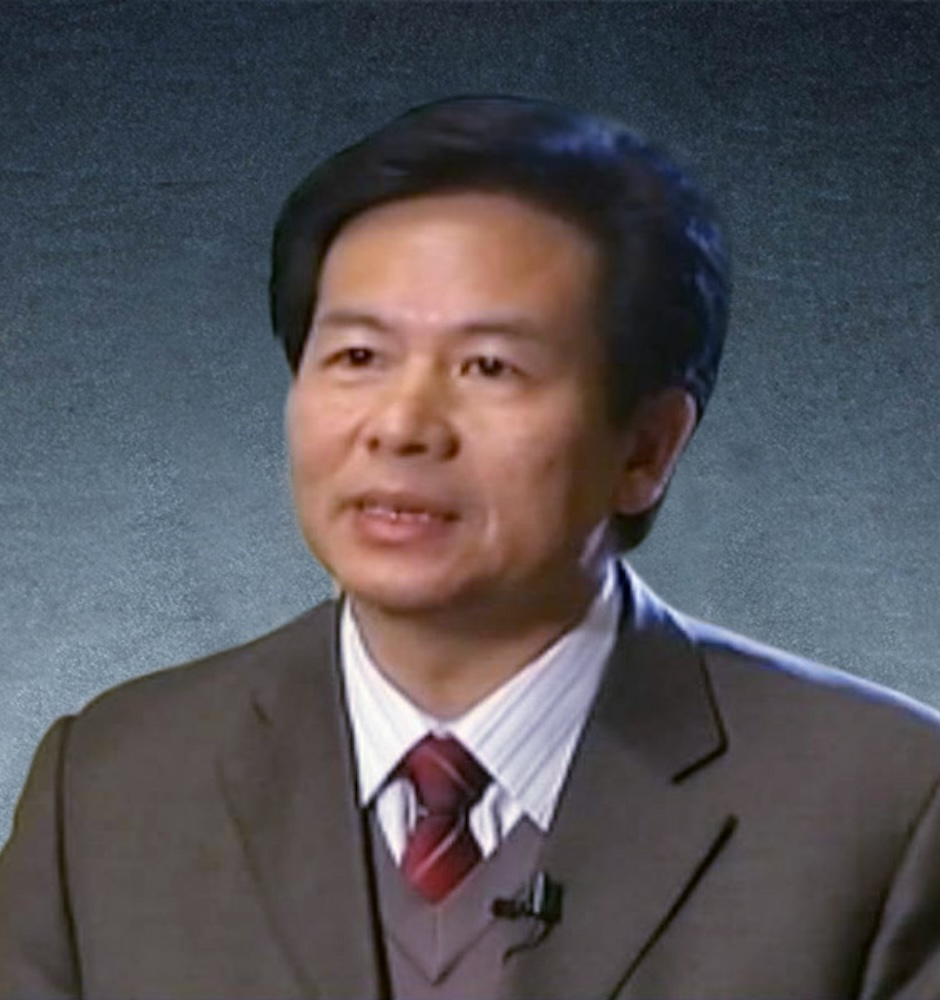

<!-- AUTO-GENERATED-BY: work/generate_obsidian_profiles.py -->

<!-- TEMPLATE: D:\workspace\信息收集整理\医生画像仓库\模板\医生画像模板.md -->

# 孙晓生

## 基础信息

| 字段 | 内容 |
|---|---|
| 姓名 | 孙晓生 |
| 医院 | 广州中医药大学第一附属医院 |
| 科室 |  |
| 职称/身份 | 男，1956年12月生，广东揭阳人，中共党员；广州中医药大学二级教授，博士生及博士后导师，全国老中医药专家学术经验继承工作指导老师，广东省名中医师承项目指导老师，享受国务院政府特殊津贴。 曾任我院党委副书记，广州中医药大学党委副书记、副校长，国家中医药管理局学术流派基地办公室常务副主任，重点学科学术带头人，世界中联养生专委会副会长，中华中医药学会养生康复分会副主委。 |
| 来源链接 | [官网原文](https://www.gztcm.com.cn/myzl/myhc/1hbaaq18sh852.shtml) |
| 采集日期 | 2026-08-15 |

## 简介/擅长

## 教育与进修经历

- 广州中医药大学二级教授，博士生及博士后导师，全国老中医药专家学术经验继承工作指导老师，广东省名中医师承项目指导老师，享受国务院政府特殊津贴。
- 培养博士（博士后）43名，著作41部，学术论文近200篇。
- 2014年获广州中医药大学优秀博士后合作导师。

## 科研项目与成果

- 广州中医药大学二级教授，博士生及博士后导师，全国老中医药专家学术经验继承工作指导老师，广东省名中医师承项目指导老师，享受国务院政府特殊津贴。
- 主持省部级课题多项。

## 论文与学术产出

- 培养博士（博士后）43名，著作41部，学术论文近200篇。

## 可包装亮点

- 官网名医荟萃收录；
- 广州中医药大学二级教授，博士生及博士后导师，全国老中医药专家学术经验继承工作指导老师，广东省名中医师承项目指导老师，享受国务院政府特殊津贴。
- 曾任我院党委副书记，广州中医药大学党委副书记、副校长，国家中医药管理局学术流派基地办公室常务副主任，重点学科学术带头人，世界中联养生专委会副会长，中华中医药学会养生康复分会副主委。
- 2009年获“挑战杯”科技竞赛广东省特等奖、全国二等奖（全国优秀指导老师）。

## 重点疾病/人群标签

- 慢性病：
- 肿瘤：
- 生殖疾病：
- 免疫/风湿：
- 术后恢复/康复：
- 疑难重症：

## 证据摘录

> 只摘录官网公开信息中的短句或关键字段，不复制大段原文。

- 官网身份字段：男，1956年12月生，广东揭阳人，中共党员；广州中医药大学二级教授，博士生及博士后导师，全国老中医药专家学术经验继承工作指导老师，广东省名中医师承项目指导老师，享受国务院政府特殊津贴。 曾任我院党委副书记，广州中医药大学党委副书记、副校…
- 官网亮眼经历线索：官网名医荟萃收录；广州中医药大学二级教授，博士生及博士后导师，全国老中医药专家学术经验继承工作指导老师，广东省名中医师承项目指导老师，享受国务院政府特殊津贴。 曾任我院党委副书记，广州中医药大学党委副书记、副校长，国家中医药管理局学术流派基地办公室常务副主任，重点学科学术带头人，世界中联养生专委会副会长，中华中医药学会养生康复分会副主委。 2009年获“挑战杯”科技竞赛广东省特等奖、全国二等奖（全国优秀指导老师）。
- 异常提示：名医荟萃详情未标当前科室
- 来源链接：https://www.gztcm.com.cn/myzl/myhc/1hbaaq18sh852.shtml

## BD 画像摘要

当前画像仅作基础资料归档，后续使用需先完成人工复核。

## 合规边界

- 仅使用医院官网、官方公众号、官方小程序等公开渠道。
- 不采集私人电话、私人微信、家庭住址、患者隐私或非公开排班信息。
- 不写“保证治愈”“疗效第一”“包治疑难杂症”等无法由官网证明的表述。
