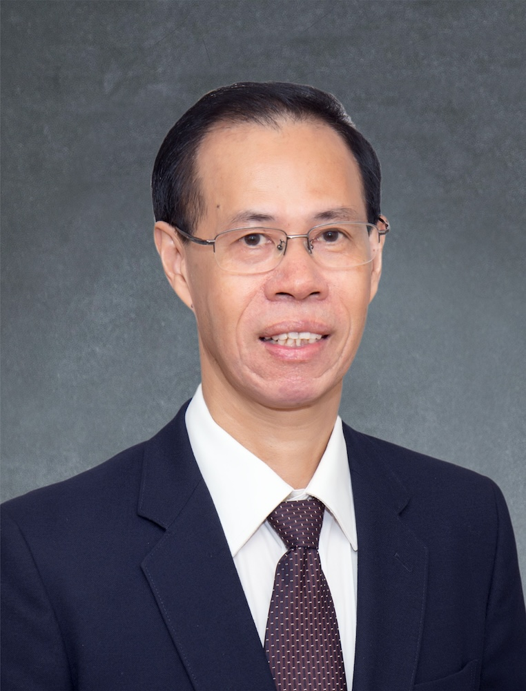

<!-- AUTO-GENERATED-BY: work/generate_obsidian_profiles.py -->

<!-- TEMPLATE: D:\workspace\信息收集整理\医生画像仓库\模板\医生画像模板.md -->

# 庄礼兴

## 基础信息

| 字段 | 内容 |
|---|---|
| 姓名 | 庄礼兴 |
| 医院 | 广州中医药大学第一附属医院 |
| 科室 |  |
| 职称/身份 | 男，1955年10月生，广东普宁人；广东省名中医，教授，主任医师，博士生导师，香港中文大学客座教授。 现任康复中心主任，国家中医药管理局针灸重点专科带头人，国家中医药管理局华南区域中医（针灸）诊疗中心学术带头人，全国中医学术流派靳三针疗法流派传承工作室负责人、代表性传承人，广东省针灸学会副主任委员，广东省中医药研究促进会副理事长，广东省中医针灸质控中心主任。 |
| 来源链接 | [官网原文](https://www.gztcm.com.cn/myzl/myhc/1hbaa9q2i4sjv.shtml) |
| 采集日期 | 2026-08-15 |

## 简介/擅长

中风、癫痫、帕金森病、血管性痴呆、难治性癫痫等脑病，创立调神针法治疗神志病

## 科研项目与成果

- 主持国家级和省部级课题10项，获省部级科技奖3项，主编著作9部，发表学术论文207篇，指导博士、硕士200多人。

## 论文与学术产出

- 主持国家级和省部级课题10项，获省部级科技奖3项，主编著作9部，发表学术论文207篇，指导博士、硕士200多人。

## 可包装亮点

- 官网名医荟萃收录；
- 广东省名中医，教授，主任医师，博士生导师，香港中文大学客座教授。
- 现任康复中心主任，国家中医药管理局针灸重点专科带头人，国家中医药管理局华南区域中医（针灸）诊疗中心学术带头人，全国中医学术流派靳三针疗法流派传承工作室负责人、代表性传承人，广东省针灸学会副主任委员，广东省中医药研究促进会副理事长，广东省中医针灸质控中心主任。
- 主持国家级和省部级课题10项，获省部级科技奖3项，主编著作9部，发表学术论文207篇，指导博士、硕士200多人。

## 重点疾病/人群标签

- 慢性病：
- 肿瘤：
- 生殖疾病：
- 免疫/风湿：
- 术后恢复/康复：
- 疑难重症：

## 证据摘录

> 只摘录官网公开信息中的短句或关键字段，不复制大段原文。

- 官网身份字段：男，1955年10月生，广东普宁人；广东省名中医，教授，主任医师，博士生导师，香港中文大学客座教授。 现任康复中心主任，国家中医药管理局针灸重点专科带头人，国家中医药管理局华南区域中医（针灸）诊疗中心学术带头人，全国中医学术流派靳三针疗法…
- 官网简介/擅长：中风、癫痫、帕金森病、血管性痴呆、难治性癫痫等脑病，创立调神针法治疗神志病
- 官网亮眼经历线索：官网名医荟萃收录；广东省名中医，教授，主任医师，博士生导师，香港中文大学客座教授。 现任康复中心主任，国家中医药管理局针灸重点专科带头人，国家中医药管理局华南区域中医（针灸）诊疗中心学术带头人，全国中医学术流派靳三针疗法流派传承工作室负责人、代表性传承人，广东省针灸学会副主任委员，广东省中医药研究促进会副理事长，广东省中医针灸质控中心主任。 主持国家级和省部级课题10项，获省部级科技奖3项，主编著作9部，发表学术论文207篇，指导博士…
- 异常提示：名医荟萃详情未标当前科室
- 来源链接：https://www.gztcm.com.cn/myzl/myhc/1hbaa9q2i4sjv.shtml

## BD 画像摘要

当前画像仅作基础资料归档，后续使用需先完成人工复核。

## 合规边界

- 仅使用医院官网、官方公众号、官方小程序等公开渠道。
- 不采集私人电话、私人微信、家庭住址、患者隐私或非公开排班信息。
- 不写“保证治愈”“疗效第一”“包治疑难杂症”等无法由官网证明的表述。
