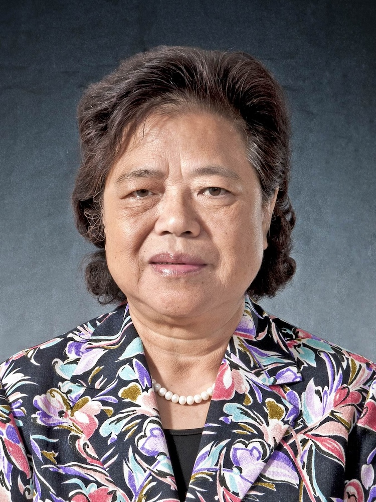

<!-- AUTO-GENERATED-BY: work/generate_obsidian_profiles.py -->

<!-- TEMPLATE: D:\workspace\信息收集整理\医生画像仓库\模板\医生画像模板.md -->

# 张玉珍

## 基础信息

| 字段 | 内容 |
|---|---|
| 姓名 | 张玉珍 |
| 医院 | 广州中医药大学第一附属医院 |
| 科室 |  |
| 职称/身份 | 女，1944年4月生，广东兴宁人，中共党员；教授，主任中医师，博士生导师，享受国务院政府特殊津贴。 |
| 来源链接 | [官网原文](https://www.gztcm.com.cn/myzl/myhc/1hbabc17sjil1.shtml) |
| 采集日期 | 2026-08-15 |

## 简介/擅长

中西医结合以中医为主防治妇科病，继承创新和发展了中医妇科学在调经、种子、安胎中的特色与优势，尤其擅长防治卵巢早衰、反复自然流产、不孕症等疑难病证，获省部级奖励8项

## 论文与学术产出

- 主编国家级规划教材《中医妇科学》3部，出版专著20余部，代表作有《卵巢早衰的中医药防治》《张玉珍女科辑要》等，主持研发“滋肾育胎丸”与“田七痛经胶囊”。

## 可包装亮点

- 官网名医荟萃收录；
- 教授，主任中医师，博士生导师，享受国务院政府特殊津贴。
- 擅长中西医结合以中医为主防治妇科病，继承创新和发展了中医妇科学在调经、种子、安胎中的特色与优势，尤其擅长防治卵巢早衰、反复自然流产、不孕症等疑难病证，获省部级奖励8项。

## 重点疾病/人群标签

- 慢性病：
- 肿瘤：
- 生殖疾病：
- 免疫/风湿：
- 术后恢复/康复：
- 疑难重症：

## 证据摘录

> 只摘录官网公开信息中的短句或关键字段，不复制大段原文。

- 官网身份字段：女，1944年4月生，广东兴宁人，中共党员；教授，主任中医师，博士生导师，享受国务院政府特殊津贴。
- 官网简介/擅长：中西医结合以中医为主防治妇科病，继承创新和发展了中医妇科学在调经、种子、安胎中的特色与优势，尤其擅长防治卵巢早衰、反复自然流产、不孕症等疑难病证，获省部级奖励8项
- 官网亮眼经历线索：官网名医荟萃收录；教授，主任中医师，博士生导师，享受国务院政府特殊津贴。 擅长中西医结合以中医为主防治妇科病，继承创新和发展了中医妇科学在调经、种子、安胎中的特色与优势，尤其擅长防治卵巢早衰、反复自然流产、不孕症等疑难病证，获省部级奖励8项。
- 异常提示：名医荟萃详情未标当前科室
- 来源链接：https://www.gztcm.com.cn/myzl/myhc/1hbabc17sjil1.shtml

## BD 画像摘要

当前画像仅作基础资料归档，后续使用需先完成人工复核。

## 合规边界

- 仅使用医院官网、官方公众号、官方小程序等公开渠道。
- 不采集私人电话、私人微信、家庭住址、患者隐私或非公开排班信息。
- 不写“保证治愈”“疗效第一”“包治疑难杂症”等无法由官网证明的表述。
