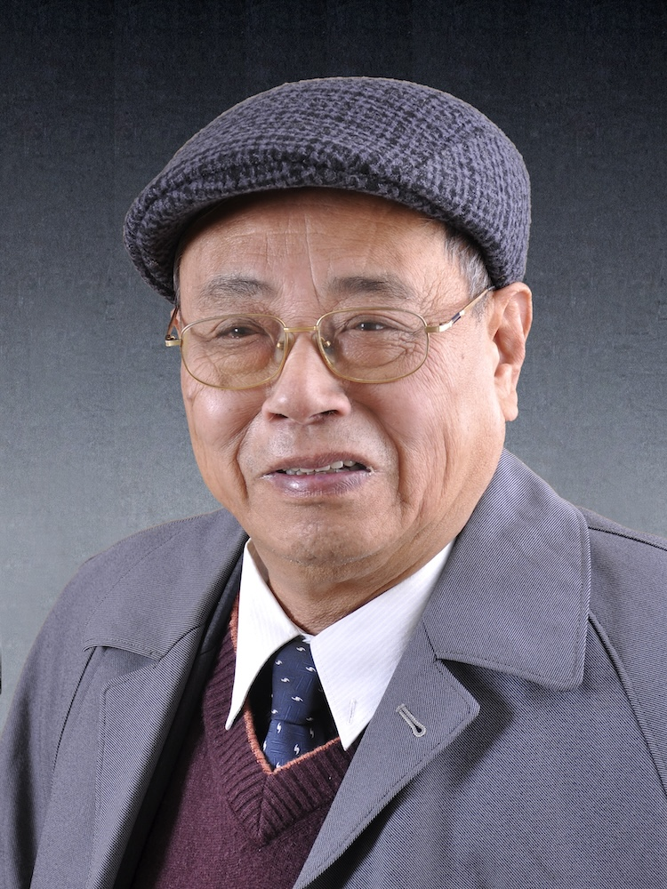

<!-- AUTO-GENERATED-BY: work/generate_obsidian_profiles.py -->

<!-- TEMPLATE: D:\workspace\信息收集整理\医生画像仓库\模板\医生画像模板.md -->

# 彭胜权

## 基础信息

| 字段 | 内容 |
|---|---|
| 姓名 | 彭胜权 |
| 医院 | 广州中医药大学第一附属医院 |
| 科室 |  |
| 职称/身份 | 男，1939年12月生，江西波阳县人（现鄱阳县），中共党员；广东省名中医，广州中医药大学首席教授，全国优秀教师，全国老中医药专家学术经验继承工作指导老师，广东省名中医师承项目指导老师，享受国务院政府特殊津贴。 四代中医世家，曾任我校教务处长，教务长，温病学教研室主任，我院四内科主任。 |
| 来源链接 | [官网原文](https://www.gztcm.com.cn/myzl/myhc/1hbabrh5rtin5.shtml) |
| 采集日期 | 2026-08-15 |

## 简介/擅长

## 科研项目与成果

- 广东省名中医，广州中医药大学首席教授，全国优秀教师，全国老中医药专家学术经验继承工作指导老师，广东省名中医师承项目指导老师，享受国务院政府特殊津贴。
- 研究成果获含国家级二等奖、省部级一等奖与二等奖等多项。

## 论文与学术产出

- 率先将经典温病学回归临床，建立全国第一个温病病区，主编全国普通高校中医药类规划教材《温病学》，倡导并开展岭南温病研究，首创温病学教、医、研三位一体新体制。

## 可包装亮点

- 官网名医荟萃收录；
- 广东省名中医，广州中医药大学首席教授，全国优秀教师，全国老中医药专家学术经验继承工作指导老师，广东省名中医师承项目指导老师，享受国务院政府特殊津贴。
- 四代中医世家，曾任我校教务处长，教务长，温病学教研室主任，我院四内科主任。
- 率先将经典温病学回归临床，建立全国第一个温病病区，主编全国普通高校中医药类规划教材《温病学》，倡导并开展岭南温病研究，首创温病学教、医、研三位一体新体制。
- 临床擅治中医热病、外感咳嗽、肝炎、肝硬化及疑难杂症等。

## 重点疾病/人群标签

- 慢性病：
- 肿瘤：
- 生殖疾病：
- 免疫/风湿：
- 术后恢复/康复：
- 疑难重症：

## 证据摘录

> 只摘录官网公开信息中的短句或关键字段，不复制大段原文。

- 官网身份字段：男，1939年12月生，江西波阳县人（现鄱阳县），中共党员；广东省名中医，广州中医药大学首席教授，全国优秀教师，全国老中医药专家学术经验继承工作指导老师，广东省名中医师承项目指导老师，享受国务院政府特殊津贴。 四代中医世家，曾任我校教务处…
- 官网亮眼经历线索：官网名医荟萃收录；广东省名中医，广州中医药大学首席教授，全国优秀教师，全国老中医药专家学术经验继承工作指导老师，广东省名中医师承项目指导老师，享受国务院政府特殊津贴。 四代中医世家，曾任我校教务处长，教务长，温病学教研室主任，我院四内科主任。 率先将经典温病学回归临床，建立全国第一个温病病区，主编全国普通高校中医药类规划教材《温病学》，倡导并开展岭南温病研究，首创温病学教、医、研三位一体新体制。 临床擅治中医热病、外感咳嗽、肝炎、肝硬…
- 异常提示：名医荟萃详情未标当前科室
- 来源链接：https://www.gztcm.com.cn/myzl/myhc/1hbabrh5rtin5.shtml

## BD 画像摘要

当前画像仅作基础资料归档，后续使用需先完成人工复核。

## 合规边界

- 仅使用医院官网、官方公众号、官方小程序等公开渠道。
- 不采集私人电话、私人微信、家庭住址、患者隐私或非公开排班信息。
- 不写“保证治愈”“疗效第一”“包治疑难杂症”等无法由官网证明的表述。
