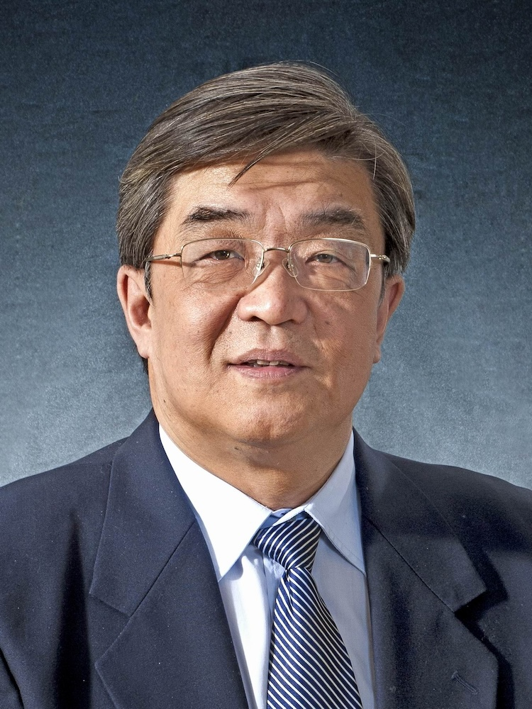

<!-- AUTO-GENERATED-BY: work/generate_obsidian_profiles.py -->

<!-- TEMPLATE: D:\workspace\信息收集整理\医生画像仓库\模板\医生画像模板.md -->

# 朱敏

## 基础信息

| 字段 | 内容 |
|---|---|
| 姓名 | 朱敏 |
| 医院 | 广州中医药大学第一附属医院 |
| 科室 |  |
| 职称/身份 | 男，1957年12月生，江苏苏州人，中共党员；广东省名中医，教授，主任中医师，硕士生导师。 曾任我院急诊科主任、内科主任、副院长。 |
| 来源链接 | [官网原文](https://www.gztcm.com.cn/myzl/myhc/1hbaajplrtqqd.shtml) |
| 采集日期 | 2026-08-15 |

## 简介/擅长

急性传染性疾病、血证、中风病等的诊治，对急危重病的抢救、治疗有独到的认识，尤其对急性传染性疾病（SARS、甲型H1N1流感等）的预防、治疗、抢救具有丰富的临床经验和理论认识

## 科研项目与成果

- 从事内科急症临床、教学、科研近40年，擅长急性传染性疾病、血证、中风病等的诊治，对急危重病的抢救、治疗有独到的认识，尤其对急性传染性疾病（SARS、甲型H1N1流感等）的预防、治疗、抢救具有丰富的临床经验和理论认识。

## 可包装亮点

- 官网名医荟萃收录；
- 广东省名中医，教授，主任中医师，硕士生导师。
- 1999年被评为广东省卫生系统白求恩式先进工作者，2003年荣获广东省“五一”劳动奖章，被授予广东省抗击非典一等功称号，2009年获“南粤优秀教育工作者”称号。
- 曾任我院急诊科主任、内科主任、副院长。
- 从事内科急症临床、教学、科研近40年，擅长急性传染性疾病、血证、中风病等的诊治，对急危重病的抢救、治疗有独到的认识，尤其对急性传染性疾病（SARS、甲型H1N1流感等）的预防、治疗、抢救具有丰富的临床经验和理论认识。

## 重点疾病/人群标签

- 慢性病：
- 肿瘤：
- 生殖疾病：
- 免疫/风湿：
- 术后恢复/康复：
- 疑难重症：

## 证据摘录

> 只摘录官网公开信息中的短句或关键字段，不复制大段原文。

- 官网身份字段：男，1957年12月生，江苏苏州人，中共党员；广东省名中医，教授，主任中医师，硕士生导师。 曾任我院急诊科主任、内科主任、副院长。
- 官网简介/擅长：急性传染性疾病、血证、中风病等的诊治，对急危重病的抢救、治疗有独到的认识，尤其对急性传染性疾病（SARS、甲型H1N1流感等）的预防、治疗、抢救具有丰富的临床经验和理论认识
- 官网亮眼经历线索：官网名医荟萃收录；广东省名中医，教授，主任中医师，硕士生导师。 1999年被评为广东省卫生系统白求恩式先进工作者，2003年荣获广东省“五一”劳动奖章，被授予广东省抗击非典一等功称号，2009年获“南粤优秀教育工作者”称号。 曾任我院急诊科主任、内科主任、副院长。 从事内科急症临床、教学、科研近40年，擅长急性传染性疾病、血证、中风病等的诊治，对急危重病的抢救、治疗有独到的认识，尤其对急性传染性疾病（SARS、甲型H1N1流感等）的预…
- 异常提示：名医荟萃详情未标当前科室
- 来源链接：https://www.gztcm.com.cn/myzl/myhc/1hbaajplrtqqd.shtml

## BD 画像摘要

当前画像仅作基础资料归档，后续使用需先完成人工复核。

## 合规边界

- 仅使用医院官网、官方公众号、官方小程序等公开渠道。
- 不采集私人电话、私人微信、家庭住址、患者隐私或非公开排班信息。
- 不写“保证治愈”“疗效第一”“包治疑难杂症”等无法由官网证明的表述。
