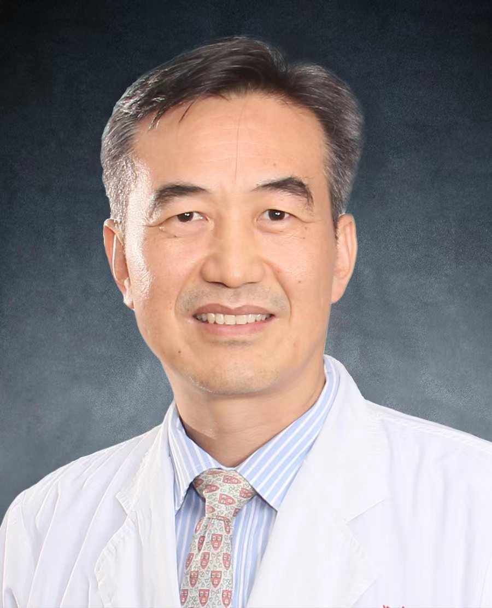

<!-- AUTO-GENERATED-BY: work/generate_obsidian_profiles.py -->

<!-- TEMPLATE: D:\workspace\信息收集整理\医生画像仓库\模板\医生画像模板.md -->

# 李俊

## 基础信息

| 字段 | 内容 |
|---|---|
| 姓名 | 李俊 |
| 医院 | 广州中医药大学第一附属医院 |
| 科室 |  |
| 职称/身份 | 男，1966年3月8日，河南周口人，中共党员；广东省名中医，主任医师，博士生导师。 |
| 来源链接 | [官网原文](https://www.gztcm.com.cn/myzl/myhc/1i8jsbeid88n3.shtml) |
| 采集日期 | 2026-08-15 |

## 简介/擅长

用中西医结合方法治疗心脑血管疾病、呼吸系统疾病及其他内科杂病

## 科研项目与成果

- 从事医疗、科研、教学工作30余年，主要从事中西医结合心脑血管、呼吸系统、脓毒症的基础与临床研究，主持各级课题10余项，出版专著5部，发表论文40余篇，获发明专利3项，科技奖励2项。

## 论文与学术产出

- 从事医疗、科研、教学工作30余年，主要从事中西医结合心脑血管、呼吸系统、脓毒症的基础与临床研究，主持各级课题10余项，出版专著5部，发表论文40余篇，获发明专利3项，科技奖励2项。

## 可包装亮点

- 官网名医荟萃收录；
- 广东省名中医，主任医师，博士生导师。
- 担任中华中医药学会急诊重症专业委员会副主委，广东省中医药学会急诊专业委员会主委，广东省医学会常务理事等学术兼职。
- 从事医疗、科研、教学工作30余年，主要从事中西医结合心脑血管、呼吸系统、脓毒症的基础与临床研究，主持各级课题10余项，出版专著5部，发表论文40余篇，获发明专利3项，科技奖励2项。

## 重点疾病/人群标签

- 慢性病：
- 肿瘤：
- 生殖疾病：
- 免疫/风湿：
- 术后恢复/康复：
- 疑难重症：

## 证据摘录

> 只摘录官网公开信息中的短句或关键字段，不复制大段原文。

- 官网身份字段：男，1966年3月8日，河南周口人，中共党员；广东省名中医，主任医师，博士生导师。
- 官网简介/擅长：用中西医结合方法治疗心脑血管疾病、呼吸系统疾病及其他内科杂病
- 官网亮眼经历线索：官网名医荟萃收录；广东省名中医，主任医师，博士生导师。 担任中华中医药学会急诊重症专业委员会副主委，广东省中医药学会急诊专业委员会主委，广东省医学会常务理事等学术兼职。 从事医疗、科研、教学工作30余年，主要从事中西医结合心脑血管、呼吸系统、脓毒症的基础与临床研究，主持各级课题10余项，出版专著5部，发表论文40余篇，获发明专利3项，科技奖励2项。
- 异常提示：名医荟萃详情未标当前科室
- 来源链接：https://www.gztcm.com.cn/myzl/myhc/1i8jsbeid88n3.shtml

## BD 画像摘要

当前画像仅作基础资料归档，后续使用需先完成人工复核。

## 合规边界

- 仅使用医院官网、官方公众号、官方小程序等公开渠道。
- 不采集私人电话、私人微信、家庭住址、患者隐私或非公开排班信息。
- 不写“保证治愈”“疗效第一”“包治疑难杂症”等无法由官网证明的表述。
