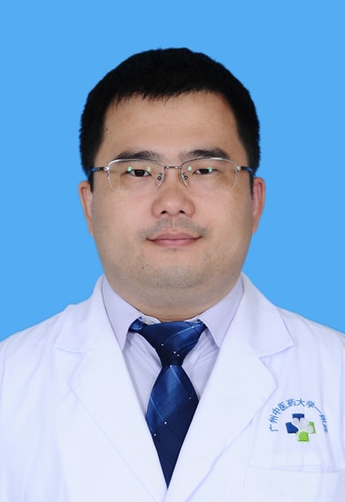

<!-- AUTO-GENERATED-BY: work/generate_obsidian_profiles.py -->

<!-- TEMPLATE: D:\workspace\信息收集整理\医生画像仓库\模板\医生画像模板.md -->

# 李大年

## 基础信息

| 字段 | 内容 |
|---|---|
| 姓名 | 李大年 |
| 医院 | 广州中医药大学第一附属医院 |
| 科室 | 心理睡眠科 |
| 职称/身份 | 主治医师，中级心理治疗师。 |
| 来源链接 | [官网原文](https://www.gztcm.com.cn/xlsmk/kszj/1iedbslhl39d0.shtml) |
| 采集日期 | 2026-08-15 |

## 简介/擅长

抑郁障碍、睡眠障碍、精神分裂症、焦虑症、强迫症和躯体形式障碍等的中西医结合治疗，对青少年的各类心理问题有丰富的咨询和治疗经验。

## 教育与进修经历

- 曾在北京大学附属回龙观医院进修青少年心理专项培训半年。

## 科研项目与成果

- 临床一线工作20年，参与国自然重大研究计划2项，主持省部级课题1项，第一作者发表多篇中科院SCI等高质量论文。

## 论文与学术产出

- 临床一线工作20年，参与国自然重大研究计划2项，主持省部级课题1项，第一作者发表多篇中科院SCI等高质量论文。

## 可包装亮点

- 临床一线工作20年，参与国自然重大研究计划2项，主持省部级课题1项，第一作者发表多篇中科院SCI等高质量论文。
- 曾在北京大学附属回龙观医院进修青少年心理专项培训半年。
- 担任广东省中西医结合学会双心医学专业委员会常委、广东省医学会精神病学分会委员等多个学术团体任职。

## 重点疾病/人群标签

- 慢性病：
- 肿瘤：
- 生殖疾病：
- 免疫/风湿：
- 术后恢复/康复：
- 疑难重症：

## 证据摘录

> 只摘录官网公开信息中的短句或关键字段，不复制大段原文。

- 官网身份字段：主治医师，中级心理治疗师。
- 官网简介/擅长：抑郁障碍、睡眠障碍、精神分裂症、焦虑症、强迫症和躯体形式障碍等的中西医结合治疗，对青少年的各类心理问题有丰富的咨询和治疗经验。
- 官网亮眼经历线索：临床一线工作20年，参与国自然重大研究计划2项，主持省部级课题1项，第一作者发表多篇中科院SCI等高质量论文。 曾在北京大学附属回龙观医院进修青少年心理专项培训半年。 担任广东省中西医结合学会双心医学专业委员会常委、广东省医学会精神病学分会委员等多个学术团体任职。
- 来源链接：https://www.gztcm.com.cn/xlsmk/kszj/1iedbslhl39d0.shtml

## BD 画像摘要

李大年医生可作为广州中医药大学第一附属医院心理睡眠科的基础医生资料入库。当前重点方向以总底表标签为准，官网未展示的信息保持空白。

## 合规边界

- 仅使用医院官网、官方公众号、官方小程序等公开渠道。
- 不采集私人电话、私人微信、家庭住址、患者隐私或非公开排班信息。
- 不写“保证治愈”“疗效第一”“包治疑难杂症”等无法由官网证明的表述。
