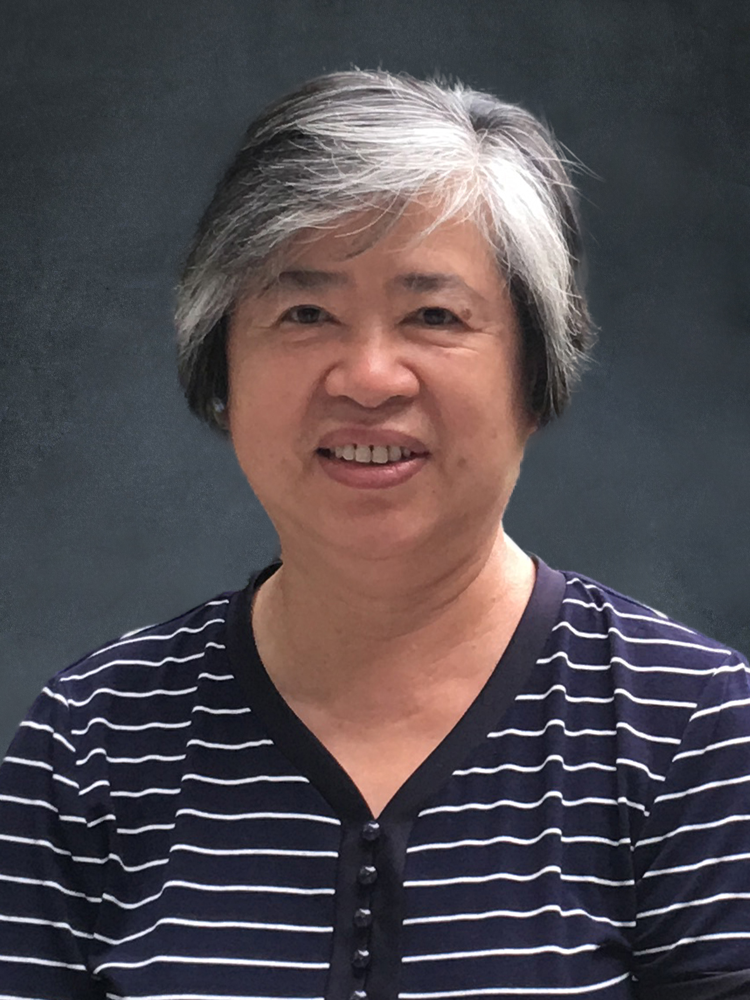

<!-- AUTO-GENERATED-BY: work/generate_obsidian_profiles.py -->

<!-- TEMPLATE: D:\workspace\信息收集整理\医生画像仓库\模板\医生画像模板.md -->

# 李宜瑞

## 基础信息

| 字段 | 内容 |
|---|---|
| 姓名 | 李宜瑞 |
| 医院 | 广州中医药大学第一附属医院 |
| 科室 |  |
| 职称/身份 | 女，1947年2月生，广东梅县人；主任中医师，广东省首位中医儿科学博士生导师，全国老中医药专家学术经验继承工作指导老师，国家中医药管理局“李宜瑞名医工作室”指导老师。 曾任儿科副主任，儿科教研室副主任，广东省中医药学会儿科专业委员会副主任委员。 |
| 来源链接 | [官网原文](https://www.gztcm.com.cn/myzl/myhc/1hbaba1ev887j.shtml) |
| 采集日期 | 2026-08-15 |

## 简介/擅长

儿童发育行为障碍（注意缺陷多动障碍、儿童抽动症、自闭症等）和小儿呼吸、消化系统疾病的专科诊疗

## 科研项目与成果

- 主持国家自然科学基金等项目12项，创制“益智宁”等制剂，获广州中医药大学科技进步二等奖1项、三等奖1项，公开发表论文50多篇，代表性著作为《儿童多动症临床治疗学》，为本学科建设和人才培养做出重要贡献。

## 论文与学术产出

- 主持国家自然科学基金等项目12项，创制“益智宁”等制剂，获广州中医药大学科技进步二等奖1项、三等奖1项，公开发表论文50多篇，代表性著作为《儿童多动症临床治疗学》，为本学科建设和人才培养做出重要贡献。

## 可包装亮点

- 官网名医荟萃收录；
- 主任中医师，广东省首位中医儿科学博士生导师，全国老中医药专家学术经验继承工作指导老师，国家中医药管理局“李宜瑞名医工作室”指导老师。
- 曾任儿科副主任，儿科教研室副主任，广东省中医药学会儿科专业委员会副主任委员。
- 现任广东省中医药学会儿科专业和广东省中西医结合学会儿科专业委员会顾问。
- 主持国家自然科学基金等项目12项，创制“益智宁”等制剂，获广州中医药大学科技进步二等奖1项、三等奖1项，公开发表论文50多篇，代表性著作为《儿童多动症临床治疗学》，为本学科建设和人才培养做出重要贡献。

## 重点疾病/人群标签

- 慢性病：
- 肿瘤：
- 生殖疾病：
- 免疫/风湿：
- 术后恢复/康复：
- 疑难重症：

## 证据摘录

> 只摘录官网公开信息中的短句或关键字段，不复制大段原文。

- 官网身份字段：女，1947年2月生，广东梅县人；主任中医师，广东省首位中医儿科学博士生导师，全国老中医药专家学术经验继承工作指导老师，国家中医药管理局“李宜瑞名医工作室”指导老师。 曾任儿科副主任，儿科教研室副主任，广东省中医药学会儿科专业委员会副主任…
- 官网简介/擅长：儿童发育行为障碍（注意缺陷多动障碍、儿童抽动症、自闭症等）和小儿呼吸、消化系统疾病的专科诊疗
- 官网亮眼经历线索：官网名医荟萃收录；主任中医师，广东省首位中医儿科学博士生导师，全国老中医药专家学术经验继承工作指导老师，国家中医药管理局“李宜瑞名医工作室”指导老师。 曾任儿科副主任，儿科教研室副主任，广东省中医药学会儿科专业委员会副主任委员。 现任广东省中医药学会儿科专业和广东省中西医结合学会儿科专业委员会顾问。 主持国家自然科学基金等项目12项，创制“益智宁”等制剂，获广州中医药大学科技进步二等奖1项、三等奖1项，公开发表论文50多篇，代表性著作…
- 异常提示：名医荟萃详情未标当前科室
- 来源链接：https://www.gztcm.com.cn/myzl/myhc/1hbaba1ev887j.shtml

## BD 画像摘要

当前画像仅作基础资料归档，后续使用需先完成人工复核。

## 合规边界

- 仅使用医院官网、官方公众号、官方小程序等公开渠道。
- 不采集私人电话、私人微信、家庭住址、患者隐私或非公开排班信息。
- 不写“保证治愈”“疗效第一”“包治疑难杂症”等无法由官网证明的表述。
