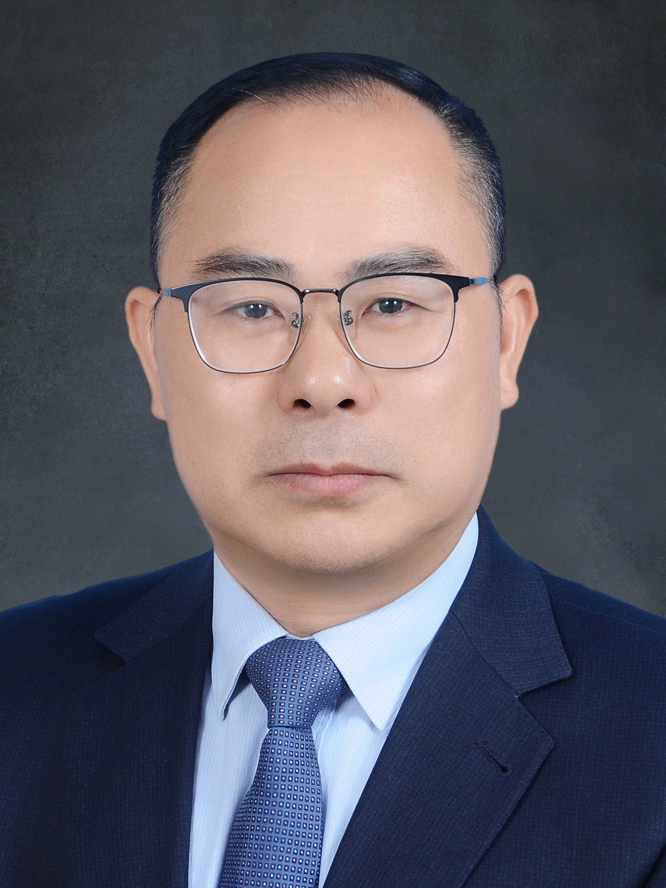

<!-- AUTO-GENERATED-BY: work/generate_obsidian_profiles.py -->

<!-- TEMPLATE: D:\workspace\信息收集整理\医生画像仓库\模板\医生画像模板.md -->

# 杨忠奇

## 基础信息

| 字段 | 内容 |
|---|---|
| 姓名 | 杨忠奇 |
| 医院 | 广州中医药大学第一附属医院 |
| 科室 |  |
| 职称/身份 | 男，1969年8月生，福建政和人，中国农工民主党党员；广东省名中医，教授，主任医师，博士生导师/博士后合作导师，国家级人才奖励计划特岗学者，国家药典委员会委员，享受国务院特殊津贴，全国老中医药专家赵立诚教授学术经验继承人，岭南刘氏内科学术传承人，国家药品监督管理局药品审评咨询专家和药品注册核查专家，广东省中医老年病质控中心主任、国家中医药管理局重点特色专科老年病科学术带头人。 现任广州中医药大学第一附属医院副院长、广东省政协委员、常委。 |
| 来源链接 | [官网原文](https://www.gztcm.com.cn/myzl/myhc/1hbaaimc9h51d.shtml) |
| 采集日期 | 2026-08-15 |

## 简介/擅长

心脑血管疾病和老年内科杂病的中西医结合治疗及中药新药的临床研究，构建中药“人用经验“技术体系

## 教育与进修经历

- 广东省名中医，教授，主任医师，博士生导师/博士后合作导师，国家级人才奖励计划特岗学者，国家药典委员会委员，享受国务院特殊津贴，全国老中医药专家赵立诚教授学术经验继承人，岭南刘氏内科学术传承人，国家药品监督管理局药品审评咨询专家和药品注册核查专家，广东省中医老年病质控中心主任、国家中医药管理局重点特色专科老年病科学术带头人。

## 科研项目与成果

- 主持国家重点研发计划等科研项目20余项，发表SCI及中文核心论文160余篇，学术专著10部，发明国家1.1类中药新药2个，获批上市医院制剂2个，专利11项。

## 论文与学术产出

- 主持国家重点研发计划等科研项目20余项，发表SCI及中文核心论文160余篇，学术专著10部，发明国家1.1类中药新药2个，获批上市医院制剂2个，专利11项。

## 可包装亮点

- 官网名医荟萃收录；
- 广东省名中医，教授，主任医师，博士生导师/博士后合作导师，国家级人才奖励计划特岗学者，国家药典委员会委员，享受国务院特殊津贴，全国老中医药专家赵立诚教授学术经验继承人，岭南刘氏内科学术传承人，国家药品监督管理局药品审评咨询专家和药品注册核查专家，广东省中医老年病质控中心主任、国家中医药管理局重点特色专科老年病科学术带头人。
- 主持国家重点研发计划等科研项目20余项，发表SCI及中文核心论文160余篇，学术专著10部，发明国家1.1类中药新药2个，获批上市医院制剂2个，专利11项。
- 荣获中华人民共和国教育部科学技术进步一等奖1项；
- 广东省人民政府科技进步一等奖1项、科学技术奖二等奖1项；

## 重点疾病/人群标签

- 慢性病：
- 肿瘤：
- 生殖疾病：
- 免疫/风湿：
- 术后恢复/康复：
- 疑难重症：

## 证据摘录

> 只摘录官网公开信息中的短句或关键字段，不复制大段原文。

- 官网身份字段：男，1969年8月生，福建政和人，中国农工民主党党员；广东省名中医，教授，主任医师，博士生导师/博士后合作导师，国家级人才奖励计划特岗学者，国家药典委员会委员，享受国务院特殊津贴，全国老中医药专家赵立诚教授学术经验继承人，岭南刘氏内科学术…
- 官网简介/擅长：心脑血管疾病和老年内科杂病的中西医结合治疗及中药新药的临床研究，构建中药“人用经验“技术体系
- 官网亮眼经历线索：官网名医荟萃收录；广东省名中医，教授，主任医师，博士生导师/博士后合作导师，国家级人才奖励计划特岗学者，国家药典委员会委员，享受国务院特殊津贴，全国老中医药专家赵立诚教授学术经验继承人，岭南刘氏内科学术传承人，国家药品监督管理局药品审评咨询专家和药品注册核查专家，广东省中医老年病质控中心主任、国家中医药管理局重点特色专科老年病科学术带头人。 主持国家重点研发计划等科研项目20余项，发表SCI及中文核心论文160余篇，学术专著10部，发…
- 异常提示：名医荟萃详情未标当前科室
- 来源链接：https://www.gztcm.com.cn/myzl/myhc/1hbaaimc9h51d.shtml

## BD 画像摘要

当前画像仅作基础资料归档，后续使用需先完成人工复核。

## 合规边界

- 仅使用医院官网、官方公众号、官方小程序等公开渠道。
- 不采集私人电话、私人微信、家庭住址、患者隐私或非公开排班信息。
- 不写“保证治愈”“疗效第一”“包治疑难杂症”等无法由官网证明的表述。
