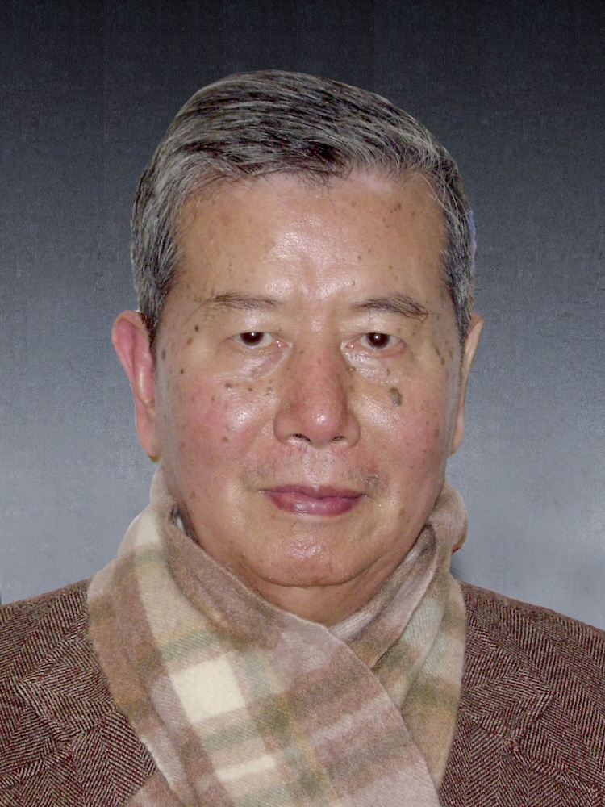

<!-- AUTO-GENERATED-BY: work/generate_obsidian_profiles.py -->

<!-- TEMPLATE: D:\workspace\信息收集整理\医生画像仓库\模板\医生画像模板.md -->

# 杨文辉

## 基础信息

| 字段 | 内容 |
|---|---|
| 姓名 | 杨文辉 |
| 医院 | 广州中医药大学第一附属医院 |
| 科室 |  |
| 职称/身份 | 男，1935年1月生，广东潮汕人；广东省名中医，教授，硕士生导师。 曾任针灸治疗教研室主任，针灸科主任。 |
| 来源链接 | [官网原文](https://www.gztcm.com.cn/myzl/myhc/1hbabiko597rk.shtml) |
| 采集日期 | 2026-08-15 |

## 简介/擅长

针法及灸法治疗疑难疾病，首次提出“头部CT定位围针”治疗神经及肌肉疾病，主持《单式针灸补泻手法的实验研究-不同针刺法对机体作用的特异性》研究获广东省中医药管理局科技进步一等奖

## 可包装亮点

- 官网名医荟萃收录；
- 广东省名中医，教授，硕士生导师。
- 曾任针灸治疗教研室主任，针灸科主任。
- 曾任中国农工民主党广州中医学院支部委员会主任委员，广东省人民代表大会代表，广东省政协委员，广东中医药研究促进会理事长，享受国务院政府特殊津贴。
- 从事医疗、教学40余年，擅长针法及灸法治疗疑难疾病，首次提出“头部CT定位围针”治疗神经及肌肉疾病，主持《单式针灸补泻手法的实验研究-不同针刺法对机体作用的特异性》研究获广东省中医药管理局科技进步一等奖。

## 重点疾病/人群标签

- 慢性病：
- 肿瘤：
- 生殖疾病：
- 免疫/风湿：
- 术后恢复/康复：
- 疑难重症：

## 证据摘录

> 只摘录官网公开信息中的短句或关键字段，不复制大段原文。

- 官网身份字段：男，1935年1月生，广东潮汕人；广东省名中医，教授，硕士生导师。 曾任针灸治疗教研室主任，针灸科主任。
- 官网简介/擅长：针法及灸法治疗疑难疾病，首次提出“头部CT定位围针”治疗神经及肌肉疾病，主持《单式针灸补泻手法的实验研究-不同针刺法对机体作用的特异性》研究获广东省中医药管理局科技进步一等奖
- 官网亮眼经历线索：官网名医荟萃收录；广东省名中医，教授，硕士生导师。 曾任针灸治疗教研室主任，针灸科主任。 曾任中国农工民主党广州中医学院支部委员会主任委员，广东省人民代表大会代表，广东省政协委员，广东中医药研究促进会理事长，享受国务院政府特殊津贴。 从事医疗、教学40余年，擅长针法及灸法治疗疑难疾病，首次提出“头部CT定位围针”治疗神经及肌肉疾病，主持《单式针灸补泻手法的实验研究-不同针刺法对机体作用的特异性》研究获广东省中医药管理局科技进步一等奖。
- 异常提示：名医荟萃详情未标当前科室
- 来源链接：https://www.gztcm.com.cn/myzl/myhc/1hbabiko597rk.shtml

## BD 画像摘要

当前画像仅作基础资料归档，后续使用需先完成人工复核。

## 合规边界

- 仅使用医院官网、官方公众号、官方小程序等公开渠道。
- 不采集私人电话、私人微信、家庭住址、患者隐私或非公开排班信息。
- 不写“保证治愈”“疗效第一”“包治疑难杂症”等无法由官网证明的表述。
