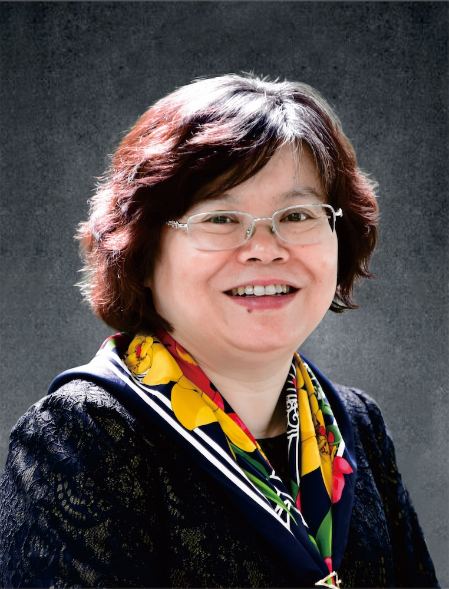

<!-- AUTO-GENERATED-BY: work/generate_obsidian_profiles.py -->

<!-- TEMPLATE: D:\workspace\信息收集整理\医生画像仓库\模板\医生画像模板.md -->

# 林丽珠

## 基础信息

| 字段 | 内容 |
|---|---|
| 姓名 | 林丽珠 |
| 医院 | 广州中医药大学第一附属医院 |
| 科室 |  |
| 职称/身份 | 女，1962年9月生，广东汕头人，中共党员；全国先进工作者，党的十九大代表，广东省名中医，广东省高等学校教学名师，首届广东省医学领军人才，医学博士，教授，博士生导师，享受国务院政府特殊津贴专家，中央保健会诊专家，国家临床重点专科、全国中医肿瘤重点专科学术带头人，国家药物临床试验机构肿瘤专业负责人，广东省重点学科中西医结合（临床）学科带头人。 现任我院党委委员、副院长，兼任广东省总工会副主席、世中联癌症姑息治疗研究专业委员会会长、《中医肿瘤学杂志》副主编等。 |
| 来源链接 | [官网原文](https://www.gztcm.com.cn/myzl/myhc/1hbaaufp149ql.shtml) |
| 采集日期 | 2026-08-15 |

## 简介/擅长

中医、中西医结合治疗中晚期恶性肿瘤，倡导以中为主，西为中用，临床治疗注重以人为本，强调生存时间与生活质量并重的理念并取得良好的临床效果

## 科研项目与成果

- 主持国家“十•五”攻关、“十一•五”支撑计划及国家自然科学基金等肺癌研究课题40多项，承担国内外GCP研究项目60多项。

## 论文与学术产出

- 现任我院党委委员、副院长，兼任广东省总工会副主席、世中联癌症姑息治疗研究专业委员会会长、《中医肿瘤学杂志》副主编等。
- 发表学术论文400多篇，SCI收录70多篇，主编《肿瘤中西医治疗学》、《中医治肿瘤理论及验案》等论著20多部，相关研究获得广东省科技进步一等奖、教育部科技进步一等奖等多项奖励。

## 可包装亮点

- 官网名医荟萃收录；
- 全国先进工作者，党的十九大代表，广东省名中医，广东省高等学校教学名师，首届广东省医学领军人才，医学博士，教授，博士生导师，享受国务院政府特殊津贴专家，中央保健会诊专家，国家临床重点专科、全国中医肿瘤重点专科学术带头人，国家药物临床试验机构肿瘤专业负责人，广东省重点学科中西医结合（临床）学科带头人。
- 现任我院党委委员、副院长，兼任广东省总工会副主席、世中联癌症姑息治疗研究专业委员会会长、《中医肿瘤学杂志》副主编等。
- 主持国家“十•五”攻关、“十一•五”支撑计划及国家自然科学基金等肺癌研究课题40多项，承担国内外GCP研究项目60多项。
- 发表学术论文400多篇，SCI收录70多篇，主编《肿瘤中西医治疗学》、《中医治肿瘤理论及验案》等论著20多部，相关研究获得广东省科技进步一等奖、教育部科技进步一等奖等多项奖励。

## 重点疾病/人群标签

- 慢性病：
- 肿瘤：
- 生殖疾病：
- 免疫/风湿：
- 术后恢复/康复：
- 疑难重症：

## 证据摘录

> 只摘录官网公开信息中的短句或关键字段，不复制大段原文。

- 官网身份字段：女，1962年9月生，广东汕头人，中共党员；全国先进工作者，党的十九大代表，广东省名中医，广东省高等学校教学名师，首届广东省医学领军人才，医学博士，教授，博士生导师，享受国务院政府特殊津贴专家，中央保健会诊专家，国家临床重点专科、全国中医…
- 官网简介/擅长：中医、中西医结合治疗中晚期恶性肿瘤，倡导以中为主，西为中用，临床治疗注重以人为本，强调生存时间与生活质量并重的理念并取得良好的临床效果
- 官网亮眼经历线索：官网名医荟萃收录；全国先进工作者，党的十九大代表，广东省名中医，广东省高等学校教学名师，首届广东省医学领军人才，医学博士，教授，博士生导师，享受国务院政府特殊津贴专家，中央保健会诊专家，国家临床重点专科、全国中医肿瘤重点专科学术带头人，国家药物临床试验机构肿瘤专业负责人，广东省重点学科中西医结合（临床）学科带头人。 现任我院党委委员、副院长，兼任广东省总工会副主席、世中联癌症姑息治疗研究专业委员会会长、《中医肿瘤学杂志》副主编等。 主…
- 异常提示：名医荟萃详情未标当前科室
- 来源链接：https://www.gztcm.com.cn/myzl/myhc/1hbaaufp149ql.shtml

## BD 画像摘要

当前画像仅作基础资料归档，后续使用需先完成人工复核。

## 合规边界

- 仅使用医院官网、官方公众号、官方小程序等公开渠道。
- 不采集私人电话、私人微信、家庭住址、患者隐私或非公开排班信息。
- 不写“保证治愈”“疗效第一”“包治疑难杂症”等无法由官网证明的表述。
